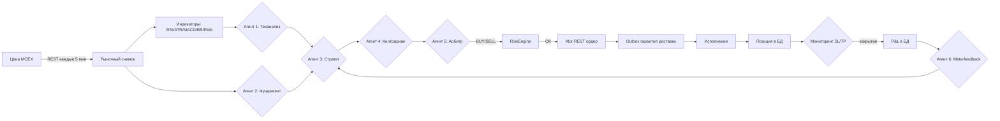
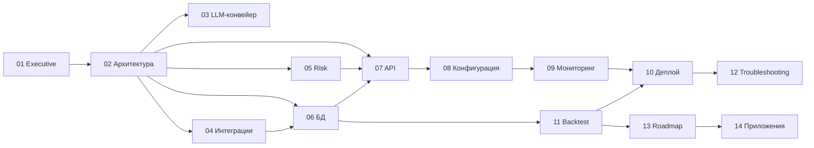

# 1. Executive Summary

> Для бизнеса и новых членов команды. Здесь нет деталей реализации — только суть, метрики и требования.

## 1.1. Что делает бот

**MMVB Trading Bot v2** — автономный алгоритмический торговый бот для **Московской биржи (MOEX)**, работающий через брокера **Alor**. Бот:

1. Раз в 5 минут получает актуальные цены 10 ликвидных российских акций (SBER, GAZP, LKOH, YNDX, MGNT, NVTK, ROSN, TATN, VTBR, ALRS).
2. Собирает **технический анализ** (RSI, ATR, MACD, Bollinger, EMA-тренд) детерминированными формулами и передаёт данные LLM-агенту.
3. Собирает **фундаментальный контекст**: ключевая ставка ЦБ, нефть Brent, курс USD/RUB (живой курс с MOEX).
4. **Стратег** (LLM) предлагает сделку (BUY/SELL/HOLD) с ценой, объёмом и стоп-уровнями.
5. **Контрариан** (LLM) играет роль «адвоката дьявола» — ищет слабые места сделки.
6. **Арбитр** (LLM + детерминированные правила) выносит финальное решение.
7. **Meta-агент** анализирует статистику закрытых сделок и подкручивает параметры стратегии (adaptive confidence, стопы, паузы).
8. При подтверждении сигнала бот размещает ордер через Alor с гарантированной доставкой (Outbox), контролем проскальзывания и следит за позицией (SL/TP/trailing stop) до закрытия.

Бот **самообучается**: с каждой закрытой сделкой улучшает понимание, когда входить и когда сидеть в стороне.

### Аналогия

Представьте команду из 6 трейдеров в одной комнате:

- **Аналитик №1** смотрит на графики и формулы индикаторов.
- **Аналитик №2** следит за макроэкономикой (ставки, нефть, доллар).
- **Стратег** предлагает сделку.
- **Скептик** пытается её раскритиковать.
- **Руководитель** (арбитр) принимает финальное решение.
- **Тренер** (meta-агент) разбирает прошедшие сделки и говорит: «в 14:00 у нас стабильно убыток, не торгуй в это время».

## 1.2. Ключевые метрики и ожидания

| Параметр | Ожидание | Обоснование |
|---|---|---|
| Ожидаемая доходность (gross) | не заявлена | Бот в SIMULATION/боевом режиме; метрики накапливаются в `positions.pnl` |
| Максимальный риск на 1 позицию | 500 000 ₽ | `risk.max-position-rub` |
| Дневной лимит убытка | 50 000 ₽ | `risk.max-daily-loss-rub`, при достижении — глобальный HOLD |
| Максимум одновременных позиций | 5 | `risk.max-open-positions` |
| Стоп-лосс по умолчанию | 2% от входа | `risk.default-stop-loss-percent` |
| Тейк-профит по умолчанию | 4% от входа | `risk.default-take-profit-percent` |
| Трейлинг-стоп | 1.5%, включён | `risk.trailing-stop-enabled`, `risk.trailing-stop-percent` |
| Средний цикл анализа | 5 мин (бот) / 10 мин (стратегия) | `trading.bot-interval-ms`, `trading.strategy-interval-ms` |
| Латентность LLM-вызова | типичная 1–5 c, пиковая до 30 c | таймаут `llm.timeout-sec: 30` |
| Целевой hit rate семантического кэша | > 60% | снижение стоимости LLM |

## 1.3. Почему LLM-агенты дают edge вместо классического бота

Классические алгоритмические боты используют жёсткие правила: `RSI < 30 → BUY`. Их преимущество — предсказуемость и скорость. Их главная проблема — **они не понимают контекст**: те же RSI=28 на растущем рынке в преддверии отчётности и RSI=28 после дивидендного отсечения — это разные ситуации.

LLM-агенты добавляют **семантическое понимание**:

| Аспект | Классический бот | LLM-агент (v2) |
|---|---|---|
| Входной сигнал | одно число (RSI/пересечение EMA) | набор индикаторов + макро + тренд + история сделок |
| Учёт контекста | нет | ставка ЦБ, нефть, курс, рыночный режим |
| Критика решения | нет | отдельный агент-контрариан |
| Самообучение | редко | meta-агент корректирует пороги и стопы |
| Поведение при ошибке | фиксированное | детерминированные guardrails + fallback |

Edge достигается за счёт **многоуровневого согласования** (техника + фундамент + контр-аргументы + финальный арбитраж) с **детерминированной страховкой** (guardrails, риск-движок, outbox). LLM не принимает решение в одиночку — он лишь один из слоёв, а всё «железное» окружение (риск, доставка ордеров, контроль проскальзывания) работает на обычном детерминированном коде.

## 1.4. Схема «от идеи до прибыли»

## 1.5. Требования к инфраструктуре

| Ресурс | Минимум | Рекомендация | Комментарий |
|---|---|---|---|
| CPU | 1 vCPU | 2 vCPU | Основная нагрузка — LLM-вызовы (ожидание сети), не CPU |
| RAM | 1 GB | 2 GB | JVM + Redis-кэш; типичный heap 512 MB |
| Диск | 10 GB | 30 GB SSD | PostgreSQL + свечи (10 тикеров × 10-мин × рост) |
| PostgreSQL | 15 | 15 managed | партиционирование `candles` по времени |
| Redis | 7 | 7 cluster (managed) | semantic cache, стратегии, feedback |
| Сеть до MOEX/Alor | — | стабильная, RTT < 50 мс | бот в SIMULATION по умолчанию |
| Сеть до Kimi API | — | HTTPS (api.moonshot.cn) | таймаут 30 c, resilience4j |
| Докер-демон | — | — | только для тестов (Testcontainers) и локального деплоя |

**Критично**: бот должен работать в **одной реплике** (singleton). Причина — конкурентные ордера: две реплики могут открыть две позиции по одному сигналу. Подробнее — раздел 2.6.

## 1.6. Быстрый старт

1. `docker compose up -d postgres redis` — поднять инфраструктуру.
2. `.\gradlew.bat bootRun` — запуск в SIMULATION (не требует токенов Alor и Kimi, использует заглушки/fallback).
3. Для полного пайплайна: задать `KIMI_API_KEY`, `ALOR_TOKEN`, `ALOR_REFRESH_TOKEN`.
4. `curl http://localhost:8080/api/v1/analytics/health` — посмотреть состояние.
5. `curl http://localhost:8080/actuator/prometheus` — метрики Prometheus.

> **Важно**: по умолчанию `TRADING_MODE=SIMULATION`, `MAX_OPEN_POS=0`. Это значит, что даже при BUY-сигнале бот НЕ открывает реальные позиции (0 разрешённых открытых). Это сознательная страховка перед боем.

## 1.7. Что нового в этой версии

Версия v2 включает несколько ключевых блоков, которых не было в ранних итерациях:

| Блок | Статус | Краткое описание |
|---|---|---|
| Event-driven слой | ✅ реализован | События `PriceChanged/StrategyGenerated/EntrySignal/ExecutionReport` заменили жёсткую связку циклов; обработчики — `@EventListener` |
| Sector concentration | ✅ реализован | Не более `risk.max-sector-exposure` (2) открытых позиций в одном секторе |
| Volatility guard | ✅ реализован | `ATR% > risk.max-volatility-percent` (5%) → стратегия HOLD |
| Backtest framework | ✅ реализован | `BacktestEngine` + `SimulatedExecution` + `BacktestMetrics`, endpoint `GET /api/v1/backtest/{ticker}` |
| Реактивная инфраструктура LLM | ✅ реализован | Circuit breaker, rate limiter, retry (resilience4j), semantic cache, prompt registry |
| Outbox для ордеров | ✅ реализован | Гарантированная доставка ордеров через транзакционную таблицу + worker |

Подробности: event-driven — раздел 2.3, риск-проверки — раздел 5.3–5.4, бэктест — раздел 11.

## 1.8. Как оценивать бота

**Главный принцип: бот не должен терять деньги быстрее, чем анализирует.**

Три уровня защиты, каждый из которых способен остановить торговлю независимо от остальных:

1. **Конвейер** — volatility guard, порог уверенности (0.55–0.80), CRITICAL challenge контрариана, пауза по статистике (серия убытков ≥ 4, PF ≤ 0.5), override при достижении дневного лимита.
2. **RiskEngine** — детерминированные проверки в `validateNewStrategy`: дневной лимит → лимит позиций → секторная концентрация.
3. **Исполнение** — Kelly-сайзинг (не более половины Kelly), адаптивные SL/TP по ATR, контроль проскальзывания, outbox-доставка с идемпотентностью.

**Сигналы здоровья бота** (из раздела 9):

- `bot.halted.daily_loss` — срабатывал ли глобальный HOLD по дневному лимиту;
- `adaptive.position_size` — насколько Kelly ограничивает объём;
- `llm.cache_hit_rate` — эффективность семантического кэша;
- `api.backtest` — запускался ли бэктест, какие результаты.

## 1.9. Сценарии использования

| Сценарий | Кто | Что делает |
|---|---|---|
| Мониторинг | оператор | `GET /api/v1/positions`, `/api/v1/strategies`, `/actuator/prometheus` |
| Диагностика | разработчик | `GET /api/v1/logs` (последние 100 agent-логов), `/api/v1/analytics/health` |
| Проверка стратегии | трейдер | `GET /api/v1/backtest/{ticker}?days=365` до ввода денег |
| Ручной цикл | оператор | `POST /api/v1/strategy/trigger`, `POST /api/v1/bot/trigger` |
| Изменение рисков | оператор | `POST /api/v1/settings` (тradingEnabled, maxPositionRub, maxDailyLossRub) |

## 1.10. Чего бот НЕ делает (границы системы)

Важно для бизнеса понимать ограничения:

- **Не гарантирует прибыль** — метрики накапливаются, но profit factor не заявлен.
- **Не торгует вне российского рынка** — только MOEX, тикеры из `trading.tickers` (10 штук).
- **Не использует limit-ордера в бэктесте** — вход по market (с проскальзыванием 0.1%).
- **Не сохраняет дневной P&L в БД** — аккумулятор в памяти, сброс при рестарте (roadmap).
- **Нет emergency-stop endpoint** — ручная остановка через env-переменные (roadmap).
- **Одна реплика** — мульти-репликация требует distributed lock (roadmap).
- **Бэктест без LLM-агентов** — сигналы индикаторные (RSI/MACD), интеграция агентов — roadmap.

## 1.11. Дорожная карта (кратко)

| Версия | Содержимое | Статус |
|---|---|---|
| v2.0 | Мультиагентный конвейер, риск-движок, outbox, resilience | ✅ реализовано |
| v2.1 | Event-driven слой, sector/volatility guard, backtest | ✅ реализовано |
| v2.2 | Emergency stop, дневной P&L в БД, LLM в бэктесте | 🔜 в планах |
| v2.3 | Мульти-реплика, k8s-манифесты, партиционирование свечей | 🔜 в планах |

Подробно — раздел 13.

## 1.12. Риски и контрмеры

| Риск | Контрмера |
|---|---|
| Экстремальная волатильность инструмента | `risk.max-volatility-percent` — HOLD при ATR% > 5% |
| Корреляция позиций (все банки сразу) | `risk.max-sector-exposure` — не более 2 в секторе |
| Сбой LLM API | resilience4j (CB/RL/retry), fallback на детерминированный baseline |
| Потеря ордера | outbox (PENDING → SENT), worker переотправляет через 30 c, идемпотентность по key |
| Гонка двух реплик | одна реплика (`Deployment replicas: 1`), идемпотентность ордеров |
| Переобучение стратегии | бэктест с критериями приёма: Sharpe > 1.2, MDD < 15%, PF > 1.3, ≥ 100 сделок |

## 1.13. Как читать эту документацию

| Читатель | Что важно | Разделы |
|---|---|---|
| Владелец продукта | что делает бот, лимиты, риски | 1, 5, 13 |
| Архитектор | C4, event-driven, потоки, singleton | 2 |
| Backend-разработчик | конвейер агентов, интеграции, БД, API | 3, 4, 6, 7 |
| DevOps | конфигурация, мониторинг, деплой, troubleshooting | 8, 9, 10, 12 |
| Аналитик / трейдер | бэктест, метрики, критерии приёма | 9, 11 |

## 1.14. Технологический стек

| Слой | Технология | Зачем |
|---|---|---|
| Язык | Kotlin 1.9.21 | типизация + корутины (WS `Flow`) |
| Фреймворк | Spring Boot 3.2.0 | DI, `@Scheduled`, `@EventListener`, actuator |
| БД | PostgreSQL 15 + JDBC (`NamedParameterJdbcTemplate`) | единый источник правды, без ORM-оверхеда |
| Кэш | Redis 7 | semantic cache, стратегии, feedback |
| LLM | Kimi (Moonshot), модель `kimi-k3` | 6 агентов конвейера |
| Устойчивость | resilience4j (CB/RateLimiter/Retry) | защита LLM-вызовов |
| Тесты | JUnit 5 + Testcontainers | unit + интеграционные |
| Миграции | Liquibase | версионирование схемы |
| Метрики | Micrometer + Prometheus | `/actuator/prometheus` |

Почему **не** JPA/Hibernate: проект намеренно использует явный SQL — торговые запросы (позиции, outbox, свечи) критичны по производительности и прозрачны, а тонкий слой JDBC проще отлаживать.

## 1.15. Метрики успеха продукта

| KPI | Как измеряется | Сейчас |
|---|---|---|
| Прибыльность | `positions.pnl` по закрытым сделкам | накапливается |
| Profit Factor | grossProfit / |grossLoss| | через `GET /api/v1/analytics/trade-stats` |
| Дисциплина риска | доля отказов RiskEngine / HOLD по guardrail | метрики `risk.reject`, `bot.halted.daily_loss` |
| Качество сигналов | win rate по тикерам и часам | `analytics/trade-stats`, `analytics/time-pattern` |
| Эффективность LLM | cache hit rate, fallback rate, токены/день | `llm.cache.hit/miss`, `llm.fallback.activated` |
| Проверяемость стратегии | доля PASS по бэктесту | `bt.pass{result=PASS}` |

## 1.16. Оценка трудозатрат (справочно)

| Этап | Оценка |
|---|---|
| LLM-инфраструктура (resilience, cache, prompts) | 1–2 недели |
| Мультиагентный конвейер (6 агентов, guardrails) | 2–3 недели |
| Alor REST/WS + outbox + slippage | 2 недели |
| Event-driven слой | 3–5 дней |
| Risk guard (sector/volatility) | 2–3 дня |
| Backtest framework | 4–5 дней |
| Документация (14 разделов) | 3–4 дня |

Оценка суммарная для команды из 1–2 разработчиков без учёта интеграционного тестирования в LIVE-режиме.

## 1.17. Связь разделов

## 1.18. Типовой день работы бота

| Время | Событие |
|---|---|
| 09:50 | старт (если деплой) — бот поднимает контекст, загружает позиции из БД |
| 10:00 | первый цикл стратегий: 10 тикеров × 6 агентов |
| 10:00–18:40 | каждые 10 мин цикл стратегий, каждые 5 мин обновление цен |
| ~10:15 | сигнал BUY по SBER прошёл guardrails + RiskEngine → ордер через outbox |
| ~14:30 | `monitor()` закрывает позицию по take-profit, P&L в БД, feedback meta-агенту |
| 18:40 | закрытие торговой сессии MOEX — бот завершает циклы |
| 18:45 | meta-агент строит дневную статистику, корректирует пороги |

Примечания:

- Бот не торгует, если рынок закрыт: свечи не приходят, `StrategyService` получает пустые окна → HOLD/NEUTRAL.
- Позиция, открытая в 10:15, может жить до нескольких дней (SL/TP/trailing управляют выходом).
- Дневной лимит в 50 000 ₽ останавливает **все** входы на остаток дня (лимит в памяти, сброс при рестарте — раздел 5.6).

## 1.19. Регламенты обслуживания

| Действие | Периодичность | Кто |
|---|---|---|
| Просмотр метрик Prometheus | ежедневно | оператор |
| Проверка алертов (BotDown, DailyLossLimitReached) | ежедневно | оператор |
| Анализ закрытых сделок (`trade-stats`) | еженедельно | аналитик |
| Бэктест новых тикеров | перед добавлением | аналитик |
| Просмотр `order_outbox` на PENDING | ежедневно | разработчик |
| Обновление промптов агентов | по необходимости | разработчик |
| Обновление этой документации | при каждом релизе | все |

## 1.20. Ответы на вопросы бизнеса

| Вопрос | Ответ |
|---|---|
| Бот реально торгует деньгами? | По умолчанию нет — `SIMULATION`. Для LIVE нужно явно выставить `TRADING_MODE=LIVE` и токены. |
| Как быстро бот окупается? | Не заявлено. Бот — инструмент, а не гарантия дохода; метрики накапливаются. |
| Что будет при сбое Kimi? | Бот перестанет открывать сделки (LLM-слой недоступен), но продолжит мониторинг открытых позиций и работу на fallback. |
| Что будет при сбое Alor? | Ордера в outbox переотправляются до 30 c; WS переподключается до 5 раз; без Alor бот не исполняет сделки. |
| Сколько стоит эксплуатация? | LLM-токены (≈20–30 млн/мес), инфраструктура — VPS + managed PG/Redis. |
| Могу ли я остановить бота? | Сейчас — через `MAX_OPEN_POS=0` или `kubectl scale --replicas=0`. Endpoint emergency-stop — roadmap (v2.2). |
