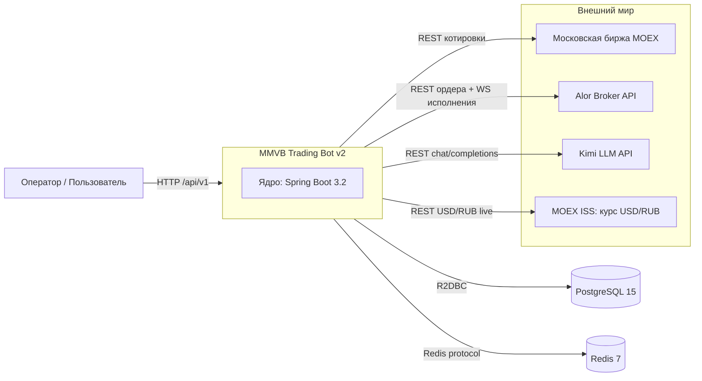
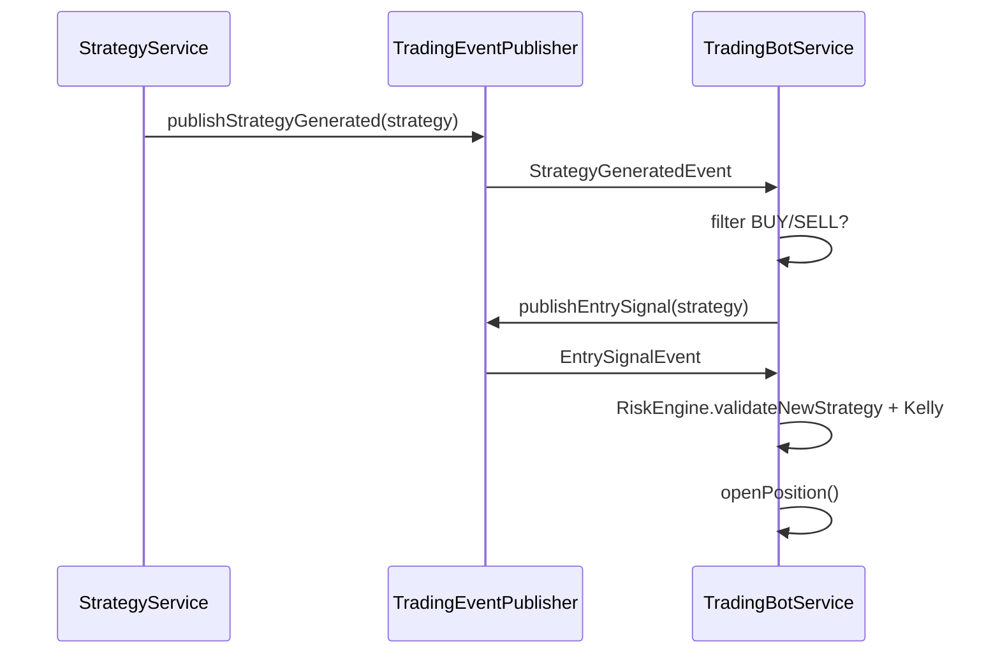
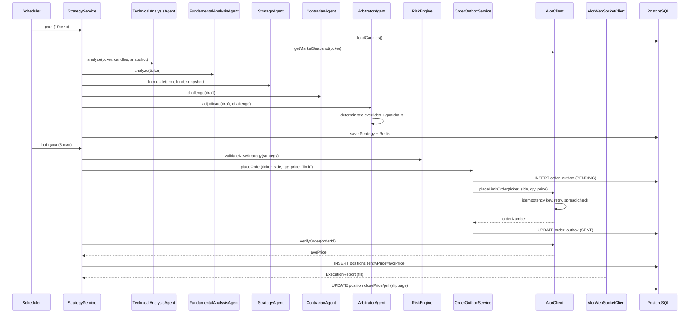
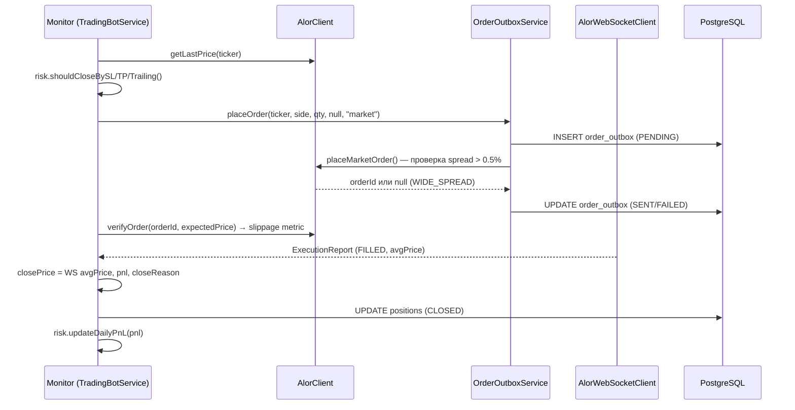
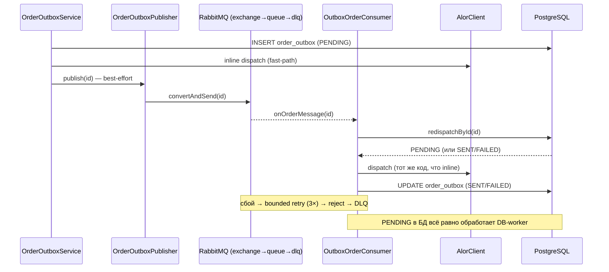
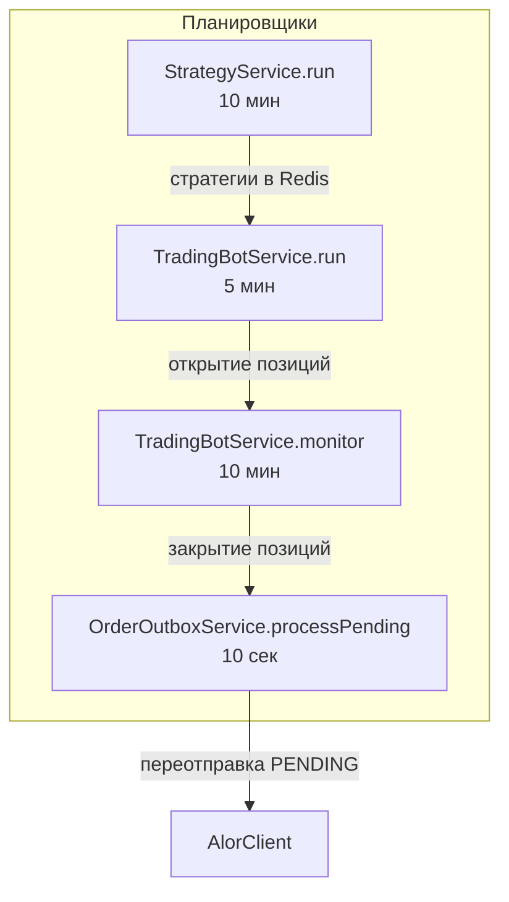

# 2. Архитектура системы

## 2.1. Общая схема (C4)

### Context-диаграмма



### Container-диаграмма

```mermaid
flowchart TB
    subgraph BOT[MMVB Trading Bot v2 — контейнеры]
        API[ApiController<br/>REST /api/v1]
        SCHED[Schedulers<br/>@Scheduled остаточные]
        EVT[Event-driven слой<br/>TradingEventPublisher<br/>@EventListener]
        AGENTS[Мультиагентный конвейер<br/>6 LLM-агентов]
        LLMINF[LLM Infrastructure<br/>ResilientLlmClient + SemanticCache + Guardrails]
        ALORC[AlorClient REST<br/>+ AlorWebSocketClient]
        MOEXC[MoexClient]
        RISK[RiskManagementService<br/>AdaptiveRiskService]
        TRADE[TradeAnalysisService]
        OUTBOX[OrderOutboxService<br/>+ worker]
        REPOS[Repositories<br/>R2DBC / DatabaseClient]
        REDIS[RedisCacheService]
    end

    API --> SCHED
    API --> AGENTS
    SCHED --> AGENTS
    SCHED --> EVT
    AGENTS --> LLMINF
    AGENTS --> MOEXC
    AGENTS --> ALORC
    AGENTS --> RISK
    AGENTS --> TRADE
    AGENTS --> REDIS
    AGENTS --> REPOS
    EVT --> AGENTS
    SCHED --> OUTBOX
    OUTBOX --> ALORC
    ALORC --> ALOR[Alor Broker]
    ALORC -->|Flow<ExecutionReport>| EVT
    LLMINF --> KIMI[Kimi LLM API]
    MOEXC --> MOEX[MOEX ISS]
    REDIS --> RD[(Redis 7)]
    REPOS --> PG[(PostgreSQL 15)]
```

## 2.2. Слои и организация пакетов

Проект использует **плоскую** структуру пакетов (существующую), поверх которой поэтапно вводится DDD-слоение. Целевая карта слоёв:

| Слой | Целевой пакет | Текущее размещение | Ответственность |
|---|---|---|---|
| `domain/` | `domain/` | `model/` | Чистые сущности и значения (Position, Strategy, Candle, ExecutionReport, ...) без фреймворков |
| `application/` | `application/` | `service/`, `agent/` | Use-cases и оркестрация (StrategyService, TradingBotService, агенты) |
| `infrastructure/` | `infrastructure/` | `client/`, `repository/`, `config/`, `infrastructure/llm/` | Внешние адаптеры: Alor, MOEX, Kimi, БД, Redis, конфигурация |
| `interfaces/` | `interfaces/` | `controller/` | REST API, health checks |

> **Инкрементальный подход**: новые классы сразу создаются в целевых пакетах (например `infrastructure/llm/`), существующие файлы не переносятся, чтобы не ломать историю. Рефакторинг переноса — вне скоупа текущих этапов.

Пакеты сейчас:

```
com.trading.bot
├── agent/            # 6 LLM-агентов
├── backtest/         # BacktestEngine, SimulatedExecution, BacktestResult (+ Metrics)
├── client/           # AlorClient, AlorWebSocketClient, MoexClient, LlmClient
├── config/           # TradingConfig, RiskConfig, AlorConfig, LlmConfig, MacroConfig
├── controller/       # ApiController
├── event/            # Events, TradingEventPublisher (event-driven слой)
├── infrastructure/llm/ # ResilientLlmClient, LlmRequestQueue, SemanticCache, PromptRegistry, PromptTemplate, Guardrails, LlmResponse
├── model/            # все сущности (Position, Strategy, Candle, Reports, Enums, ...)
├── repository/       # R2DBC-репозитории (DatabaseClient)
└── service/          # StrategyService, TradingBotService, RiskManagementService, ...
```

## 2.3. Event-driven архитектура

Бот построен на **гибридной схеме**: критичные операции (вход/выход, исполнение ордеров) переведены на event-driven слой, периодические фоновые задачи (poll котировок, outbox retry) остаются на `@Scheduled`.

> **Статус**: событийный слой реализован (пакет `com.trading.bot.event`, обработчики — `@EventListener` в сервисах). Ранее планировался — реализован в рамках этапа event-driven рефакторинга.

### События (`event/Events.kt`)

| Событие | Издатель | Подписчик | Payload |
|---|---|---|---|
| `PriceChangedEvent` | `TradingEventPublisher.publishPriceChanged` | `TradingBotService.onPriceChanged` (мониторинг SL/TP/trailing) | ticker, price, ts |
| `StrategyGeneratedEvent` | `StrategyService` (после сохранения) | `TradingBotService.onStrategyGenerated` | Strategy |
| `EntrySignalEvent` | `TradingBotService.onStrategyGenerated` (при BUY/SELL) | `TradingBotService.onEntrySignal` (RiskEngine + открытие) | Strategy |
| `ExecutionReportEvent` | WS-fill / `AlorWebSocketClient` | `TradingBotService.onExecutionReport` | ExecutionReport |

```kotlin
data class PriceChangedEvent(val ticker: String, val price: BigDecimal, val timestamp: Instant = Instant.now())
data class StrategyGeneratedEvent(val strategy: Strategy)
data class EntrySignalEvent(val strategy: Strategy)
data class ExecutionReportEvent(val report: ExecutionReport)
```

### Издатель (`event/TradingEventPublisher.kt`)

Синхронная публикация через `ApplicationEventPublisher` — обработчики гарантированно получают событие в том же потоке/транзакции:

```kotlin
@Component
class TradingEventPublisher(private val publisher: ApplicationEventPublisher) {
    fun publishPriceChanged(ticker: String, price: BigDecimal) { publisher.publishEvent(PriceChangedEvent(ticker, price)) }
    fun publishStrategyGenerated(strategy: Strategy)            { publisher.publishEvent(StrategyGeneratedEvent(strategy)) }
    fun publishEntrySignal(strategy: Strategy)                  { publisher.publishEvent(EntrySignalEvent(strategy)) }
    fun publishExecutionReport(report: ExecutionReport)         { publisher.publishEvent(ExecutionReportEvent(report)) }
}
```

### Обработчики в `TradingBotService`

| Метод | Событие | Действие |
|---|---|---|
| `onPriceChanged` | `PriceChangedEvent` | обновление `currentPrice`, проверка SL/TP/trailing, при необходимости `closePosition` |
| `onStrategyGenerated` | `StrategyGeneratedEvent` | фильтр `action == BUY/SELL` → `publishEntrySignal` |
| `onEntrySignal` | `EntrySignalEvent` | `risk.validateNewStrategy` + Kelly + открытие позиции |
| `onExecutionReport` | `ExecutionReportEvent` | фиксация `closePrice`/`closeReason`/P&L + slippage метрика |

### Поток стратегия → позиция через события



### Остаточный `@Scheduled`

Детерминированные циклы, которые не переводились на события:

| Метод | Интервал | Задача |
|---|---|---|
| `TradingBotService.pollMarketData` | `bot-interval-ms` (5 мин) | загрузка котировок, публикация `PriceChangedEvent` |
| `StrategyService.run` | `strategy-interval-ms` (10 мин) | конвейер агентов → сохранение стратегии + событие |
| `TradingBotService.monitor` | `monitor-interval-ms` (10 мин) | фоновый мониторинг позиций (SL/TP/trailing) |
| `OrderOutboxService.processPending` | 10 сек | переотправка PENDING ордеров |

### Шина данных между циклами (Redis)

Независимо от событий, стратегия, сгенерированная в 10:00, доступна боту до истечения TTL 15 минут даже если циклы не совпадают по времени: ключ `strategy:<ticker>` с TTL 15 мин. Это резервный механизм доставки на случай, если event-обработчик пропущен (например, из-за рестарта между публикацией и потреблением).

### Гарантии и идемпотентность

| Аспект | Механизм |
|---|---|
| Пропуск события | Redis `strategy:<ticker>` TTL 15 мин как бэкап |
| Повторная обработка ExecutionReport | идемпотентность по `alorOrderId` (БД) |
| Двойной ордер | idempotency key в запросе Alor + outbox (одна PENDING-строка) |
| Синхронность | ApplicationEventPublisher — тот же поток, порядок событий сохраняется |

## 2.4. Поток данных при открытии позиции

Пошагово, с таймингами (значения по умолчанию):

| # | Шаг | Компонент | Детали | Когда |
|---|---|---|---|---|
| 1 | Тик цены | AlorClient.getMarketSnapshot() | REST `GET /md/v2/Securities/MOEX/{ticker}/quotes` | каждые 5 мин (bot) / 10 мин (strategy) |
| 2 | Загрузка свечей | StrategyService.loadCandles() | сначала PostgreSQL, если < 50 свечей — MOEX ISS | каждые 10 мин |
| 3 | Индикаторы | IndicatorCalculator | RSI(14), ATR(14), MACD(12/26/9), Bollinger(20,2σ), EMA(12/26) | в цикле |
| 4 | Агент 1 | TechnicalAnalysisAgent | LLM + детерминированный baseline | в цикле |
| 5 | Агент 2 | FundamentalAnalysisAgent | LLM + макро-контекст (USD/RUB live) | в цикле |
| 6 | Агент 3 | StrategyAgent | Draft (action/target/qty/SL/TP) + guardrails | в цикле |
| 7 | Агент 4 | ContrarianAgent | ChallengeReport (riskLevel LOW..CRITICAL) | в цикле |
| 8 | Агент 5 | ArbitratorAgent | детерминированные overrides → LLM → post-guardrails → Final | в цикле |
| 9 | RiskEngine | TradingBotService.openPosition() | validateNewStrategy + Kelly size | при BUY/SELL |
| 10 | Ордер | OrderOutboxService.placeOrder() | outbox PENDING → AlorClient.placeLimitOrder (idempotency key) → SENT | при входе |
| 11 | Проверка | AlorClient.verifyOrder() | avgPrice → entryPrice позиции | после ордера |
| 12 | Исполнение | AlorWebSocketClient | ExecutionReport → applyExecutionReport | в реальном времени |
| 13 | Сохранение | PositionRepository.save() | запись позиции в PostgreSQL | сразу |



## 2.5. Поток данных при закрытии позиции

Закрытие по трём причинам:

1. **STOP_LOSS / TAKE_PROFIT / TRAILING_STOP** — в `TradingBotService.monitor()` (каждые 10 мин):
   - `price = alorClient.getLastPrice(ticker)`
   - проверка `risk.shouldCloseBySL/TP/Trailing(pos, price)`
   - вызов `closePosition(pos, price, reason)`
2. **STRATEGY_CLOSE** — если Redis-стратегия для тикера имеет `action == CLOSE`.
3. **EXECUTION_FILL** — фактическое закрытие по WS (фиксирует реальную цену исполнения в `closePrice`).



## 2.6. RabbitMQ-транспорт outbox (roadmap v2.3, раздел 13.8.4)

**Функция — дополнительный канал доставки**, не замена: при сохранении ордера
`OrderOutboxService` (placeOrder/placeCancelOrder) помимо синхронного inline-dispatch
вызывает `OrderOutboxPublisher`, который best-effort публикует id строки в очередь.
`OutboxOrderConsumer` забирает сообщение и диспетчирует через тот же
`OrderOutboxService.redispatchById` (PENDING → dispatch, SENT → ack, FAILED → ack без
переотправки) — единый диспетчер, гарантии идемпотентности не меняются. DB-worker
(`processPending`) остаётся фолбэком; источник истины — строка в `order_outbox`.



Включение: `app.outbox.rabbitmq.enabled=true` (+ `spring.rabbitmq.*`). Выключено по
умолчанию — поведение идентично до-RabbitMQ. Ack — AUTO (контейнер сам подтверждает/
отклоняет), `defaultRequeueRejected=false` → poison-сообщения паркуются в DLQ. См.
подробности и обоснование в разделе 13.8.4.

## 2.7. Singleton constraint: почему бот в 1 реплике

**Проблема**: бот принимает торговые решения и исполняет ордера. Две реплики = два независимых мозга, которые могут:

- открыть **две позиции** по одному сигналу (`openPosition` проверяет `open.any { it.ticker == strat.ticker }` в памяти каждого пода — но оба пода увидят пустую БД одновременно);
- **дважды** отправить ордер на один сигнал (если нет общей блокировки);
- **дважды** обработать ExecutionReport (идемпотентность по `alorOrderId` в БД спасает, но создаёт лишние UPDATE-запросы).

**Решение** (целевое):

1. `Deployment replicas: 1` и `strategy: Recreate` (см. раздел 10) — основной барьер.
2. БД как **единый источник правды** для позиций: `openPosition()` должен использовать атомарный `INSERT ... WHERE NOT EXISTS` или `SELECT ... FOR UPDATE` перед открытием.
3. **Идемпотентность ордеров**: idempotency key `ticker|side|qty|price|type|timestamp` в теле запроса Alor — Alor дедуплицирует повторные отправки.
4. **Outbox** как единый канал доставки: строка создаётся один раз (одним потребителем), worker переотправляет только PENDING старше 30 c.
5. **Distributed lock** (реализовано в v2.2, `DistributedLockService`): Redis-лок `SET distributed-lock:<name> <uuid> NX PX ttl` вокруг входа в позицию (`position:<ticker>`) и критических планировщиков (`scheduler:*`, outbox-worker, strategy cycle, poll, reconciles, force close). Включается флагом `distributed-lock.enabled`; в single-instance лок не используется. См. roadmap, раздел 13.7.5.

Текущее состояние: одна реплика (один Spring Boot), но механизмы идемпотентности (outbox, idempotency key, `findByAlorOrderId`) и distributed lock уже заложены — включение флага `DISTRIBUTED_LOCK_ENABLED=true` позволяет запустить несколько реплик без гонок.

## 2.8. Ключевые потоки управления


