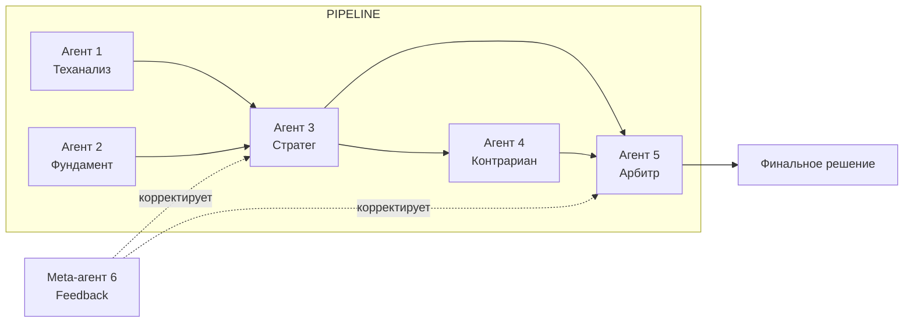
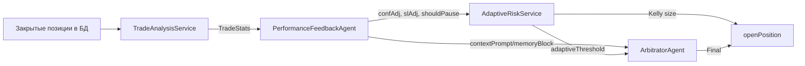

# 3. Мультиагентный конвейер (LLM Brain)

## 3.1. Философия: зачем 6 агентов вместо одного промпта

Один большой промпт «проанализируй и скажи, что делать» даёт нестабильные результаты:

- LLM смешивает роли: аналитик не должен принимать торговые решения, а риск-менеджер не должен читать графики.
- Контекст в одном промпте превышает окно внимания модели — модель «забывает» ранние данные.
- Нет контроля каждой стадии: невозможно отдельно логировать, кэшировать и защищать каждый шаг.
- Нельзя применить **разные** guardrails к разным стадиям (например, критиковать сделку — одно правило, финальный вердикт — другое).

Разделение на агентов даёт **конвейер ответственности** (pipeline of responsibility): каждый агент выполняет узкую задачу, имеет собственный промпт, собственные метрики и собственные страховки. Ошибка одного агента не приводит к неверному финалу — арбитр и guardrails подстрахуют.



**Важное правило**: LLM — это «мозг», но не «руки». Всё исполнительное (ордера, риск, БД) — детерминированный Kotlin-код. Агенты возвращают **строгий JSON**, который парсится и проходит guardrails.

## 3.2. Детальное описание каждого агента

Все агенты реализованы в `com.trading.bot.agent` и используют единый интерфейс вызова `ResilientLlmClient.complete(...)`. Каждый агент пишет `AgentLog` в БД (таблица `agent_logs`) и инкрементит метрику `agent.<name>.decision`.

Общая последовательность работы агента:

```kotlin
val prompt = promptRegistry.getTemplate("<name>", version)
val resp = llmClient.complete(agent = "<name>", ticker = ticker, prompt = prompt,
    variables = variables, fingerprint = fingerprint, temperature = T)
// fallback → детерминированный результат
// иначе → парсинг JSON → guardrails → log + return
```

---

### Agent 1: TechnicalAnalysisAgent (`TechnicalAnalysisAgent.kt`)

**Роль**: превратить массив свечей в вердикт о направлении движения цены.

**Входные данные**:
- `candles: List<Candle>` — 10-минутные свечи (минимум 30, иначе `INSUFFICIENT_DATA`);
- `snapshot: MarketSnapshot` — текущая цена, объём;
- `cycleId: String` — для трассировки;
- `version` — версия промпта (default/conservative/aggressive).

**Предрасчёт индикаторов** (`IndicatorCalculator.calculate`):

| Индикатор | Формула (как в коде) | Период |
|---|---|---|
| RSI | `100 - 100/(1+RS)`, RS = avgGain/avgLoss, сглаживание Уайлдера | 14 |
| ATR | средний True Range `max(H−L, |H−prevC|, |L−prevC|)`, сглаживание Уайлдера | 14 |
| MACD | `ema12 - ema26` (линия), EMA9 от линии (сигнал), гистограмма = линия − сигнал | 12/26/9 |
| Bollinger | среднее ± 2σ по скользящему окну | 20, 2σ |
| Тренд | `ema12 > ema26 → "UP"`, `< → "DOWN"`, иначе `"SIDEWAYS"` | 12/26 |

Детерминированный вывод (`conclusion`): `RSI<30 && close<=BB_lower → BULLISH`; `RSI>70 && close>=BB_upper → BEARISH`; иначе по знаку MACD-гистограммы.

**Промпт**: файл `prompts/technical-analysis.yml`, переменные: `ticker, currentPrice, rsi, atr, macdHistogram, bbLower, bbMiddle, bbUpper, trend, volume, timeframe`. Системный промпт требует строго JSON: `{"conclusion":"BULLISH|BEARISH|NEUTRAL","confidence":0.0,"reasoning":"string"}`.

**Кэширование**: fingerprint = `цена(1 знак) + RSI(int) + trend + volatilityRegime`. Режим волатильности: ATR% от цены `< 1.0 → LOW`, `< 2.5 → MEDIUM`, иначе `HIGH`.

**Fallback** (LLM недоступен): возвращается детерминированный `baseline` — `conclusion` по индикаторам, `confidence = 0.55`. Метрика `llm.fallback.activated{agent="technical"}`.

**Выход**: `TechnicalReport(trend, rsi, atr, macd, bbUpper, bbLower, conclusion, confidence, reasoning)`.

**Латентность**: типичная 1–3 c, пиковая 30 c (таймаут). SLA в контексте цикла: 10-минутный цикл — запас огромный.

**Guardrails**: `INSUFFICIENT_DATA` (свечей < 30) или `confidence < 0.5` → StrategyAgent сразу вернёт HOLD без LLM.

---

### Agent 2: FundamentalAnalysisAgent (`FundamentalAnalysisAgent.kt`)

**Роль**: оценить макроэкономический фон тикера.

**Входные данные**:
- `ticker`;
- макро-контекст из `MacroContextService.fetch()`:
  - `cbrRate` — ключевая ставка ЦБ (из конфига `macro.cbr-rate`, env `CBR_RATE`);
  - `brentPrice` — нефть Brent (конфиг `macro.brent-price`, env `BRENT_PRICE`);
  - `usdRub` — **живой** курс с MOEX ISS (`USD000UTSTOM`, валютная секция), при ошибке — конфиг `macro.usd-rub`.

**Промпт**: `prompts/fundamental-analysis.yml`. Выход: `{"conclusion":"BULLISH|BEARISH|NEUTRAL","confidence":0.0,"reasoning":"string"}`.

**Частота обновления**: каждый цикл стратегии (10 мин). Live USD/RUB — каждое обращение к MOEX ISS (таймаут 5 c). Кэша нет — стоимость вызова мала, но в roadmap есть кэш макро на 4 часа (раздел 13).

**Fallback**: `FundamentalReport(conclusion="NEUTRAL", confidence=0.0, reasoning="LLM unavailable")`.

**Особенность**: не использует semantic cache (макро-контекст меняется редко, но переменные для fingerprint не построены).

---

### Agent 3: StrategyAgent (`StrategyAgent.kt`)

**Роль**: сформулировать черновую сделку (Draft) на основе теха + фундамента.

**Входные данные**: `tech: TechnicalReport`, `fund: FundamentalReport`, `snapshot`, `adaptiveThreshold` (порог уверенности от AdaptiveRiskService).

**Guardrails ДО LLM-вызова**:
- `tech.conclusion == "INSUFFICIENT_DATA"` или `tech.confidence < 0.5` → **HOLD** без вызова LLM, `overrideReason = "GUARDRAIL: INSUFFICIENT_TECH_DATA"`. Экономия токенов и защита от «аналитик без данных».

**Промпт**: `prompts/strategy.yml` (3 версии). Переменные: `ticker, currentPrice, techConclusion, techConfidence, techTrend, techRsi, techReasoning, fundConclusion, fundConfidence, fundReasoning`. Выход JSON: `{"action":"BUY|SELL|HOLD","targetPrice":0.0,"quantity":0,"stopLoss":0.0,"takeProfit":0.0,"trailingStop":false,"confidence":0.0,"reasoning":"string"}`.

**Кэширование**: fingerprint `цена + rsi + trend + "technical"` — семантический: одна и та же рыночная ситуация не гоняет LLM повторно.

**Fallback**: HOLD с причиной "LLM unavailable".

**Post-processing Guardrails** (`Guardrails.apply`):
- HOLD → как есть;
- `riskLevel == CRITICAL` → HOLD;
- дневной лимит убытка → HOLD;
- `confidence < adaptiveThreshold` → HOLD (`GUARDRAIL: LOW_CONFIDENCE`);
- `quantity <= 0` → HOLD (`GUARDRAIL: ZERO_QUANTITY`);
- отклонение `targetPrice` от рыночной цены > 3% → скорректировать до рыночной (`GUARDRAIL: PRICE_DEVIATION`).

**Взаимодействие с MarketRegime**: LLM-агенты сами по себе не получают `MarketRegime` (LOW/NORMAL/VOLATILE/STRESS) — он вычисляется детерминированно вне LLM-пути: рыночный overlay по RVI (`MarketRegimeService`) и per-ticker режим (`RegimeDetector` → `PerTickerRegime`, направление × волатильность × ликвидность + Crash/Pump) вычисляются в `StrategyService`, управляют выбором стратегий (`StrategySelector`/`StrategyRunner`), блокируют входы при CRASH/PUMP/THIN/EXTREME и урезают размер позиции (`AdaptiveRiskService`). В промпт агентов по-прежнему передаются `trend` (UP/DOWN/SIDEWAYS) и `volatilityRegime` (LOW/MEDIUM/HIGH_VOLATILITY по ATR%) как неявное описание режима (см. 5-ю главу).

**Выход**: `Draft(action, targetPrice, quantity, stopLoss, takeProfit, trailingStop, confidence, reasoning)`.

---

### Agent 4: ContrarianAgent (`ContrarianAgent.kt`)

**Роль**: «адвокат дьявола». Найти слабые места предложенной сделки.

**Guardrail оптимизации**: если `draft.action == HOLD` — LLM **не вызывается**, возвращается `ChallengeReport(isValid=true, riskLevel="LOW", critique="No position proposed", confidence=1.0)`. Экономит токены: критика не нужна, если сделки нет.

**Промпт**: `prompts/contrarian.yml`. Переменные: `action, quantity, targetPrice, strategyReasoning, techConclusion, techConfidence, techReasoning, fundConclusion, fundConfidence, currentPrice, trend, rsi, atr`. Выход JSON: `{"isValid":true,"riskLevel":"LOW|MEDIUM|HIGH|CRITICAL","critique":"string","confidence":0.0}`.

**Уровни риска**:
| Уровень | Значение | Действие арбитра |
|---|---|---|
| LOW | сделка выглядит безопасно | пропустить |
| MEDIUM | есть риски | учесть в LLM-арбитраже |
| HIGH | существенные риски | арбитр учтёт, консервативный режим → HOLD |
| CRITICAL | явная опасность (gap, сбой ликвидности, экстремальная волатильность) | **детерминированный HOLD** |

**Fallback**: `ChallengeReport(isValid=true, riskLevel="LOW", critique="LLM unavailable", confidence=0.5)` — бот не блокирует торговлю из-за недоступности критика.

**Выход**: `ChallengeReport(isValid, riskLevel, critique, confidence)`.

---

### Agent 5: ArbitratorAgent (`ArbitratorAgent.kt`)

**Роль**: финальный судья. Принимает Draft стратега и Challenge контрариана, выдаёт Final.

**Deterministic Overrides** — выполняются ДО LLM, не подлежат обсуждению:

| # | Условие | Результат | `overrideReason` |
|---|---|---|---|
| 1 | `challenge.riskLevel == "CRITICAL"` | HOLD | `DETERMINISTIC: CRITICAL_CHALLENGE` |
| 2 | `riskContext.shouldPause` (адаптивная пауза) | HOLD | `DETERMINISTIC: RISK_CONTEXT_PAUSE` |
| 3 | `riskContext.dailyLossLimitReached` | HOLD | `DETERMINISTIC: DAILY_LOSS_LIMIT` |
| 4 | `draft.action == HOLD` | HOLD (без LLM) | null |
| 5 | `draft.confidence < adaptiveConfidence` | HOLD | `DETERMINISTIC: LOW_DRAFT_CONFIDENCE` |

Метрика: `arbitrator.deterministic.override{reason=<...>}`.

**LLM-арбитраж** (если overrides не сработали): промпт `prompts/arbitrator.yml`. Переменные: `action, targetPrice, quantity, confidence, strategyReasoning, riskLevel, critique, techConclusion, techTrend, techRsi, fundConclusion, currentPrice, adaptiveThreshold, memoryBlock`.

**memoryBlock** — контекст памяти из Meta-агента (`PerformanceFeedbackAgent.StrategyFeedback.contextPrompt`): результаты последних сделок по тикеру. Передаётся отдельной секцией `CONTEXT MEMORY (recent trades results):`.

**Post-processing Guardrails** (после LLM): те же, что у StrategyAgent, плюс передаются `riskLevel` и `dailyLossLimitReached`.

**Fallback**:
- LLM недоступен → HOLD с `overrideReason = "FALLBACK: LLM_UNAVAILABLE"`;
- parse error → HOLD с `overrideReason = "FALLBACK: PARSE_ERROR"`, метрика `agent.arbitrator.parse.error`.

**OverrideReason** записывается в `AgentLog.overrideReason` и в `Strategy.rawJson`.

**Выход**: `Final(action, targetPrice, quantity, stopLoss, takeProfit, trailingStop, confidence, reasoning, overrideReason)`.

---

### Agent 6: PerformanceFeedbackAgent (`PerformanceFeedbackAgent.kt`)

**Роль**: Meta-агент. Анализирует статистику закрытых сделок и корректирует поведение downstream-агентов.

**Порядок работы**:
1. `stats = tradeAnalysisService.analyzeLastNDays(14)[ticker]`.
2. **Guardrail**: если сделок < 5 (`stats == null || totalTrades < 5`) → **rule-based** feedback без LLM (`feedback.rule_based{reason=LOW_TRADES}`).
3. Вычисляется `statsHash` (SHA-256 от `ticker:totalTrades:winRate:slHitRate:tpHitRate`).
4. **Кэш в Redis** (`feedback:<ticker>`, TTL 60 мин): если `statsHash` совпадает с прошлым — возвращается кэш (`feedback.cache.hit`), иначе `miss`.
5. LLM-анализ: промпт `prompts/performance-feedback.yml`.
6. Результат сохраняется в Redis и в `strategy_adjustments`, пишется `AgentLog` с `cycleId="META"`.

**Rule-based fallback** (детерминированные правила):

| Условие | Действие |
|---|---|
| `maxConsecutiveLosses >= 3` | `shouldPauseTrading = true` |
| `winRate < 35%` | `confidenceAdjustment = +0.15` (повышаем порог входа — входить только при большей уверенности) |
| `slHitRate > 60%` | `slAdjustmentPercent = +0.20` (расширяем стоп) |
| иначе | без изменений |

**Выход**: `StrategyFeedback(ticker, confidenceAdjustment, slAdjustmentPercent, tpAdjustmentPercent, contextPrompt, agentSpecificNotes, shouldPauseTrading, rawJson)`.

**Как влияет на downstream**:
- `shouldPauseTrading=true` → StrategyService пропускает тикер целиком (`strategy.skipped`, пауза также дублируется в `adaptiveRisk.shouldPauseTrading`);
- `contextPrompt` → встраивается в промпт арбитра как `memoryBlock`;
- корректировки сохраняются в `strategy_adjustments` (таблица) и видны через `GET /api/v1/analytics/adjustments`.

**Blind Spot Detection**: не в этом агенте, а в `TradeAnalysisService.detectAndPersistBlindSpots`:
- доля SL-закрытий среди убыточных > 60% → слепое пятно «стоп слишком близко»;
- вход в конкретный час с ≥ 3 убыточными сделками → слепое пятно «не входить в HH:00».
Записываются в таблицу `blind_spots` (active=true), показываются через `GET /api/v1/analytics/blind-spots`.

---

## 3.3. Prompt Registry

### Структура YAML-файлов

Файлы лежат в `src/main/resources/prompts/`. Имя файла = имя промпта.

```yaml
# prompts/strategy.yml
prompts:
  default:                 # <-- версия
    system: >              # system-промпт (роль, правила, формат)
      Ты — стратег алгоритмического торгового бота...
    user_template: >       # шаблон пользовательского сообщения с {{переменными}}
      ТИКЕР: {{ticker}}
      Текущая цена: {{currentPrice}}
      ...
  conservative:            # <-- ещё версия
    system: >              # консервативная: входить при согласии всех сигналов
      ...
    user_template: >       # шаблон консервативной версии
      ...
  aggressive:              # <-- ещё версия
    system: >              # агрессивная: допускать вход по одному сигналу
      ...
    user_template: >       # шаблон агрессивной версии
      ...
```

### Версионирование

| Версия | Константа | Философия |
|---|---|---|
| `default` | `PromptRegistry.DEFAULT_VERSION` | сбалансированный режим |
| `conservative` | `CONSERVATIVE_VERSION` | входить только при согласии всех сигналов, чаще HOLD |
| `aggressive` | `AGGRESSIVE_VERSION` | допускать вход по одному сильному сигналу |

Переключение версии — параметр `version` в методах агентов (по умолчанию `default`). Глобальный переключатель версии из env — задача roadmap.

### Hot-reload через Kubernetes ConfigMap

`PromptRegistry.load()` — `@Synchronized`, перечитывает `classpath:prompts/*.yml` с очисткой кэша. В k8s промпты монтируются из **ConfigMap** в `/workspace/prompts` (см. раздел 10). Чтобы Spring видел файлы вне jar, в `application.yml` подключается `spring.config.additional-location=file:/workspace/` (roadmap). Текущая загрузка — classpath.

### Шаблонизация `{{variable}}`

`PromptTemplate` парсит `{{...}}` и компилирует в список Literal/Variable (`compile()`). Отсутствующие переменные подставляются пустой строкой. Скомпилированные шаблоны кэшируются в `ConcurrentHashMap`.

```kotlin
prompt.renderSystem(variables)   // system-промпт с переменными
prompt.renderUser(variables)     // user-шаблон с переменными
```

## 3.4. LLM Infrastructure

### ResilientLlmClient (`infrastructure/llm/ResilientLlmClient.kt`)

Единая точка доступа к LLM. Обвязка:

| Слой | Механизм | Конфиг (application.yml) |
|---|---|---|
| Retry (внутренний) | `resilience4j.retry.instances.llm`, экспоненциальный backoff 1s→2s→4s, 3 попытки | `retry` |
| Rate Limiter | `resilience4j.ratelimiter.instances.llm`: 20 запросов/60 с, timeout 5 с | `ratelimiter` |
| Circuit Breaker (внешний) | `resilience4j.circuitbreaker.instances.llm`: окно 10, порог 50%, open на 20 с | `circuitbreaker` |
| Очередь запросов | `LlmRequestQueue` (Kotlin Channel): FIFO, максимум параллельных вызовов = `queue-concurrency`, ожидание слота не блокирует поток | `llm.queue-capacity`, `llm.queue-concurrency` |
| HTTP | WebClient + Reactor Netty, connect timeout 5 с, response timeout 30 с | `llm.timeout-sec` |
| Semantic Cache | Redis поверх всех вызовов (см. ниже) | `llm.semantic-cache-*` |
| Fallback | `LlmResponse.fallback(reason)` — JSON NEUTRAL/0.0 | — |

Декор-порядок в коде: `queue { retry { rateLimiter { circuitBreaker { callLlm(...) } } } }`.

Запрос к Kimi (`POST {llm.base-url}/chat/completions`):

```json
{
  "model": "kimi-k3",
  "messages": [
    {"role": "system", "content": "<system>"},
    {"role": "user", "content": "<user>"}
  ],
  "temperature": 0.15,
  "max_tokens": 4096,
  "response_format": {"type": "json_object"}
}
```

Метрики: `llm.latency{agent}`, `llm.tokens.used{agent,model}`, `llm.fallback.activated{agent,reason}` (NO_API_KEY, CALL_ERROR).

### Fallback-поведение

| Ситуация | Результат |
|---|---|
| `llm.api-key` пуст | мгновенный fallback `NO_API_KEY` (не тратим сеть) |
| CB открыт / RL сработал / retry исчерпан / таймаут | `fallback("CALL_ERROR")` |
| LLM вернул пустой контент | `IllegalStateException` → fallback |

Все агенты на fallback отвечают детерминированно (NEUTRAL/baseline/HOLD) — **торговля не останавливается**.

### SemanticCache (`infrastructure/llm/SemanticCache.kt`)

| Аспект | Значение |
|---|---|
| Ключ | `llm:semantic:` + SHA-256(`agent:ticker:fingerprint`) |
| Fingerprint | `price.setScale(1) + ":" + rsi.roundToInt() + ":" + trend + ":" + volatilityRegime` |
| TTL | `llm.semantic-cache-ttl-minutes` (10 мин) |
| Хранит | сериализованный `LlmResponse` (JSON), флаг `fromCache=true` при попадании |
| Отключение | `llm.semantic-cache-enabled: false` |
| Метрики | `llm.cache.hit{agent}`, `llm.cache.miss{agent}`, `llm.cache.error{agent}` |

Пример fingerprint: цена 280.50, RSI 62.9, trend UP, MEDIUM_VOLATILITY → `"280.5:63:UP:MEDIUM_VOLATILITY"`.

**Целевой hit rate**: > 60%. Достигается за счёт того, что 10-минутный цикл при неизменной рыночной ситуации генерирует одинаковый fingerprint.

### Мониторинг стоимости

Стоимость оценивается по метрике `llm.tokens.used{agent,model}` (счётчик суммарных токенов). Оценка бюджета (пример):

- 10 тикеров × 6 агентов × 20 торговых дней.
- Приблизительно 1 500–2 500 входных токенов на вызов (система + user).
- ~1 200 вызовов/день (с кэшем), без кэша до ~4 800.
- Бюджет в день = `llm.tokens.used` за день × цена за 1K токенов модели.

Дневной бюджет как guardrail (стоп-расход) — задача roadmap.

## 3.5. Качество решений (Feedback Loop)



**Как оценивается качество**: `TradeAnalysisService.analyzeLastNDays(days)` по закрытым позициям:

- `winRate = wins / total`;
- `profitFactor = grossProfit / |grossLoss|`;
- `maxConsecutiveLosses`, `avgWin`, `avgLoss`, `avgHoldTimeMinutes`;
- `slHitRate`, `tpHitRate`, `strategyCloseRate`;
- `bestEntryHour` / `worstEntryHour` — win rate по часам входа.

**Метрика `llm.decision.quality`**: в текущей версии не реализована как отдельная метрика; эквивалент — `bot.pnl{ticker}` и статистика P&L по закрытым позициям. Задача — добавить `llm.decision.quality{agent}` как отношение прибыльных решений агента к общим (roadmap).

**Адаптивный порог уверенности** (`AdaptiveRiskService.getAdaptiveConfidenceThreshold`):

| winRate (14 дн) | Порог confidence |
|---|---|
| нет данных | 0.60 |
| < 0.35 | 0.80 |
| < 0.45 | 0.70 |
| > 0.60 | 0.55 |
| иначе | 0.60 |

Механика: проигрываем → требуем от LLM большей уверенности; выигрываем → снижаем порог. Порог передаётся в StrategyAgent (guardrail) и в ArbitratorAgent (детерминированный override LOW_DRAFT_CONFIDENCE).

**Паузы**:
- `AdaptiveRiskService.shouldPauseTrading(ticker)`: `maxConsecutiveLosses >= 4` или `profitFactor <= 0.5 при trades >= 5` → пауза;
- `isInDrawdownRecovery()`: 3+ подряд убыточных за 3 дня → recovery-режим.
