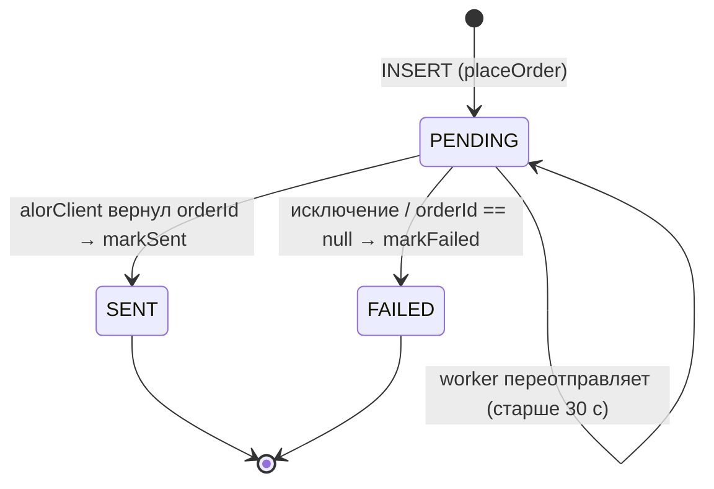
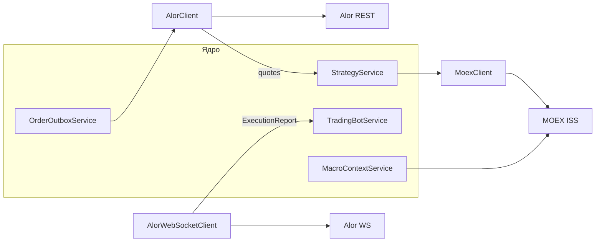
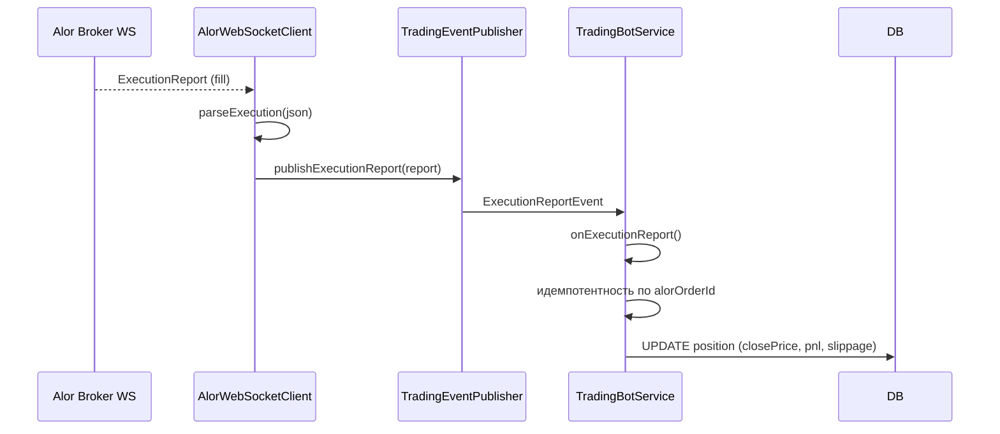

# 4. Интеграции с внешними системами

## 4.1. Alor Broker API

### REST API — используемые endpoints

| Метод | Endpoint | Назначение | Класс |
|---|---|---|---|
| GET | `${alor.api-url}/md/v2/Securities/{exchange}/{ticker}/quotes` | рыночный снимок (lastPrice, bid, ask, volume) | `AlorClient.getMarketSnapshot` |
| POST | `${alor.api-url}/commandapi/warptrans/TRADE/v2/client/orders/actions/limit` | лимитный ордер | `AlorClient.placeLimitOrder` |
| POST | `${alor.api-url}/commandapi/warptrans/TRADE/v2/client/orders/actions/market` | маркет-ордер | (через `placeMarketOrder`) |
| GET | `${alor.api-url}/commandapi/warptrans/TRADE/v2/client/orders/{orderId}?portfolio=...` | проверка статуса ордера | `AlorClient.verifyOrder` |
| POST | `${alor.api-url}/oauth/token` | обновление access token по refresh token | `AlorClient.getActualToken` |

### Авторизация (Bearer + refresh token)

1. Стартовый `accessToken` берётся из конфига `alor.token`.
2. Если `alor.refresh-token` не пуст — при старте и далее до истечения (`expiresIn`) токен обновляется через `POST /oauth/token`:
   ```json
   {"refreshToken": "<alor.refresh-token>"}
   ```
   Ответ: `{"accessToken": "...", "expiresIn": 3600, ...}`.
3. Токен кэшируется в поле `accessToken`, обновляется за 60 с до истечения.
4. Все REST-запросы идут с заголовком `Authorization: Bearer <accessToken>`.
5. При сбое обновления — продолжаем со старым токеном (graceful degradation), логируем warning.

### WebSocket

`AlorWebSocketClient.subscribeToOrders()` возвращает `Flow<ExecutionReport>` (kotlinx.coroutines):

- URL: `${alor.ws-url}?token=...`.
- Подписка: после соединения отправляется JSON:
  ```json
  {
    "opcode": "OrdersGetAndSubscribeV2",
    "guid": "<uuid>",
    "token": "<alor.token>",
    "portfolio": "<alor.portfolio>",
    "exchange": "MOEX",
    "format": "Simple"
  }
  ```
- Входящие сообщения парсятся `parseExecution(json)` в `ExecutionReport(orderId, status, filledQty, avgPrice, ticker, side)`.
- Статус маппится: содержит "fill" → FILLED (если filledQty >= quantity) / PARTIALLY_FILLED; "cancel" → CANCELED; "reject" → REJECTED; иначе NEW/UNKNOWN.
- Цена: `avgFillPrice` → `filledPrice` → `price` (fallback-цепочка).

**Переподключение** (reconnect):
- до **5 попыток**;
- backoff = `попытка * 5 c` (5, 10, 15, 20, 25 c);
- при исчерпании — `alor.ws.disconnected{reason=MAX_ATTEMPTS}` и поток закрывается;
- метрики: `alor.ws.reconnect`, `alor.ws.error`, `alor.ws.closed`, `alor.ws.execution_received`.

**Потребитель**: `TradingBotService.init()` — коллектит `Flow` и применяет fill к позициям (`applyExecutionReport`).

### Idempotency Key

**Формат**: SHA-256(`ticker|side|qty|price|type|epochMillis`), обрезанный до 32 hex-символов.

**Генерация**: `AlorClient.idempotencyKey(...)` — хэш уникален на момент отправки.

**Защита от дублей**:
1. Outbox хранит payload с `idempotencyKey`;
2. при переотправке (worker) **тот же** ключ отправляется снова — Alor дедуплицирует ордера по `id` в теле запроса;
3. в коде: сначала `placeLimitOrder`, только если не удалось — `placeMarketOrder` (вход), но при outbox-потоке это не применяется (вход всегда limit).

### Order Outbox Pattern

**Таблица** `order_outbox` (миграция `003-order-outbox.sql`):

| Колонка | Тип | Описание |
|---|---|---|
| id | UUID PK | идентификатор строки |
| payload | JSONB | тикер, сторона, кол-во, цена, тип, idempotencyKey |
| status | VARCHAR(20) | PENDING / SENT / FAILED |
| alor_order_id | VARCHAR(100) | номер ордера в Alor после успешной отправки |
| created_at | TIMESTAMP | время создания |
| processed_at | TIMESTAMP | время обработки |
| error_message | TEXT | текст ошибки (обрезка до 2000 символов) |

Индекс: `idx_outbox_status_created(status, created_at)` — для быстрого поиска PENDING-строк.

**Жизненный цикл строки** (`OrderOutboxService`):



**Worker** (`processPending`, `@Scheduled(fixedDelay = 10000)`):
- каждые 10 секунд выбирает `findRetryable(maxOrderRetries)` — PENDING старше 30 c и FAILED c retry_count < maxRetries;
- перед повторной отправкой (retryCount > 0) выполняется State Reconciliation (`reconcileOrderByIdempotencyKey`): FOUND → фиксируем orderNumber без повторной отправки, UNKNOWN → пропуск цикла (fail-safe), NOT_FOUND → повторная отправка с тем же ключом;
- переотправляет через `dispatch(outbox)` — тот же код, что и при первичной отправке;
- повторное создание строки исключено: dispatch работает с существующим id.

**Метрики**: `outbox.saved{type}`, `outbox.sent{type}`, `outbox.failed{type}`.

### Slippage control

**Правило для market-ордеров** (`AlorClient.placeMarketOrder`):
- вычисляется `spreadPercent = (ask - bid) / ask`;
- если `spreadPercent > 0.5%` — ордер **блокируется**, метрика `alor.order.blocked{reason=WIDE_SPREAD}`, лог WARN. Защита от покупки/продажи по разорванному стакану;
- при нормальном спреде маркет-ордер исполняется как лимитный по `ask` (buy) / `bid` (sell) — фактически это **лимитированный маркет** (без проскальзывания хуже котировки).

**Фактическая цена из WS**: `TradingBotService.applyExecutionReport()` фиксирует `avgPrice` из `ExecutionReport` в `Position.closePrice` (для закрывающих ордеров) и в `Position.closePrice/pnl` по совпадению `alorOrderId`.

**Метрика проскальзывания**: `AlorClient.recordSlippage(expectedPrice, filledPrice, qty)`:
`slippageRub = |expected - filled| * qty` → `trade.slippage.rub` (counter, приращение в рублях).

**В точке закрытия**: `verifyOrder(orderId, expectedPrice = price)` передаёт ожидаемую цену закрытия; если Alor вернул `filledPrice` — метрика обновляется.

## 4.2. MOEX ISS API

**Назначение**: исторические свечи для технического анализа (fallback, когда в БД < 50 свечей).

**Endpoint**:
```
GET https://iss.moex.com/iss/engines/stock/markets/shares/boards/TQBR/securities/{ticker}/candles.json?interval=10&from=...&until=...
```

**Параметры**:
| Параметр | Значение |
|---|---|
| interval | 10 (минут) — соответствует `trading.timeframe=MINUTE_10` |
| from / until | `yyyy-MM-dd HH:mm:ss`, последние 7 дней |
| columns | begin, open, high, low, close, volume |

**Ограничения rate limit**: MOEX ISS формально не лимитирует, но не рекомендуется > 1 запрос/с на секцию. Бот делает 1 запрос на тикер в цикле (10 тикеров за цикл).

**Кэширование**: свечи сохраняются в PostgreSQL (`candles`, UNIQUE `(ticker, timeframe, time)`); повторные загрузки не дублируются (`existsByTickerAndTimeframeAndTime`). Целевое партиционирование — раздел 6.

**Лимиты**: `takeLast(500)` свечей за раз; таймаут 10 c; при ошибке — `emptyList()` (бота не роняет).

## 4.3. Kimi LLM API (Moonshot AI)

| Аспект | Значение |
|---|---|
| Endpoint | `POST {llm.base-url}/chat/completions` (default `https://api.moonshot.cn/v1`) |
| Модель | `kimi-k3` (default) — `KIMI_MODEL` |
| Температура | 0.15 по умолчанию (агенты переопределяют: technical 0.1, strategy 0.15, arbitrator 0.1) |
| max_tokens | 4096 |
| Формат ответа | `response_format={"type":"json_object"}` — принудительный JSON |
| Auth | `Authorization: Bearer ${KIMI_API_KEY}` |

**Стоимость (пример расчёта)**:

| Параметр | Оценка |
|---|---|
| Вызовов за цикл | 10 тикеров × 4 LLM-агента (tech, fund, strategy, contrarian) + арбитр ≈ 50–60 |
| Вызовов в день (кэш, циклы каждые 10 мин) | ~1 000–1 500 (с semantic cache ~2–3× меньше) |
| Входных токенов на вызов | ~1 500–2 500 |
| Выходных токенов | ~100–300 |
| Токенов в день | ~2–4 млн (с кэшем ~1 млн) |
| Месячный бюджет | ≈ 20–30 млн токенов |

Мониторинг: `llm.tokens.used{agent,model}`.

**Fallback при ошибках (graceful degradation)**:

| Сбой | Поведение |
|---|---|
| Network / 5xx / timeout | Retry (3, экспоненциально) → CB → fallback NEUTRAL/HOLD |
| 429 | Rate Limiter (20/мин) + retry по `TooManyRequests` |
| 400 (Bad Request) | НЕ ретраим (ignoreExceptions) → fallback |
| Пустой контент | `IllegalStateException` → fallback |
| Невалидный JSON в ответе | парсер агента ловит исключение → детерминированный fallback |

## 4.4. Схема интеграций (сводная)



## 4.5. Быстрый старт (интеграции)

1. Зарегистрироваться на `https://www.alor.ru` / получить тестовый контур.
2. Положить `ALOR_TOKEN`, `ALOR_REFRESH_TOKEN`, `ALOR_PORTFOLIO` в env.
3. Проверить котировки: `GET /api/v1/positions` пуст, но в логах `DEBUG` видно `getMarketSnapshot`.
4. `ALOR_TOKEN` пуст + `SIMULATION` → бот работает с фиктивными ценами (100.0).
5. Kimi: `KIMI_API_KEY` + `KIMI_BASE_URL`, проверить через метрики `llm.tokens.used`.

## 4.6. Event-driven интеграция исполнений

WS-поток Alor связан с остальной системой через **событийный слой** (раздел 2.3):



Поток цен:

- `TradingBotService.pollMarketData` (каждые 5 мин) берёт снимок через `AlorClient.getMarketSnapshot` и публикует `PriceChangedEvent`.
- `TradingBotService.onPriceChanged` обновляет `currentPrice` и проверяет SL/TP/trailing для открытых позиций.
- События синхронны (тот же поток) — обработчик гарантированно вызывается после публикации.

## 4.7. Матрица отказов интеграций

| Интеграция | Тип сбоя | Поведение системы | Метрика |
|---|---|---|---|
| Alor REST quotes | 5xx / timeout (10 c) | возвращается fallback-цена (100.0 в SIMULATION), конвейер продолжает | `alor.error` |
| Alor REST ордер | network | outbox остаётся PENDING, worker переотправляет через 30 c | `outbox.failed` |
| Alor REST ордер | отказ брокера (reject) | `markFailed`, лог WARN, позиция не открывается | `alor.order.blocked` |
| Alor WS | обрыв | reconnect до 5 попыток (5–25 c backoff), затем поток закрывается | `alor.ws.disconnected` |
| MOEX ISS candles | timeout / 5xx | `emptyList()`, индикаторы не считаются, агенты получают NEUTRAL | `moex.error` |
| Kimi LLM | network / 5xx | retry (3, exp backoff) → circuit breaker → fallback baseline | `llm.fallback` |
| Kimi LLM | 429 | rate limiter (20/мин) + retry по `TooManyRequests` | `llm.ratelimited` |
| Kimi LLM | 400 | без retry (ignoreExceptions), fallback | `llm.error{status=400}` |
| Redis | недоступен | кэш пропускается, стратегии не кэшируются (БД остаётся источником) | `redis.error` |
| PostgreSQL | недоступен | бот не стартует (источник правды) | — |

Принцип: **ни одна внешняя система не должна ронять бота**. Fallback-значения (цена 100.0, NEUTRAL/HOLD, emptyList) подбираются так, чтобы в худшем случае бот просто не торговал, а не торговал на мусорных данных.

## 4.8. Конфигурация интеграций

| Переменная | Default | Куда применяется |
|---|---|---|
| `ALOR_API_URL` | `https://api.alor.ru` | REST endpoints AlorClient |
| `ALOR_WS_URL` | `wss://api.alor.ru/ws` | WebSocket |
| `ALOR_TOKEN` | пусто | Bearer-авторизация (пусто → SIMULATION fallback) |
| `ALOR_REFRESH_TOKEN` | пусто | автообновление токена через `/oauth/token` |
| `ALOR_PORTFOLIO` | `D12345` | portfolio в командах и подписках WS |
| `ALOR_EXCHANGE` | `MOEX` | биржа в `md/v2/Securities` |
| `MOEX_BASE_URL` | `https://iss.moex.com/iss` | исторические свечи |
| `KIMI_API_KEY` | пусто | `Authorization: Bearer` (пусто → fallback агентов) |
| `KIMI_BASE_URL` | `https://api.moonshot.cn/v1` | `POST /chat/completions` |
| `KIMI_MODEL` | `kimi-k3` | модель |
| `CBR_RATE` | `16.0` | ключевая ставка ЦБ (fallback макро) |
| `BRENT_PRICE` | `75.0` | нефть Brent (fallback макро) |
| `USD_RUB` | `90.0` | курс USD/RUB (fallback макро) |
| `USD_RUB_TICKER` | `USD000UTSTOM` | живой курс с MOEX |

## 4.9. Промышленные требования к интеграциям

### Alor (брокерский контур)

- Обращения к `commandapi` должны идти **только через outbox** — прямое отправление ордеров запрещено (обход гарантии доставки).
- **Ручная ликвидация** позиции должна дублироваться блокировкой новых ордеров: сначала `risk` HOLD, затем рыночный ордер на закрытие.
- Токены доступа хранятся в env/secrets, **не** в коде и не в git-истории.

### MOEX ISS

- Соблюдать вежливый rate limit (≥ 1 c между запросами на секцию). Бот делает 1 запрос/тикер/цикл.
- Все исторические данные **кэшируются в PostgreSQL** — повторный запрос не ходит в сеть (`existsByTickerAndTimeframeAndTime`).
- `from`/`until` — не более 7 дней за один запрос (лимит MOEX), данные сливаются и дедуплицируются.

### Kimi (LLM)

- Включён resilience4j: `circuit-breaker-enabled`, `rate-limiter-enabled`, `retry-enabled` (все `true` по умолчанию).
- **Очередь запросов** (`LlmRequestQueue` на Kotlin Channel): параллельные вызовы ограничены `llm.queue-concurrency` (по умолчанию 2), избыточные встают в FIFO. Защищает от таранов при параллельной обработке тикеров.
- `response_format={"type":"json_object"}` — гарантия структурированного ответа.
- **Семантический кэш** отключается через `LLM_SEMANTIC_CACHE=false`, TTL — `LLM_SEMANTIC_CACHE_TTL` (10 мин).

## 4.10. Диагностика интеграций

| Симптом | Что смотреть |
|---|---|
| Нет котировок | лог `DEBUG com.trading.bot.client`, метрика `alor.error` |
| Ордер застрял PENDING | `SELECT * FROM order_outbox WHERE status='PENDING'` — проверка worker-цикла |
| WS не доставляет fills | `alor.ws.reconnect`, `alor.ws.disconnected{reason=MAX_ATTEMPTS}` |
| LLM отвечает fallback | `llm.fallback`, `llm.circuit_open`, `llm.ratelimited` |
| Пустые свечи | `moex.error`, проверка `SELECT count(*) FROM candles` |
| Нет макро-контекста | `macro.error`, fallback-значения из env |

## 4.11. Требования к секретам и безопасности

| Секрет | Где хранится | Кто имеет доступ |
|---|---|---|
| `ALOR_TOKEN` | env / Kubernetes Secret | только приложение |
| `ALOR_REFRESH_TOKEN` | env / Kubernetes Secret | только приложение |
| `KIMI_API_KEY` | env / Kubernetes Secret | только приложение |
| `DB_PASS` | env / Kubernetes Secret | приложение + DBA |
| `ALOR_PORTFOLIO` | env / Kubernetes Secret | оператор |

Правила:

- Никаких секретов в `application.yml` (только `${VAR:default}` ссылки) и в git-истории.
- Ротация: токены Alor обновляются автоматически через refresh token; `KIMI_API_KEY` — вручную при необходимости.
- В логах секреты не логируются (все клиенты используют `{VAR}` без значения). Проверка: `grep -iE "token|secret|api_key" logs | grep -v "ALOR_TOKEN:"` не должен давать значений.
- Аудит доступа к Secrets: через облачную политику (IAM) — кто читал Secret, виден в аудит-логе.

## 4.12. Чеклист готовности интеграций

- [ ] `ALOR_TOKEN` + `ALOR_REFRESH_TOKEN` в env/Secrets (для LIVE)
- [ ] `KIMI_API_KEY` в env/Secrets (иначе бот не торгует по LLM)
- [ ] `ALOR_PORTFOLIO` корректен для контура (DEMO/LIVE)
- [ ] WS-подписка работает: `alor.ws.execution_received` растёт при исполнениях
- [ ] Outbox: `outbox.saved` = `outbox.sent` (нет накопления PENDING)
- [ ] MOEX ISS доступен: свечи пишутся в `candles`
- [ ] Проверен fallback: остановить Kimi → бот продолжает работать, `llm.fallback.activated` растёт
- [ ] Проверен Slippage control: при искусственном спреде > 0.5% ордер блокируется `WIDE_SPREAD`
