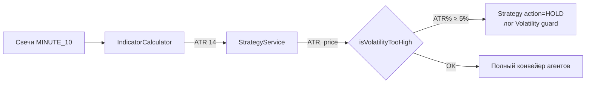
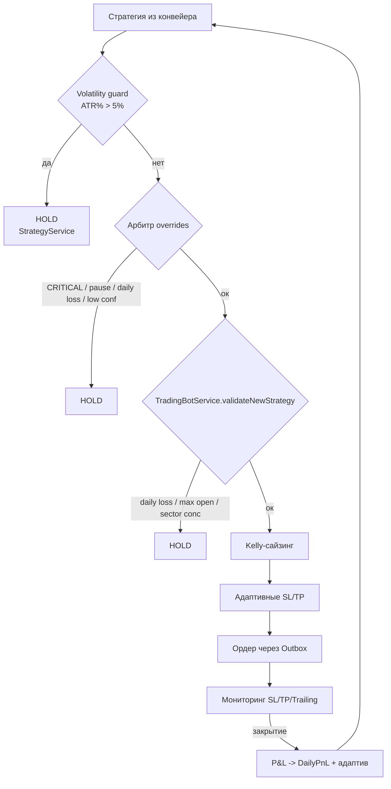
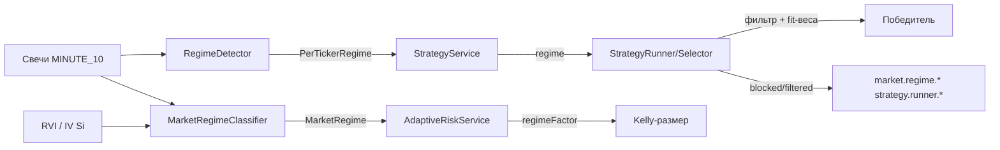

# 5. Risk Management

> ⚠️ Этот раздел описывает **stock-контур** (RiskManagementService, AdaptiveRiskService).
> Фьючерсный контур Si — риск-движок, сайзинг, ликвидация, daily loss limit — см.
> **[раздел 15 — Фьючерсный контур (Si)](15-futures-trading.md)**.

Риск-движок бота реализован в двух сервисах:

- **`RiskManagementService`** (`com.trading.bot.service`) — детерминированные правила входа/выхода: дневной лимит, лимит позиций, секторная концентрация, волатильность, SL/TP/trailing, дневной P&L.
- **`AdaptiveRiskService`** — Kelly-сайзинг, адаптивные SL/TP, динамический порог confidence, паузы по статистике.

Конфигурация — `RiskConfig` (`com.trading.bot.config`), префикс `risk.` в `application.yml`.

## 5.1. RiskConfig — все параметры

| Свойство | Default | Тип | Описание |
|---|---|---|---|
| `risk.enabled` | `true` | Boolean | мастер-выключатель риск-движка |
| `risk.max-position-rub` | `50000` | BigDecimal | максимальный размер позиции в рублях (база для Kelly) |
| `risk.max-daily-loss-rub` | `5000` | BigDecimal | дневной лимит убытка (закрытые сделки) |
| `risk.max-open-positions` | `5` | Integer | максимум одновременных открытых позиций |
| `risk.max-sector-exposure` | `2` | Integer | макс. открытых позиций в одном секторе |
| `risk.max-volatility-percent` | `5.0` | Double | ATR% от цены, выше которого вход запрещён |
| `risk.default-stop-loss-percent` | `2.0` | Double | стоп-лосс по умолчанию, % от цены входа |
| `risk.default-take-profit-percent` | `4.0` | Double | тейк-профит по умолчанию, % от цены входа |
| `risk.trailing-stop-enabled` | `true` | Boolean | трейлинг-стоп включён |
| `risk.trailing-stop-percent` | `1.5` | Double | отступ трейлинг-стопа, % от текущей цены |
| `risk.sectors` | `{}` | Map<String, String> | справочник `ticker -> сектор` |
| `risk.confidence-calibration-enabled` | `true` | Boolean | онлайн-калибровка порога уверенности по исходам сделок (13.11.8) |
| `risk.confidence-calibration-days` | `14` | Integer | окно сбора закрытых сделок тикера, календарных дней |
| `risk.confidence-calibration-min-trades` | `10` | Integer | минимум сделок в выборке `confidence >= c` для калиброванного порога |
| `risk.confidence-calibration-target-win-rate` | `0.55` | Double | целевой win rate отфильтрованной по порогу выборки |
| `risk.confidence-calibration-min-threshold` | `0.50` | Double | нижняя граница поиска порога |
| `risk.confidence-calibration-max-threshold` | `0.85` | Double | верхняя граница поиска порога |
| `risk.confidence-calibration-step` | `0.05` | Double | шаг перебора порога |
| `risk.confidence-sizing-enabled` | `true` | Boolean | масштабирование размера позиции по уверенности сигнала (13.11.9) |
| `risk.confidence-sizing-min-factor` | `0.5` | Double | размер-множитель при confidence == адаптивный порог |
| `risk.confidence-sizing-max-factor` | `1.0` | Double | размер-множитель при confidence >= ceiling |
| `risk.confidence-sizing-ceiling` | `0.90` | Double | уверенность, при которой размер достигает max-factor |

Реализация полей (`RiskConfig.kt`):

```kotlin
@ConfigurationProperties(prefix = "risk")
class RiskConfig {
    var enabled: Boolean = true
    var maxPositionRub: BigDecimal = BigDecimal("50000")   // fallback AUM (см. AumProvider)
    var maxDailyLossRub: BigDecimal = BigDecimal("5000")
    var maxOpenPositions: Int = 1
    var maxSectorExposure: Int = 2
    var maxVolatilityPercent: Double = 5.0
    var defaultStopLossPercent: Double = 2.0
    var defaultTakeProfitPercent: Double = 4.0
    var trailingStopEnabled: Boolean = true
    var trailingStopPercent: Double = 1.0
    var sectors: Map<String, String> = emptyMap()
}
```

> **AUM (активы под управлением)** для Kelly, Gross/Net exposure и Multi-Tier drawdown лимитов
> берётся из `AumProvider` (реальный баланс портфеля Alor, кэш 60с). `maxPositionRub` —
> только fallback (SIMULATION / недоступность Alor / нулевой баланс).

### Справочник секторов по умолчанию

Из `application.yml`:

```yaml
risk:
  sectors:
    SBER: FINANCE
    VTBR: FINANCE
    GAZP: ENERGY
    ROSN: ENERGY
    TATN: ENERGY
    LKOH: ENERGY
    NVTK: ENERGY
    YNDX: IT
    MGNT: RETAIL
    ALRS: METALS
```

> Тикер, отсутствующий в справочнике, получает сектор `UNKNOWN` (см. `sectorOf`). Для `UNKNOWN` секторная проверка работает так же: не более `max-sector-exposure` позиций с сектором `UNKNOWN`.

## 5.2. Порядок риск-проверок перед входом

`RiskManagementService.validateNewStrategy(strategy, openPositions)` возвращает `RiskCheckResult(allowed, reason, adjustedQty)`.

Порядок проверок в методе (порядок важен — при срабатывании первой возвращается отказ):

| # | Guardrail | Условие блокировки | Результат |
|---|---|---|---|
| 1 | Дневной лимит | `dailyPnL <= -maxDailyLossRub` | `allowed=false` + метрика `bot.halted.daily_loss` |
| 2 | Max open positions | `openPositions.size >= maxOpenPositions` | `allowed=false` |
| 3 | Секторная концентрация | `count(sector) >= maxSectorExposure` | `allowed=false` |
| 4 | OK | — | `allowed=true`, `adjustedQty = strategy.quantity` |

Каждая проверка обёрнута в `if (riskConfig.enabled && ...)` — при `risk.enabled=false` все три guardrail отключаются, решение принимает конвейер агентов.

### Логика метода

```kotlin
fun validateNewStrategy(strategy: Strategy, openPositions: List<Position>): RiskCheckResult {
    if (riskConfig.enabled && isDailyLossLimitReached()) {
        return RiskCheckResult(false, "Daily loss limit reached ($dailyPnL <= -${riskConfig.maxDailyLossRub})", 0)
    }
    if (riskConfig.enabled && openPositions.size >= riskConfig.maxOpenPositions) {
        return RiskCheckResult(false, "Max open positions reached (${riskConfig.maxOpenPositions})", 0)
    }
    if (riskConfig.enabled && exceedsSectorExposure(strategy.ticker, openPositions)) {
        val sector = sectorOf(strategy.ticker)
        val count = openPositions.count { sectorOf(it.ticker) == sector }
        return RiskCheckResult(false,
            "Sector concentration exceeded: $count open in sector $sector >= max ${riskConfig.maxSectorExposure}", 0)
    }
    return RiskCheckResult(true, "OK", strategy.quantity)
}
```

### Ранние (невидимые) проверки на уровне агентов

До `validateNewStrategy` сигнал проходит через конвейер агентов, где HOLD выставляется раньше:

- **порог уверенности** — `AdaptiveRiskService.getAdaptiveConfidenceThreshold` → StrategyAgent guardrail + ArbitratorAgent deterministic override;
- **CRITICAL challenge** — контрариан может заблокировать сделку;
- **пауза по статистике** — `shouldPauseTrading` (серия убытков ≥ 4, PF ≤ 0.5);
- **volatility guard** — при ATR% > лимита `StrategyService` формирует стратегию с `action = HOLD` (см. 5.2.2).

## 5.3. Sector Concentration (реализовано)

> **Статус**: реализовано. Ранее (до этапа риск-инжина) проверка была «запланирована» — теперь это третий guardrail в `validateNewStrategy`.

### Назначение

Защита от корреляции: если 5 из 5 открытых позиций — банки (SBER + VTBR + ...), их цены двигаются синхронно, и фактический риск портфеля выше суммы номиналов. Лимит по секторам ограничивает концентрацию в одном секторе.

### Реализация

```kotlin
fun exceedsSectorExposure(ticker: String, openPositions: List<Position>): Boolean {
    val sector = sectorOf(ticker)
    val count = openPositions.count { sectorOf(it.ticker) == sector }
    return count >= riskConfig.maxSectorExposure   // по умолчанию 2
}

fun sectorOf(ticker: String): String =
    riskConfig.sectors[ticker] ?: "UNKNOWN"
```

### Пример

Справочник: SBER и VTBR → FINANCE, `maxSectorExposure = 2`.

- Открыты: SBER, GAZP → новый сигнал VTBR: `count(FINANCE) = 1 < 2` → **разрешено**.
- Открыты: SBER, VTBR → новый сигнал GAZP: `count(ENERGY) = 0 < 2` → **разрешено** (другой сектор).
- Открыты: SBER, VTBR → новый сигнал YNDX: **разрешено** (IT, 0 позиций).
- Открыты: SBER, VTBR → новый сигнал SBER (докатка): `count(FINANCE) = 2 >= 2` → **заблокировано**.
- Открыты: SBER, VTBR → новый сигнал любой третий банк: **заблокировано**.

### Логирование и отказ

При блокировке возвращается `RiskCheckResult(false, "Sector concentration exceeded: 2 open in sector FINANCE >= max 2", 0)`. Отказ виден в логах `com.trading.bot: DEBUG` и не открывает позицию.

## 5.4. Volatility Check (реализовано)

> **Статус**: реализовано. Ранее волатильность учитывалась только через `volatilityRegime` (LOW/MEDIUM/HIGH) в промпте технического агента. Теперь добавлен жёсткий guardrail «ATR% > лимита → запрет входа».

### Назначение

Инструменты с экстремальной волатильностью (ATR% от цены > 5%) ломают и стоп-менеджмент (стоп 2% пробивается обычным шумом), и Kelly-сайзинг. Правило запрещает вход, когда `ATR(14) / цена > max-volatility-percent`.

### Реализация

```kotlin
fun isVolatilityTooHigh(atr: BigDecimal?, price: BigDecimal): Boolean {
    if (!riskConfig.enabled || atr == null || atr <= ZERO || price <= ZERO) return false
    val atrPercent = atr * 100 / price   // в процентах, scale=4
    val result = atrPercent > riskConfig.maxVolatilityPercent   // default 5.0
    logger.info { "Volatility check: ATR%=$atrPercent vs limit=${riskConfig.maxVolatilityPercent}% -> ${if (result) "BLOCK" else "OK"}" }
    return result
}
```

Защиты от дегенеративных входов: `atr == null`, `atr <= 0`, `price <= 0` → всегда `false` (не блокирует).

### Точка вызова — `StrategyService`

Проверка вызывается **до** сборки финальной стратегии (строки 103–109 `StrategyService.kt`):

```kotlin
val atr = BigDecimal.valueOf(tech.atr)
if (riskManagement.isVolatilityTooHigh(atr, snapshot.currentPrice)) {
    logger.warn { "Volatility guard: $ticker ATR=$atr > ${riskConfig.maxVolatilityPercent}%, strategy -> HOLD" }
    // финальная стратегия action=HOLD
}
```

При срабатывании:

- конвейер продолжает работу (агенты выполняются),
- но в `strategyService` сохраняется стратегия с `action = HOLD`,
- трейдер в цикле бота фильтрует не-BUY/SELL, поэтому **новая позиция не открывается**.

Это **мягкий отказ на уровне конвейера** (в отличие от `validateNewStrategy`, который блокирует после финального решения). Именно здесь проверка живёт, потому что ATR известен только после расчёта индикаторов.

### Поток волатильности в системе



## 5.5. Kelly Criterion (`AdaptiveRiskService.calculateOptimalPositionSize`)

Формула (Quarter-Kelly по умолчанию):

```
aum = AumProvider.currentAum()   # реальный баланс из Alor (кэш 60с), fallback — risk.max-position-rub
w = winRate (за 30 дней, Wilson lower bound — шринкейдж при малой выборке)
r = avgWin / |avgLoss| (выигрыш/проигрыш)
kelly = (w * r - (1 - w)) / r
safeKelly = clamp(kelly * kellyFraction, 0.0, 0.10)   # kellyFraction = 0.25 (Quarter), жёсткий кап 10% AUM
base = aum * safeKelly
```

- Без статистики / сделок < `kellyMinTrades` (15): `base = aum * min(kellyNoDataFraction, kellyMaxPositionFraction)`
  (0.15 → ограничено капом 0.10) — консервативный fallback, «жёсткий кап» не обходится.
- База размера — **актуальный AUM** ([AumProvider]), а не конфигурационная константа `maxPositionRub`
  (константа — только fallback в SIMULATION / при недоступности Alor).

**Volatility targeting** (размер зависит от ATR инструмента):

```
atrPercent = ATR * 100 / currentPrice
volMultiplier = clamp(volatilityTargetPercent / atrPercent, 0.25, 2.0)
size = base * volMultiplier
```

| ATR% инструмента | volMultiplier | Пример |
|---|---|---|
| 2% (низкая) | 2.0 | ×2 |
| 4% (целевая) | 1.0 | ×1 |
| 10% (высокая) | 0.4 | ×0.5 |
| 20% (очень высокая) | 0.25 (floor) | ×0.25 |

**Drawdown degradation**: при режиме восстановления после просадки (`isInDrawdownRecovery()`)
итоговый размер ещё умножается на `kellyDrawdownReduction = 0.5`. Итого в просадке
позиции могут быть в 4 раза меньше, чем при Full-Kelly.

- Если сделок < `kellyMinTrades` (15) → `base = aum * min(kellyNoDataFraction, kellyMaxPositionFraction)`
  (консервативный fallback вместо 100% депозита; множители волатильности/просадки применяются).
- Метрика: `adaptive.position_size{ticker}` (gauge).

**Risk-per-trade кап для акций** (`StockEntryProfile.sizePosition`, аналог `FuturesPositionSizer`):

```
riskAmount = aum * riskPerTradePercent / 100          # 1% от AUM
lossPerShare = entryPrice * defaultStopLossPercent / 100   # SL 2%
maxQtyByRisk = floor(riskAmount / lossPerShare)
finalQty = min(kellyQty, maxQtyByRisk);  finalQty < 1 → reject ZERO_RISK_SIZE
```

Т.е. убыток при срабатывании стопа по акциям не может превысить `riskPerTradePercent`% от AUM —
двойная защита от оверсайзинга вместе с капом Kelly 0.10.

**Применение в `StockEntryProfile.sizePosition`** (акции):

```
kellyQty = floor(kellySizeRub / entryPrice)
finalQty = min(kellyQty, maxQtyByRisk)   # risk-per-trade кап, см. выше
finalQty < 1 → вход отклонён (ZERO_RISK_SIZE)
```

### Портфельные лимиты (Gross/Net Exposure, `RiskManagementService.exceedsPortfolioLimits`)

Перед открытием позиции проверяется, что после добавления кандидата:

- **Gross Exposure** (сумма нотионалов всех позиций) ≤ `maxGrossExposurePercent` (150%) депозита;
- **Net Exposure** (long − short) в пределах ±`maxNetExposurePercent` (100%) депозита.

Депозит для лимитов — актуальный AUM ([AumProvider]), не константа `maxPositionRub`.

Превышение → вход запрещён (`bot.risk.reject{reason=PORTFOLIO_LIMIT}`).

### Секторный корреляционный фильтр (`AdaptiveRiskService.exceedsSectorCorrelationLimit`)

Запрещает вторую позицию в том же секторе, если корреляция закрытий с уже открытой
позицией > `maxSectorCorrelation` (0.7). Сектор определяется из `risk.sectors`
(например ENERGY: GAZP/LKOH/ROSN/NVTK/TATN). В отличие от глобального
`exceedsCorrelationLimit` (порог 0.8), этот фильтр срабатывает только внутри сектора.

### Динамический порог confidence

`getAdaptiveConfidenceThreshold(ticker)` — онлайн-калибровка по исходам сделок
(roadmap 13.11.8): закрытые позиции тикера за окно калибровки джойнятся с
уверенностью стратега на входе (`agent_logs`), `ConfidenceCalibrator` подбирает
нижнюю границу, при которой выборка `confidence >= c` достигает целевого win rate
(раздел 13.11.8). Fallback при недостатке данных — таблица правил в разделе 3.5
(0.55–0.80). Метрики: `adaptive.confidence_threshold`,
`adaptive.confidence_calibrated`, `adaptive.confidence_fallback`.

### Confidence-aware сайзинг

`calculateOptimalPositionSize(ticker, confidence)` масштабирует размер позиции по
уверенности сигнала (roadmap 13.11.9): линейная интерполяция от
`confidence-sizing-min-factor` (0.5) при `confidence == адаптивный порог` до
`confidence-sizing-max-factor` (1.0) при `confidence >= confidence-sizing-ceiling`
(0.90). Множитель только урезает размер (max = 1.0), `confidence == null` и
выключенный сайзинг нейтральны. Метрика: `adaptive.confidence_factor{ticker}`.

## 5.6. Daily Loss Limit

**Как считается**: `RiskManagementService.dailyPnL` — аккумулятор, обновляется в `updateDailyPnL(pnl)`:

- при открытии позиции: изменений нет;
- при закрытии: `+pnl` фактической сделки.

> **Важно**: аккумулятор персистится в БД — `daily_risk_snapshot` (одна строка на торговую дату, раздел 6.6). Снапшот обновляется на закрытие позиции и по циклу риск-движка, при старте (`ApplicationReadyEvent`) и при первом касании дня подгружается из БД, так что рестарт в течение дня не сбрасывает накопленный убыток.

**Что происходит при достижении**:

- `isDailyLossLimitReached()` → `true` когда `dailyPnL <= -maxDailyLossRub`;
- `TradingBotService.run()` в начале цикла: HALT всего бота + метрика `bot.halted.daily_loss`;
- `ArbitratorAgent`: детерминированный override `DETERMINISTIC: DAILY_LOSS_LIMIT` → HOLD;
- `Guardrails.apply`: `dailyLossLimitReached` → HOLD.

**Сброс лимита**: автоматически по календарной дате 00:00 МСК — новый день начинает новую строку `daily_risk_snapshot`.

## 5.7. Position Monitoring

Выполняется `TradingBotService.monitor()` каждые `monitor-interval-ms` (10 сек):

1. Берём все OPEN-позиции из БД.
2. `price = alorClient.getLastPrice(ticker)`.
3. Обновляем `currentPrice`, считаем `pnl` по формуле:
   - LONG: `(price - entryPrice) * qty`
   - SHORT: `(entryPrice - price) * qty`
4. Проверки выхода (по порядку):

```kotlin
if (risk.shouldCloseBySL(pos, price))        { closePosition(pos, price, "STOP_LOSS"); return }
if (risk.shouldCloseByTP(pos, price))        { closePosition(pos, price, "TAKE_PROFIT"); return }
if (risk.shouldCloseByTrailing(pos, price))  { closePosition(pos, price, "TRAILING_STOP"); return }
risk.updateTrailingStop(pos, price)          // иначе подтягиваем трейлинг
```

5. Проверка стратегии: если Redis-стратегия `action == CLOSE` → `closePosition(pos, price, "STRATEGY_CLOSE")`.
6. Обновление SL/TP из новой стратегии (только в «правильную» сторону).

### Логика условий

| Условие | LONG | SHORT |
|---|---|---|
| `shouldCloseBySL` | `price <= stopLoss` | `price >= stopLoss` |
| `shouldCloseByTP` | `price >= takeProfit` | `price <= takeProfit` |
| `shouldCloseByTrailing` | `price <= trailingStopPrice` | `price >= trailingStopPrice` |
| `updateTrailingStop` | `price * (1 - 1.5%)` | `price * (1 + 1.5%)` |

Реализация (`RiskManagementService`):

```kotlin
fun shouldCloseBySL(pos: Position, price: BigDecimal): Boolean =
    when (pos.direction) {
        PositionDirection.LONG -> pos.stopLoss != null && price <= pos.stopLoss
        PositionDirection.SHORT -> pos.stopLoss != null && price >= pos.stopLoss
    }

fun shouldCloseByTP(pos: Position, price: BigDecimal): Boolean =
    when (pos.direction) {
        PositionDirection.LONG -> pos.takeProfit != null && price >= pos.takeProfit
        PositionDirection.SHORT -> pos.takeProfit != null && price <= pos.takeProfit
    }

fun shouldCloseByTrailing(pos: Position, price: BigDecimal): Boolean {
    if (!riskConfig.trailingStopEnabled || pos.trailingStopPrice == null) return false
    return when (pos.direction) {
        PositionDirection.LONG -> price <= pos.trailingStopPrice
        PositionDirection.SHORT -> price >= pos.trailingStopPrice
    }
}

fun updateTrailingStop(pos: Position, price: BigDecimal) {
    if (!riskConfig.trailingStopEnabled) return
    val percent = BigDecimal(riskConfig.trailingStopPercent.toString()).divide(BigDecimal("100"))
    val newStop =
        when (pos.direction) {
            PositionDirection.LONG -> price.multiply(BigDecimal.ONE.subtract(percent))
            PositionDirection.SHORT -> price.multiply(BigDecimal.ONE.add(percent))
        }
    pos.trailingStopPrice = newStop.setScale(2, RoundingMode.HALF_UP)
}
```

### Trailing Stop

- Активируется при открытии: `trailingStopPrice = strat.stopLoss` если `strat.trailingStop == true`.
- Обновляется **только в прибыльную сторону** (монитор вызывает `updateTrailingStop` каждый цикл; формула считает новый стоп от текущей цены — фактически это обновление без проверки «не хуже прежнего», но поскольку стоп считается от растущей цены, значение монотонно улучшается при росте).
- `risk.trailing-stop-percent: 1.5` — отступ.

### Вспомогательные калькуляторы

```kotlin
fun calcSL(entryPrice: BigDecimal, direction: PositionDirection): BigDecimal {
    val percent = BigDecimal(riskConfig.defaultStopLossPercent.toString()).divide(BigDecimal("100"))
    return when (direction) {
        PositionDirection.LONG -> entryPrice.multiply(BigDecimal.ONE.subtract(percent))
        PositionDirection.SHORT -> entryPrice.multiply(BigDecimal.ONE.add(percent))
    }
}

fun calcTP(entryPrice: BigDecimal, direction: PositionDirection): BigDecimal {
    val percent = BigDecimal(riskConfig.defaultTakeProfitPercent.toString()).divide(BigDecimal("100"))
    return when (direction) {
        PositionDirection.LONG -> entryPrice.multiply(BigDecimal.ONE.add(percent))
        PositionDirection.SHORT -> entryPrice.multiply(BigDecimal.ONE.subtract(percent))
    }
}
```

## 5.8. Emergency Stop

**Реализовано** (`EmergencyStopService`, endpoint `POST /api/v1/bot/emergency-stop`):

1. **Ручная остановка**: `POST /api/v1/bot/emergency-stop` — ставит флаг `bot:emergency-stop=true` в Redis + локально, персистит причину в `trading_halt` (reason `EMERGENCY_STOP`), блокирует новые входы через `TradingGate` (`TradingBlockReason.EMERGENCY_STOP`) и опционально закрывает все позиции рыночными ордерами (`liquidate=true`). `StrategyService.run()` проверяет флаг в начале цикла и выходит.
2. **Возобновление**: только `POST /api/v1/bot/resume` (или рестарт — остановка переживает рестарт через `trading_halt`).
3. **Автоматическая остановка** (`source=AUTO`, реализовано): `DrawdownProtectionService.computeStatus()` суммирует реализованный PnL закрытых позиций за скользящее окно (по умолчанию 60 мин, `risk.auto-stop-window-minutes`). Если убыток за окно > порога в % от AUM (по умолчанию 10%, `risk.auto-stop-hourly-loss-percent`; AUM = текущий баланс счёта) — публикуется `AutoStopTriggeredEvent`, слушатель вызывает `EmergencyStopService.stop(source=AUTO)` (без ликвидации позиций). Триггер проверяется в каждом цикле `computeStatus`; тайм-кул между срабатываниями = длина окна (антиспам при повторных прогонах). Включается/выключается флагом `risk.auto-stop-enabled=true`. Метрика часового PnL: es `drawdown.hourly.pnl`.

Метрики: `bot.emergency_stop{source}`, `bot.emergency_resume`.

## 5.9. Иерархия риск-решений



Три независимых уровня блокировки:

1. **Конвейер** — volatility guard (HOLD в стратегии), порог confidence, CRITICAL challenge, пауза, daily loss override.
2. **Детерминированный RiskEngine** — `validateNewStrategy`: daily loss → max open → sector concentration.
3. **Исполнение** — Kelly-сайзинг ограничивает объём, адаптивные стопы — риск удержания.

## 5.10. Сводка статусов

| Проверка | Статус | Где живёт |
|---|---|---|
| Дневной лимит | ✅ реализовано | `RiskManagementService` |
| Max open positions | ✅ реализовано | `RiskManagementService` |
| Sector concentration | ✅ реализовано | `RiskManagementService.exceedsSectorExposure` |
| Volatility (ATR% > 5%) | ✅ реализовано | `StrategyService` + `RiskManagementService.isVolatilityTooHigh` |
| Kelly-сайзинг | ✅ реализовано | `AdaptiveRiskService` |
| Адаптивные SL/TP | ✅ реализовано | `AdaptiveRiskService` |
| Trailing stop | ✅ реализовано | `RiskManagementService` |
| Пауза по статистике | ✅ реализовано | `AdaptiveRiskService.shouldPauseTrading` |
| Рыночный режим (RVI overlay) | ✅ реализовано | `MarketRegimeService` / `MarketRegimeClassifier` |
| Per-ticker режим (RegimeDetector) | ✅ реализовано | `RegimeDetector` → `PerTickerRegime` |
| Стратегия-селектор | ✅ реализовано | `StrategySelector` / `StrategyRunner` |
| Emergency stop (endpoint) | ✅ реализовано (5.8) | — |
| Дневной лимит в БД (календарный день) | 🔜 запланировано | — |
| `RiskBreachedEvent` (event-driven) | 🔜 запланировано | — |

## 5.11. Correlation Engine — видимость портфельного риска

> **Статус**: реализовано. Входные корреляционные фильтры (`PortfolioRiskEngineImpl`,
> `AdaptiveRiskService`) существовали ранее; этот раздел описывает **видимость** —
> live-снимок текущего портфеля через `RiskExposureService` (вкладка **Correlation** в UI).

### Назначение

Входные фильтры отвечают на вопрос «можно ли добавить кандидата» (VaR / effectiveN /
концентрация гипотетического входа). `RiskExposureService` показывает **ТЕКУЩЕЕ**
состояние портфеля: насколько оно уже сконцентрировано и коррелировано. Единый
**Exposure Score (0..100)** агрегирует риск в одну цифру.

### Классы

- `RiskExposureService` (`com.trading.bot.service`) — сборка снимка, без записи в БД;
- `RiskExposureReport` / `PositionExposure` / `SectorExposure` (`com.trading.bot.model.dto`);
- `RiskExposureController` (`com.trading.bot.controller`) — read-only API.

### Что входит в снимок

- **Gross / Net Exposure** в % AUM + лимиты (`maxGrossExposurePercent` 150%,
  `maxNetExposurePercent` 100%);
- **Sector exposure** по `risk.sectors` (gross/net % AUM, число позиций);
- **Корреляционная матрица** открытых позиций — общий `CorrelationMatrixProvider`
  (Пирсон по закрытиям, `MINUTE_10`, период `portfolioCorrelationLookbackPeriod` = 50);
- **Effective positions** — корреляционно-скорректированное число независимых ставок:
  `eff = (Σ|wᵢ|)² / Σᵢⱼ|wᵢ||wⱼ|ρᵢⱼ` (кластер ρ≈1 → eff≈1, «одна ставка на рынок»);
- **VaR95** — `1.645 · σp · gross`, дневная волатильность из `DAY_1` (fallback —
  внутридневная ×√57);
- **Max pair correlation** по открытым позициям.

### Exposure Score (0..100)

Взвешенный композит, каждый член ограничен [0, 1]:

```
Score = 100 · ( 0.25·концентрация          |net|/gross
              + 0.25·(1/eff, нормализовано) min(eff,10)/10 → (1 - норм) инвертированно
              + 0.25·(VaR% / maxPortfolioVaRPercent)
              + 0.125·(gross% / maxGrossExposurePercent)
              + 0.125·(|net%| / maxNetExposurePercent) )
```

Уровни: < 40 — LOW (зелёный), 40–69 — MEDIUM (оранжевый), ≥ 70 — HIGH (красный).
Score **информационный**: входа не блокирует (гейты входа — фильтры из раздела 5.10);
пустой портфель → score = 0.

### Prometheus-метрики

| Метрика | Тип | Описание |
|---|---|---|
| `risk.exposure.score` | gauge | Exposure Score 0..100 |
| `risk.exposure.gross_percent` | gauge | Gross exposure, % AUM ×100 |
| `risk.exposure.net_percent` | gauge | Net exposure, % AUM ×100 |
| `risk.exposure.var95_percent` | gauge | VaR95, % AUM ×100 |
| `risk.exposure.effective_positions` | gauge | эффективное число ставок ×100 |
| `risk.exposure.sector_percent{sector}` | gauge | gross экспозиция сектора, % AUM ×100 |

### API

- `GET /api/v1/risk/exposure` — снимок портфеля (см. раздел 7);
- `GET /api/v1/risk/correlation?tickers=&timeframe=&period=` — полная матрица watchlist
  (heatmap; без `tickers` — `trading.tickers`).

## 5.12. Market Regime → Strategy Selector → Risk (поток режимов)

> **Статус**: реализовано. Два уровня режимов:
> **(1) рыночный overlay** по индексу волатильности RVI (`MarketRegimeService`,
> `MarketRegimeClassifier`) и **(2) per-ticker режим** из 10-минутных свечей
> (`RegimeDetector` → `PerTickerRegime`). Оба влияют на выбор стратегий и на размер
> позиции; CRASH/PUMP/THIN/EXTREME дополнительно **запрещают новые входы**.

### 5.12.1. Рыночный overlay (RVI) — `MarketRegime`

`MarketRegime` — enum `LOW / NORMAL / VOLATILE / STRESS`. `MarketRegimeClassifier`
классифицирует текущую волатильность по перцентильному рангу в её историческом
распределении (перцентиль < p40 → LOW, < p70 → NORMAL, < p90 → VOLATILE, ≥ p90 → STRESS).
`MarketRegimeService` обновляет режим из RVI (fallback — фьючерсная IV Si), хранит в памяти
и реализует `MarketRegimeProvider` (внедряется в `FuturesRiskEngine` и `AdaptiveRiskService`).

Влияние на размер позиции (`AdaptiveRiskService.calculateOptimalPositionSize`):

| Режим | Множитель | Эффект |
|---|---|---|
| LOW / NORMAL | 1.0 | без изменений |
| VOLATILE | `regimeVolatileSizeMultiplier` (0.5) | позиция вдвое меньше |
| STRESS | 0.0 | **новые входы запрещены** (`FuturesRiskEngine` + Kelly-размер = 0) |

Метрики: `risk.market.regime.level` (ordinal), `risk.market.regime.stress` (0/1).

### 5.12.2. Per-ticker режим — `RegimeDetector` → `PerTickerRegime`

В отличие от рыночного overlay (одно значение на весь рынок), per-ticker режим
считается **для каждого тикера** из последних 200 свечей MINUTE_10 чистой функцией
`RegimeDetector.detect(candles, RegimeDetectionConfig)` и имеет 4 оси:

| Ось | Тип | Как определяется |
|---|---|---|
| `direction` | TREND_UP / TREND_DOWN / RANGE | выравнивание EMA12/EMA26 по окну `regime.direction-window-bars` (10), порог N-2 из N |
| `volatility` | LOW / NORMAL / HIGH / EXTREME | перцентильный ранг ATR% (как `MarketRegimeClassifier`, но per-ticker, `volatility-history-bars`=50) |
| `liquidity` | NORMAL / THIN | перцентильный ранг последнего объёма (< p10 → THIN) |
| `event` | NONE / CRASH / PUMP | движение open→close за `move-window-bars` (6): падение ≥ 2.5% → CRASH, рост ≥ 2.5% → PUMP |

**Fail-safe**: меньше `regime.min-bars` (20) свечей → `PerTickerRegime.UNKNOWN`
(`isUnknown=true`) — **входы блокируются (fail-closed)**: недостаток данных ≠
безопасная торговля. Режим полностью выключен (`risk.per-ticker-regime-enabled`
= false) → regime = null, гейт не применяется (обсознанный pass-through).

**Блокировка входов** (`blocksEntry`) — при любом из условий: CRASH, PUMP, THIN
или EXTREME. Множитель размера (`sizeMultiplier`): блок → 0, HIGH → 0.5, иначе 1.0.

### 5.12.3. Strategy Selector — `StrategySelector` / `StrategyRunner`

`StrategySelector` (пакет `com.trading.bot.application`, рядом с `StrategyRunner`)
задаёт **матрицу совместимости** «стратегия × режим»: `fitScore(strategyId, regime): Double`
в диапазоне 0..1, где 0 = стратегия несовместима с режимом (не запускается), (0, 1) =
допустима, но уверенность решений взвешивается вниз.

| Стратегия | TREND (вес) | RANGE (вес) | HIGH-вол | Примечание |
|---|---|---|---|---|
| TREND_FOLLOWING | 1.0 | 0.0 | — | чистый трендовый |
| BREAKOUT | 0.8 | 0.3 | — | склонность к тренду |
| SCALPING | 0.7 | 0.4 | ×0.7 | внутридневная |
| DISCRETIONARY | 0.8 | 0.7 | ×0.7 | гибрид |
| ARBITRAGE | 0.5 | 0.8 | ×0.7 | диапазонный |
| GRID | 0.0 | 1.0 | — | только range |
| MEAN_REVERSION | 0.0 | 1.0 | — | только range |

Механика `StrategyRunner.runAll(context)`:

1. `blocksEntry` → HOLD, метрика `strategy.runner.blocked` (цикл стратегий не запускается);
2. иначе — `eligibleStrategyIds(regime)` (жёсткий фильтр: только стратегии с fit > 0);
   нет совместимых → HOLD «No strategies compatible with regime»;
3. параллельный запуск допустимых стратегий, `confidence` каждого решения умножается
   на `fitScore` (мягкое взвешивание, влияет на выбор победителя);
4. при фильтрации хотя бы одной стратегии — метрика `strategy.runner.filtered`.

Без режима в контексте (или `per-ticker-regime-enabled=false`) поведение прежнее:
все стратегии, без взвешивания.

### 5.12.4. Точки интеграции

- **`StrategyService`** — перед запуском стратегий вызывает `RegimeDetector.detect(candles, …)`;
  при `blocksEntry` — ранний skip тикера (`strategy.skipped{reason=…}`, лог «Regime blocks entry»);
  режим передаётся в `StrategyContext.regime`, попадает в `reasoning` сигнала и лог победителя;
  метрики `market.regime.level{ticker}` (gauge, `encodedLevel`) и `market.regime.blocked{reason}`.
- **`AdaptiveRiskService.calculateOptimalPositionSize`** — итоговый размер умножается на
  `regimeFactor = marketRegimeFactor × perTickerRegimeFactor`
  (`perTickerRegimeSizeMultiplier(ticker)` пересчитывает режим из кэша свечей MINUTE_10).
  Это страховка на случай, если сигнал прошёл стратегический фильтр.
- **`FuturesRiskEngine`** — блокирует вход при `MarketRegime.STRESS`.

### 5.12.5. Конфигурация (`risk.regime.*`)

| Свойство | Default | Описание |
|---|---|---|
| `risk.per-ticker-regime-enabled` | `true` | мастер-выключатель per-ticker режима |
| `risk.regime.min-bars` | `20` | минимум свечей для классификации (иначе fail-safe) |
| `risk.regime.direction-window-bars` | `10` | окно выравнивания EMA12/EMA26 |
| `risk.regime.move-window-bars` | `6` | окно движения для Crash/Pump |
| `risk.regime.crash-percent` | `2.5` | падение за окно → CRASH |
| `risk.regime.pump-percent` | `2.5` | рост за окно → PUMP |
| `risk.regime.low-volume-percentile` | `10` | перцентиль объёма → THIN |
| `risk.regime.low-volatility-percentile` | `40` | ATR% p-rank → LOW |
| `risk.regime.normal-volatility-percentile` | `70` | ATR% p-rank → NORMAL |
| `risk.regime.high-volatility-percentile` | `90` | ATR% p-rank → EXTREME |
| `risk.regime.volatility-history-bars` | `50` | глубина распределения ATR% |

### 5.12.6. Поток


