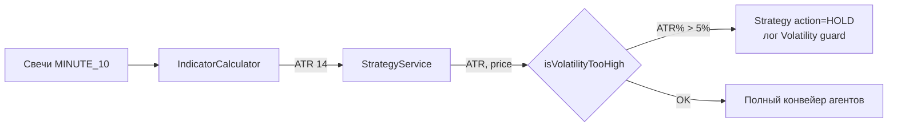
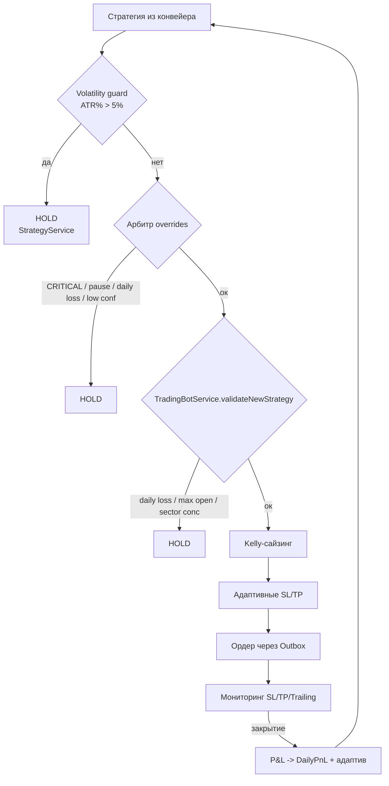

# 5. Risk Management

> ⚠️ Этот раздел описывает **stock-контур** (RiskManagementService, AdaptiveRiskService).
> Фьючерсный контур Si — риск-движок, сайзинг, ликвидация, daily loss limit — см.
> **[раздел 15 — Фьючерсный контур (Si)](15-futures-trading.md)**.

Риск-движок бота реализован в двух сервисах:

- **`RiskManagementService`** (`com.trading.bot.service`) — детерминированные правила входа/выхода: дневной лимит, лимит позиций, секторная концентрация, волатильность, SL/TP/trailing, дневной P&L.
- **`AdaptiveRiskService`** — Kelly-сайзинг, адаптивные SL/TP, динамический порог confidence, паузы по статистике.

Конфигурация — `RiskConfig` (`com.trading.bot.config`), префикс `risk.` в `application.yml`.

## 5.1. RiskConfig — все параметры

| Свойство | Default | Тип | Описание |
|---|---|---|---|
| `risk.enabled` | `true` | Boolean | мастер-выключатель риск-движка |
| `risk.max-position-rub` | `500000` | BigDecimal | максимальный размер позиции в рублях (база для Kelly) |
| `risk.max-daily-loss-rub` | `50000` | BigDecimal | дневной лимит убытка (закрытые сделки) |
| `risk.max-open-positions` | `5` | Integer | максимум одновременных открытых позиций |
| `risk.max-sector-exposure` | `2` | Integer | макс. открытых позиций в одном секторе |
| `risk.max-volatility-percent` | `5.0` | Double | ATR% от цены, выше которого вход запрещён |
| `risk.default-stop-loss-percent` | `2.0` | Double | стоп-лосс по умолчанию, % от цены входа |
| `risk.default-take-profit-percent` | `4.0` | Double | тейк-профит по умолчанию, % от цены входа |
| `risk.trailing-stop-enabled` | `true` | Boolean | трейлинг-стоп включён |
| `risk.trailing-stop-percent` | `1.5` | Double | отступ трейлинг-стопа, % от текущей цены |
| `risk.sectors` | `{}` | Map<String, String> | справочник `ticker -> сектор` |

Реализация полей (`RiskConfig.kt`):

```kotlin
@ConfigurationProperties(prefix = "risk")
class RiskConfig {
    var enabled: Boolean = true
    var maxPositionRub: BigDecimal = BigDecimal("500000")
    var maxDailyLossRub: BigDecimal = BigDecimal("50000")
    var maxOpenPositions: Int = 5
    var maxSectorExposure: Int = 2
    var maxVolatilityPercent: Double = 5.0
    var defaultStopLossPercent: Double = 2.0
    var defaultTakeProfitPercent: Double = 4.0
    var trailingStopEnabled: Boolean = true
    var trailingStopPercent: Double = 1.5
    var sectors: Map<String, String> = emptyMap()
}
```

### Справочник секторов по умолчанию

Из `application.yml`:

```yaml
risk:
  sectors:
    SBER: FINANCE
    VTBR: FINANCE
    GAZP: ENERGY
    ROSN: ENERGY
    TATN: ENERGY
    LKOH: ENERGY
    NVTK: ENERGY
    YNDX: IT
    MGNT: RETAIL
    ALRS: METALS
```

> Тикер, отсутствующий в справочнике, получает сектор `UNKNOWN` (см. `sectorOf`). Для `UNKNOWN` секторная проверка работает так же: не более `max-sector-exposure` позиций с сектором `UNKNOWN`.

## 5.2. Порядок риск-проверок перед входом

`RiskManagementService.validateNewStrategy(strategy, openPositions)` возвращает `RiskCheckResult(allowed, reason, adjustedQty)`.

Порядок проверок в методе (порядок важен — при срабатывании первой возвращается отказ):

| # | Guardrail | Условие блокировки | Результат |
|---|---|---|---|
| 1 | Дневной лимит | `dailyPnL <= -maxDailyLossRub` | `allowed=false` + метрика `bot.halted.daily_loss` |
| 2 | Max open positions | `openPositions.size >= maxOpenPositions` | `allowed=false` |
| 3 | Секторная концентрация | `count(sector) >= maxSectorExposure` | `allowed=false` |
| 4 | OK | — | `allowed=true`, `adjustedQty = strategy.quantity` |

Каждая проверка обёрнута в `if (riskConfig.enabled && ...)` — при `risk.enabled=false` все три guardrail отключаются, решение принимает конвейер агентов.

### Логика метода

```kotlin
fun validateNewStrategy(strategy: Strategy, openPositions: List<Position>): RiskCheckResult {
    if (riskConfig.enabled && isDailyLossLimitReached()) {
        return RiskCheckResult(false, "Daily loss limit reached ($dailyPnL <= -${riskConfig.maxDailyLossRub})", 0)
    }
    if (riskConfig.enabled && openPositions.size >= riskConfig.maxOpenPositions) {
        return RiskCheckResult(false, "Max open positions reached (${riskConfig.maxOpenPositions})", 0)
    }
    if (riskConfig.enabled && exceedsSectorExposure(strategy.ticker, openPositions)) {
        val sector = sectorOf(strategy.ticker)
        val count = openPositions.count { sectorOf(it.ticker) == sector }
        return RiskCheckResult(false,
            "Sector concentration exceeded: $count open in sector $sector >= max ${riskConfig.maxSectorExposure}", 0)
    }
    return RiskCheckResult(true, "OK", strategy.quantity)
}
```

### Ранние (невидимые) проверки на уровне агентов

До `validateNewStrategy` сигнал проходит через конвейер агентов, где HOLD выставляется раньше:

- **порог уверенности** — `AdaptiveRiskService.getAdaptiveConfidenceThreshold` → StrategyAgent guardrail + ArbitratorAgent deterministic override;
- **CRITICAL challenge** — контрариан может заблокировать сделку;
- **пауза по статистике** — `shouldPauseTrading` (серия убытков ≥ 4, PF ≤ 0.5);
- **volatility guard** — при ATR% > лимита `StrategyService` формирует стратегию с `action = HOLD` (см. 5.2.2).

## 5.3. Sector Concentration (реализовано)

> **Статус**: реализовано. Ранее (до этапа риск-инжина) проверка была «запланирована» — теперь это третий guardrail в `validateNewStrategy`.

### Назначение

Защита от корреляции: если 5 из 5 открытых позиций — банки (SBER + VTBR + ...), их цены двигаются синхронно, и фактический риск портфеля выше суммы номиналов. Лимит по секторам ограничивает концентрацию в одном секторе.

### Реализация

```kotlin
fun exceedsSectorExposure(ticker: String, openPositions: List<Position>): Boolean {
    val sector = sectorOf(ticker)
    val count = openPositions.count { sectorOf(it.ticker) == sector }
    return count >= riskConfig.maxSectorExposure   // по умолчанию 2
}

fun sectorOf(ticker: String): String =
    riskConfig.sectors[ticker] ?: "UNKNOWN"
```

### Пример

Справочник: SBER и VTBR → FINANCE, `maxSectorExposure = 2`.

- Открыты: SBER, GAZP → новый сигнал VTBR: `count(FINANCE) = 1 < 2` → **разрешено**.
- Открыты: SBER, VTBR → новый сигнал GAZP: `count(ENERGY) = 0 < 2` → **разрешено** (другой сектор).
- Открыты: SBER, VTBR → новый сигнал YNDX: **разрешено** (IT, 0 позиций).
- Открыты: SBER, VTBR → новый сигнал SBER (докатка): `count(FINANCE) = 2 >= 2` → **заблокировано**.
- Открыты: SBER, VTBR → новый сигнал любой третий банк: **заблокировано**.

### Логирование и отказ

При блокировке возвращается `RiskCheckResult(false, "Sector concentration exceeded: 2 open in sector FINANCE >= max 2", 0)`. Отказ виден в логах `com.trading.bot: DEBUG` и не открывает позицию.

## 5.4. Volatility Check (реализовано)

> **Статус**: реализовано. Ранее волатильность учитывалась только через `volatilityRegime` (LOW/MEDIUM/HIGH) в промпте технического агента. Теперь добавлен жёсткий guardrail «ATR% > лимита → запрет входа».

### Назначение

Инструменты с экстремальной волатильностью (ATR% от цены > 5%) ломают и стоп-менеджмент (стоп 2% пробивается обычным шумом), и Kelly-сайзинг. Правило запрещает вход, когда `ATR(14) / цена > max-volatility-percent`.

### Реализация

```kotlin
fun isVolatilityTooHigh(atr: BigDecimal?, price: BigDecimal): Boolean {
    if (!riskConfig.enabled || atr == null || atr <= ZERO || price <= ZERO) return false
    val atrPercent = atr * 100 / price   // в процентах, scale=4
    val result = atrPercent > riskConfig.maxVolatilityPercent   // default 5.0
    logger.info { "Volatility check: ATR%=$atrPercent vs limit=${riskConfig.maxVolatilityPercent}% -> ${if (result) "BLOCK" else "OK"}" }
    return result
}
```

Защиты от дегенеративных входов: `atr == null`, `atr <= 0`, `price <= 0` → всегда `false` (не блокирует).

### Точка вызова — `StrategyService`

Проверка вызывается **до** сборки финальной стратегии (строки 103–109 `StrategyService.kt`):

```kotlin
val atr = BigDecimal.valueOf(tech.atr)
if (riskManagement.isVolatilityTooHigh(atr, snapshot.currentPrice)) {
    logger.warn { "Volatility guard: $ticker ATR=$atr > ${riskConfig.maxVolatilityPercent}%, strategy -> HOLD" }
    // финальная стратегия action=HOLD
}
```

При срабатывании:

- конвейер продолжает работу (агенты выполняются),
- но в `strategyService` сохраняется стратегия с `action = HOLD`,
- трейдер в цикле бота фильтрует не-BUY/SELL, поэтому **новая позиция не открывается**.

Это **мягкий отказ на уровне конвейера** (в отличие от `validateNewStrategy`, который блокирует после финального решения). Именно здесь проверка живёт, потому что ATR известен только после расчёта индикаторов.

### Поток волатильности в системе



## 5.5. Kelly Criterion (`AdaptiveRiskService.calculateOptimalPositionSize`)

Формула:

```
w = winRate (за 30 дней)
r = avgWin / |avgLoss| (выигрыш/проигрыш)
kelly = (w * r - (1 - w)) / r
safeKelly = clamp(kelly, 0.0, 0.50)   # half-Kelly верхний предел
size = maxPositionRub * safeKelly
```

- Если сделок < 5 → `size = maxPositionRub` (без статистики не ограничиваем, но и не увеличиваем).
- Метрика: `adaptive.position_size{ticker}` (gauge).

**Применение в `TradingBotService.openPosition`**:

```
kellyQty = size / targetPrice (округляется вниз, минимум 1)
qty = kellyQty, если kellyQty > 0 и kellyQty < strategy.quantity, иначе adjustedQty/strategy.quantity
```

### Адаптивные стопы (`calculateAdaptiveSL` / `calculateAdaptiveTP`)

Множитель к ATR зависит от статистики попадания в стоп/тейк:

| Статистика (14 дней) | Множитель SL | Статистика | Множитель TP |
|---|---|---|---|
| slHitRate > 0.65 | 2.5 × ATR | tpHitRate > 0.50 | 3.0 × ATR |
| slHitRate < 0.30 | 1.5 × ATR | tpHitRate < 0.20 | 2.0 × ATR |
| иначе | 2.0 × ATR | иначе | 2.5 × ATR |

`SL = entry - mult*ATR` (LONG) / `entry + mult*ATR` (SHORT). Аналогично TP с обратным знаком. Результат округляется до 2 знаков.

> Отличие от volatility guard: адаптивные стопы **расширяют** стоп при высокой волатильности статистики (slHitRate высокий), а guard запрещает вход при экстремальном ATR%. Они дополняют друг друга: guard срабатывает до входа, адаптив — внутри удержания.

### Динамический порог confidence

`getAdaptiveConfidenceThreshold(ticker)` — таблица в разделе 3.5 (0.55–0.80).

## 5.6. Daily Loss Limit

**Как считается**: `RiskManagementService.dailyPnL` — аккумулятор, обновляется в `updateDailyPnL(pnl)`:

- при открытии позиции: изменений нет;
- при закрытии: `+pnl` фактической сделки.

> **Важно**: аккумулятор хранится **в памяти** сервиса и сбрасывается при перезапуске. Механика «календарный день» в текущей версии не реализована (хранится в памяти, а не в БД). Задача — перенести в БД с привязкой к дате (roadmap).

**Что происходит при достижении**:

- `isDailyLossLimitReached()` → `true` когда `dailyPnL <= -maxDailyLossRub`;
- `TradingBotService.run()` в начале цикла: HALT всего бота + метрика `bot.halted.daily_loss`;
- `ArbitratorAgent`: детерминированный override `DETERMINISTIC: DAILY_LOSS_LIMIT` → HOLD;
- `Guardrails.apply`: `dailyLossLimitReached` → HOLD.

**Сброс лимита**: сейчас — только перезапуск пода. Целевое — сброс в 00:00 МСК по БД-записи.

## 5.7. Position Monitoring

Выполняется `TradingBotService.monitor()` каждые `monitor-interval-ms` (10 мин):

1. Берём все OPEN-позиции из БД.
2. `price = alorClient.getLastPrice(ticker)`.
3. Обновляем `currentPrice`, считаем `pnl` по формуле:
   - LONG: `(price - entryPrice) * qty`
   - SHORT: `(entryPrice - price) * qty`
4. Проверки выхода (по порядку):

```kotlin
if (risk.shouldCloseBySL(pos, price))        { closePosition(pos, price, "STOP_LOSS"); return }
if (risk.shouldCloseByTP(pos, price))        { closePosition(pos, price, "TAKE_PROFIT"); return }
if (risk.shouldCloseByTrailing(pos, price))  { closePosition(pos, price, "TRAILING_STOP"); return }
risk.updateTrailingStop(pos, price)          // иначе подтягиваем трейлинг
```

5. Проверка стратегии: если Redis-стратегия `action == CLOSE` → `closePosition(pos, price, "STRATEGY_CLOSE")`.
6. Обновление SL/TP из новой стратегии (только в «правильную» сторону).

### Логика условий

| Условие | LONG | SHORT |
|---|---|---|
| `shouldCloseBySL` | `price <= stopLoss` | `price >= stopLoss` |
| `shouldCloseByTP` | `price >= takeProfit` | `price <= takeProfit` |
| `shouldCloseByTrailing` | `price <= trailingStopPrice` | `price >= trailingStopPrice` |
| `updateTrailingStop` | `price * (1 - 1.5%)` | `price * (1 + 1.5%)` |

Реализация (`RiskManagementService`):

```kotlin
fun shouldCloseBySL(pos, price)  = LONG ? price <= stopLoss : price >= stopLoss
fun shouldCloseByTP(pos, price)  = LONG ? price >= takeProfit : price <= takeProfit
fun shouldCloseByTrailing(pos, price) =
    riskConfig.trailingStopEnabled && pos.trailingStopPrice != null &&
    (LONG ? price <= trailingStopPrice : price >= trailingStopPrice)

fun updateTrailingStop(pos, price) {
    if (!riskConfig.trailingStopEnabled) return
    val newStop = LONG ? price * (1 - 1.5%) : price * (1 + 1.5%)
    pos.trailingStopPrice = newStop.setScale(2, HALF_UP)
}
```

### Trailing Stop

- Активируется при открытии: `trailingStopPrice = strat.stopLoss` если `strat.trailingStop == true`.
- Обновляется **только в прибыльную сторону** (монитор вызывает `updateTrailingStop` каждый цикл; формула считает новый стоп от текущей цены — фактически это обновление без проверки «не хуже прежнего», но поскольку стоп считается от растущей цены, значение монотонно улучшается при росте).
- `risk.trailing-stop-percent: 1.5` — отступ.

### Вспомогательные калькуляторы

```kotlin
fun calcSL(entryPrice, direction): BigDecimal = entry * (1 ± 2%)   // по направлению
fun calcTP(entryPrice, direction): BigDecimal = entry * (1 ∓ 4%)   // по направлению
```

## 5.8. Emergency Stop

> **Статус**: endpoint `POST /api/v1/bot/emergency-stop` **не реализован** в текущей версии — запланирован (см. раздел 13 и 7.2).

**Проектное решение**:

1. **Ручная остановка**: `POST /api/v1/bot/emergency-stop` — ставит флаг в Redis (`bot:emergency-stop=true`), `TradingBotService.run()` и `StrategyService.run()` проверяют флаг в начале цикла и выходят.
2. **Автоматическая остановка**: если убыток закрытых позиций за час > 10% от `max-position-rub` (500 000 × 10% = 50 000 ₽) — автоматический emergency stop. Реализация требует хранить PnL с таймстампами (БД) — roadmap.

**Как остановить сейчас**:

- `MAX_OPEN_POS=0` (не открывать новые позиции);
- `risk.max-daily-loss-rub` (дневной лимит);
- перезапуск с `TRADING_MODE=SIMULATION`.

## 5.9. Иерархия риск-решений



Три независимых уровня блокировки:

1. **Конвейер** — volatility guard (HOLD в стратегии), порог confidence, CRITICAL challenge, пауза, daily loss override.
2. **Детерминированный RiskEngine** — `validateNewStrategy`: daily loss → max open → sector concentration.
3. **Исполнение** — Kelly-сайзинг ограничивает объём, адаптивные стопы — риск удержания.

## 5.10. Сводка статусов

| Проверка | Статус | Где живёт |
|---|---|---|
| Дневной лимит | ✅ реализовано | `RiskManagementService` |
| Max open positions | ✅ реализовано | `RiskManagementService` |
| Sector concentration | ✅ реализовано | `RiskManagementService.exceedsSectorExposure` |
| Volatility (ATR% > 5%) | ✅ реализовано | `StrategyService` + `RiskManagementService.isVolatilityTooHigh` |
| Kelly-сайзинг | ✅ реализовано | `AdaptiveRiskService` |
| Адаптивные SL/TP | ✅ реализовано | `AdaptiveRiskService` |
| Trailing stop | ✅ реализовано | `RiskManagementService` |
| Пауза по статистике | ✅ реализовано | `AdaptiveRiskService.shouldPauseTrading` |
| Emergency stop (endpoint) | 🔜 запланировано | — |
| Дневной лимит в БД (календарный день) | 🔜 запланировано | — |
| `RiskBreachedEvent` (event-driven) | 🔜 запланировано | — |
