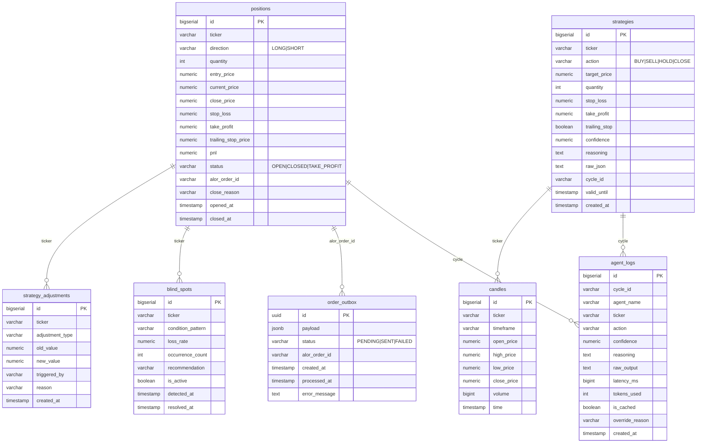

# 6. База данных

PostgreSQL 15, доступ через `spring-boot-starter-jdbc` + `NamedParameterJdbcTemplate` (без JPA/Hibernate). Миграции — Liquibase.

## 6.1. ER-диаграмма



## 6.2. Таблицы

### positions

| Колонка | Тип | NOT NULL | Описание |
|---|---|---|---|
| id | BIGSERIAL | PK | автоинкремент |
| ticker | VARCHAR(20) | ✓ | тикер MOEX |
| direction | VARCHAR(10) | ✓ | LONG / SHORT |
| quantity | INT | ✓ | количество лотов |
| entry_price | NUMERIC(19,6) | ✓ | цена входа (avgPrice из verifyOrder) |
| current_price | NUMERIC(19,6) | | последняя цена из монитора |
| close_price | NUMERIC(19,6) | | цена закрытия (WS fill или market) |
| stop_loss | NUMERIC(19,6) | | стоп-лосс |
| take_profit | NUMERIC(19,6) | | тейк-профит |
| trailing_stop_price | NUMERIC(19,6) | | текущий трейлинг-стоп |
| pnl | NUMERIC(19,6) | | итоговый P&L |
| status | VARCHAR(20) | ✓ default 'OPEN' | OPEN / CLOSED / TAKE_PROFIT |
| alor_order_id | VARCHAR(100) | | номер ордера Alor (связь с outbox и WS) |
| close_reason | VARCHAR(50) | | STOP_LOSS / TAKE_PROFIT / TRAILING_STOP / STRATEGY_CLOSE / EXECUTION_FILL |
| opened_at | TIMESTAMP | ✓ | время открытия |
| closed_at | TIMESTAMP | | время закрытия |

Индексы: `idx_positions_ticker(ticker)`, `idx_positions_status(status)`, `idx_positions_closed_at(closed_at)`.

### strategies

| Колонка | Тип | NOT NULL | Описание |
|---|---|---|---|
| id | BIGSERIAL | PK | |
| ticker | VARCHAR(20) | ✓ | |
| action | VARCHAR(20) | ✓ | BUY/SELL/HOLD/CLOSE |
| target_price | NUMERIC(19,6) | ✓ | целевая цена |
| quantity | INT | ✓ | лоты |
| stop_loss / take_profit | NUMERIC(19,6) | | из финального решения |
| trailing_stop | BOOLEAN | ✓ default false | |
| confidence | NUMERIC(5,4) | ✓ | 0..1 |
| reasoning | TEXT | ✓ | обоснование (с меткой Meta) |
| raw_json | TEXT | | полный JSON финального решения арбитра |
| cycle_id | VARCHAR(50) | ✓ | идемпотентность / трассировка |
| valid_until | TIMESTAMP | ✓ | срок годности сигнала |
| created_at | TIMESTAMP | ✓ | |

Индексы: `idx_strategies_ticker(ticker)`, `idx_strategies_created_at(created_at)`.

### candles

| Колонка | Тип | NOT NULL | Описание |
|---|---|---|---|
| id | BIGSERIAL | PK | |
| ticker | VARCHAR(20) | ✓ | |
| timeframe | VARCHAR(20) | ✓ | MINUTE_10 |
| open_price / high_price / low_price / close_price | NUMERIC(19,6) | ✓ | OHLC |
| volume | BIGINT | ✓ | |
| time | TIMESTAMP | ✓ | начало свечи |

UNIQUE `(ticker, timeframe, time)` — защита от дублей. Индекс `idx_candles_ticker_time(ticker, timeframe, time)`.

> **Целевое**: партиционирование по `time` (диапазоны), раздел 6.4.

### agent_logs

| Колонка | Тип | Описание |
|---|---|---|
| id | BIGSERIAL PK | |
| cycle_id | VARCHAR(50) | correlation id цикла (для агентов 1–5) или "META" |
| agent_name | VARCHAR(100) | Agent-1-Technical ... Agent-6-Performance, TradingBot |
| ticker | VARCHAR(20) | |
| action | VARCHAR(50) | conclusion/action/CHALLENGE:LEVEL |
| confidence | NUMERIC(5,4) | |
| reasoning | TEXT | |
| raw_output | TEXT | сырой ответ LLM |
| latency_ms | BIGINT | |
| tokens_used | INT | добавлено миграцией 002 |
| is_cached | BOOLEAN | добавлено миграцией 002 |
| override_reason | VARCHAR(200) | добавлено миграцией 002 |
| created_at | TIMESTAMP | |

Индексы: `idx_agent_logs_cycle(cycle_id)`, `idx_agent_logs_created_at(created_at)`.

### order_outbox

см. раздел 4.1 (полная спецификация). Индекс `idx_outbox_status_created(status, created_at)`.

### blind_spots

| Колонка | Тип | Описание |
|---|---|---|
| id | BIGSERIAL PK | |
| ticker | VARCHAR(20) | |
| condition_pattern | VARCHAR(4000) | например "Stop-Loss hit rate > 60% for SBER" |
| loss_rate | NUMERIC(5,4) | доля убыточных сделок под паттерном |
| occurrence_count | INT | число вхождений (инкремент при повторе) |
| recommendation | VARCHAR(4000) | рекомендация |
| is_active | BOOLEAN | TRUE пока не resolved |
| detected_at / resolved_at | TIMESTAMP | |

Индекс: `idx_blind_spots_ticker_active(ticker, is_active)`.

### strategy_adjustments

| Колонка | Тип | Описание |
|---|---|---|
| id | BIGSERIAL PK | |
| ticker | VARCHAR(20) | |
| adjustment_type | VARCHAR(50) | CONFIDENCE / SL_PERCENT / TP_PERCENT |
| old_value / new_value | NUMERIC(19,6) | |
| triggered_by | VARCHAR(50) | META_AGENT |
| reason | VARCHAR(4000) | |
| created_at | TIMESTAMP | |

Индекс: `idx_adjustments_ticker(ticker)`.

## 6.3. Liquibase Changelogs

**Master changelog** `db/changelog/db.changelog-master.yaml`:

```yaml
databaseChangeLog:
  - include:
      file: db/changelog/changes/001-create-tables.sql
  - include:
      file: db/changelog/changes/002-add-agent-log-columns.sql
  - include:
      file: db/changelog/changes/003-order-outbox.sql
```

**Пример changeset** (001):

```sql
--liquibase formatted sql
--changeset dmitry:001

CREATE TABLE IF NOT EXISTS positions (
    id BIGSERIAL PRIMARY KEY,
    ticker VARCHAR(20) NOT NULL,
    ...
);
CREATE INDEX IF NOT EXISTS idx_positions_ticker ON positions(ticker);
```

**Пример будущего changeset с партициями** (проект):

```sql
--liquibase formatted sql
--changeset dmitry:004

CREATE TABLE candles_part (
    LIKE candles INCLUDING ALL
) PARTITION BY RANGE (time);

CREATE TABLE candles_2026_q3 PARTITION OF candles_part
    FOR VALUES FROM ('2026-07-01') TO ('2026-10-01');
```

## 6.4. Оптимизация запросов

**Частые выборки и покрытие**:

| Запрос | Где | Индекс |
|---|---|---|
| `positions WHERE status='OPEN'` | TradingBotService | `idx_positions_status` |
| `positions WHERE alor_order_id=?` | applyExecutionReport | `alor_order_id` (рекомендуется добавить индекс) |
| `positions WHERE status != 'OPEN' AND closed_at >= ?` | TradeAnalysisService | `idx_positions_closed_at` |
| `positions ... AND ticker=? AND closed_at >= ?` | timePatternAnalysis | составной `(ticker, closed_at)` — рекомендация |
| `candles WHERE ticker=? AND timeframe=? AND time BETWEEN ?` | loadCandles | `idx_candles_ticker_time` |
| `agent_logs WHERE cycle_id=?` | трассировка | `idx_agent_logs_cycle` |
| `order_outbox WHERE status='PENDING' AND created_at < ?` | outbox worker | `idx_outbox_status_created` |

**Партиционирование `candles`**: таблица растёт быстрее всех (10 тикеров × 144 свечи/день = ~1 400 строк/день, ~42 000/мес). Партиционирование по `time` (квартальные секции) ускоряет выборки по периоду и упрощает архивацию.

**Архивация старых данных**: удаление/перенос данных старше 90 дней. Для `agent_logs` — `raw_output` старых циклов можно удалять (аггрегаты остаются в `positions`). Запланировано как @Scheduled job (раздел 13).

**Прочие рекомендации**:
- добавить индекс на `positions.alor_order_id` (есть частый lookup по WS-fill);
- покрывающий индекс для `TradeAnalysisService`: `(ticker, status, closed_at)` include (pnl, close_reason, opened_at).

## 6.5. Использование БД в бэктесте

`BacktestEngine` (раздел 11) читает историю исключительно из таблицы `candles`:

```kotlin
candleRepo.findByTickerAndTimeframeAndTimeBetween(
    ticker, "MINUTE_10", now.minusDays(days), now
)
```

Требования к данным для бэктеста:

| Аспект | Требование | Реализация |
|---|---|---|
| Глубина истории | ≥ 32 свечей для `minBarsForSignal + 2` | иначе `emptyResult()` |
| Полнота OHLC | open/high/low/close заполнены | наполнение MOEX ISS |
| Непрерывность | пробелы допустимы (обработка по порядку времени) | `sortedBy { it.time }` |
| Лотность | `quantity` совместим с позициями | `lotRounded` вниз |

> **Проект**: таблица `backtest_results` для сохранения результатов и сравнения итераций (раздел 11.8).

## 6.6. Проблема дневного P&L и почему его нет в БД

Дневной лимит убытка (`risk.max-daily-loss-rub`) хранится в **памяти** `RiskManagementService.dailyPnL` (раздел 5.6). Это осознанное ограничение текущей версии:

| Аспект | Сейчас | Целевое |
|---|---|---|
| Хранение | поле `dailyPnL` в сервисе | таблица `daily_pnl(date, pnl)` с UNIQUE по дате |
| Сброс | при перезапуске пода | по календарной дате (00:00 МСК) |
| Прозрачность | `GET /api/v1/risk/daily-pnl` (в памяти) | тот же endpoint, но из БД |
| History | нет | график дневных результатов, статистика лимитов |

Миграция `004-daily-pnl.sql` (проект):

```sql
--liquibase formatted sql
--changeset dmitry:004

CREATE TABLE IF NOT EXISTS daily_pnl (
    trade_date DATE PRIMARY KEY,
    pnl NUMERIC(19,6) NOT NULL DEFAULT 0,
    updated_at TIMESTAMP NOT NULL DEFAULT now()
);
```

Обновление: `INSERT ... ON CONFLICT (trade_date) DO UPDATE SET pnl = daily_pnl.pnl + EXCLUDED.pnl`.

## 6.7. Транзакционность и консистентность

| Операция | Транзакция | Комментарий |
|---|---|---|
| Outbox INSERT | `@Transactional` (placeOrder) | строка ордера и его payload — атомарны |
| Открытие позиции | INSERT positions | идемпотентность по сигналу (одна позиция на тикер) |
| Применение fill | UPDATE по `alor_order_id` | повторный fill не создаёт дубль |
| Закрытие | UPDATE status/close_price | `closed_at`, `close_reason`, `pnl` в одном UPDATE |
| Партиционирование candles | без | roadmap (раздел 6.4) |

Важное следствие: **PostgreSQL — единый источник правды**. Redis хранит только кэшируемые артефакты (стратегии с TTL, semantic cache, feedback), и потеря Redis не разрушает бизнес-данные.

## 6.8. Резервное копирование

| Уровень | Рекомендация |
|---|---|
| pg_dump | ежедневно, офсайт |
| PITR | включить WAL-архив (managed PG) |
| Проверка restore | еженедельный тест восстановления на staging |
| Свечи | перезагружаемы с MOEX ISS (не критичны) |
| positions/strategies | критичны — восстановление из бэкапа |

## 6.9. Мониторинг БД

| Метрика | Источник | Предел |
|---|---|---|
| Размер таблиц | `pg_total_relation_size` | candles — следить за ростом |
| Медленные запросы | pg_stat_statements | > 100 мс |
| Заблокированные транзакции | pg_stat_activity | > 30 c |
| Bloat | pgstat | регулярная autovacuum |

Включение pg_stat_statements:

```sql
-- в postgresql.conf
shared_preload_libraries = 'pg_stat_statements';
```
