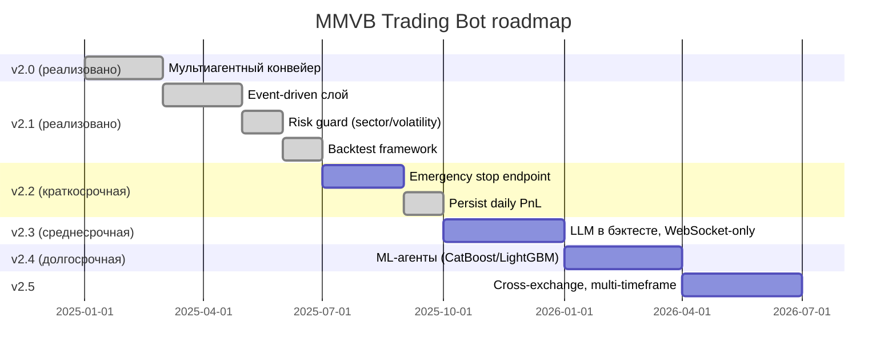
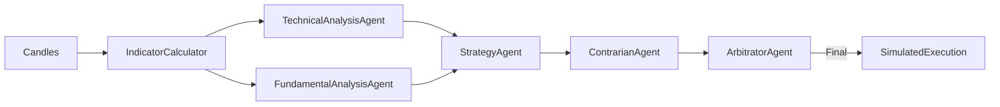
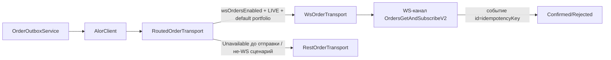
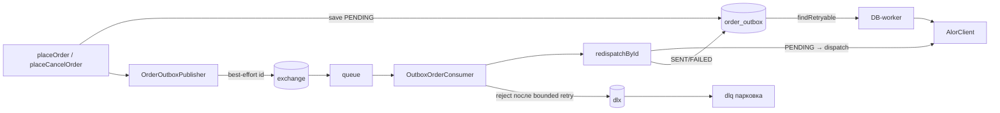
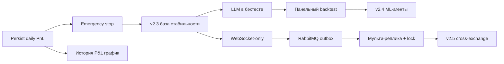

# 13. Roadmap и планы развития

## 13.1. Текущее состояние (v2.1)

**Реализовано в текущей ветке:**

- 6 LLM-агентов (тех. анализ, фундаментал, стратегия, контрар, арбитр, feedback) + Guardrails + semantic cache + resilience (CB/RateLimiter/Retry).
- Alor-интеграция: REST + WebSocket, idempotency, outbox, контроль спреда.
- MOEX ISS данные, индикаторы (MA, RSI, ATR, MACD, Bollinger, EMA), Kelly criterion, адаптивные SL/TP.
- Стратегии `conservative`/`default`/`aggressive`, self-learning (PerformanceFeedbackAgent).
- 7 таблиц, Liquibase, REST API, Prometheus-метрики, alertmanager-конфиг.
- Docker compose (TimescaleDB/PostgreSQL 15 + Redis 7).
- **Event-driven слой** (раздел 2.3): `PriceChangedEvent`, `StrategyGeneratedEvent`, `EntrySignalEvent`, `ExecutionReportEvent` + `TradingEventPublisher` + `@EventListener`.
- **Sector concentration** (раздел 5.3): `risk.max-sector-exposure`, справочник `risk.sectors`.
- **Volatility guard** (раздел 5.4): ATR% > `risk.max-volatility-percent` → HOLD.
- **Backtest framework** (раздел 11): `BacktestEngine`, `SimulatedExecution`, `BacktestMetrics`, endpoint `GET /api/v1/backtest/{ticker}`, 6 unit-тестов.
- **TimescaleDB для candles** (раздел 6.4): гипертаблица (чанки по time, retention 90 дней) + батч-запись свечей `CandleRepository.saveAll` вместо построчного `exists`+`save`.
- **Наблюдаемость LLM-агента** (раздел 13.18): JSON-логирование + trace_id, трейс-хранилище S3/MinIO, Shadow Mode / decision-level A/B + Grafana, **RAG-анализ ошибок** по трейсам (`/api/v1/rag/*`).

## 13.2. Дорожная карта по версиям



### v2.2 — Краткосрочные улучшения

| Фича | Описание | Статус |
|---|---|---|
| Emergency stop endpoint | `POST /api/v1/bot/emergency-stop` — закрывает все позиции + запрещает открытие | ✅ |
| Persist daily PnL | перенос `dailyPnl` из памяти в БД (`daily_risk_snapshot`) + `GET /api/v1/risk/daily-pnl-history` (раздел 6.6) | ✅ |
| Партиционирование `candles` | TimescaleDB hypertable: чанки по time (1 неделя) + retention 90 дней (раздел 6.4) | ✅ v2.2 |
| Партиционирование `positions`/`agent_logs` | PostgreSQL native partitioning (раздел 6.4) | ✅ v2.2 |
| Точный контроль SL/TP в лимитных заявках | биржевые stop/take-profit-заявки при открытии позиции (раздел 13.7.4) | ✅ v2.2 |
| Distributed lock | возможность запуска нескольких инстансов без гонок (раздел 2.6) | ✅ v2.2 |
| Multi-account | поддержка нескольких Alor-портфелей с общим конвейером и персональными лимитами | ✅ |
| Backtest: сохранение результатов | таблица `backtest_results` + сравнение итераций | ✅ |
| Backtest: out-of-sample | walk-forward (train → tune SL/TP → OOS), защита от переобучения | ✅ |

### v2.3 — Среднесрочные

| Фича | Описание | Статус |
|---|---|---|
| **LLM-агенты в бэктесте** | заменить детерминированный `signalAt()` на конвейер tech→fund→strategy→contrarian→arbitrator (раздел 11.1) | ✅ (раздел 13.8.1) |
| Backtest: панельный прогон | несколько тикеров за один вызов, распределение результатов | ✅ (POST `/api/v1/backtest/panel`, раздел 11.6.1) |
| Backtest: конфиг `bt.*` | вынос констант 20%/2%/4% и `initialCapital` из кода | ✅ (раздел 11.8.1) |
| WebSocket-only исполнение | полный переход на WS для market-data и ордеров, REST — только fallback | ✅ (раздел 13.8.2) |
| Уменьшение LLM-латентности | параллельные вызовы агентов, дельта-промпты | ✅ (раздел 13.8.5) |
| Очередь (RabbitMQ) для outbox | RabbitMQ — дополнительный канал доставки outbox-строк (publisher → очередь → консьюмер через `redispatchById`), DB-worker остаётся фолбэком | ✅ (раздел 13.8.4) |

### v2.4 — ML-агенты

- Замена/дополнение части LLM-инференса ML-моделями (CatBoost/LightGBM) для задач, где нужна скорость и стабильность: скрининг кандидатов, оценка вероятности удержания тренда.
- Retraining pipeline: собранные через `agent_logs` и сделки данные → features → обучение на CI.
- ✅ **Шаг 1 (датасет-экспорт)**: `GET /api/v1/ml/dataset` (CSV) + `/dataset/stats`, признаки на входе из candles + макро + `agent_logs` + слепые зоны, флаг `ml.enabled` (раздел 13.11).
- ✅ **Шаг 1.5 (исторические макро-снапшоты)**: `macro_snapshots` + `MacroSnapshotCollector`, макро в датасете берутся на момент входа (`macro_source=SNAPSHOT`), lookahead-утечка устранена (раздел 13.11.2).
- ✅ **Шаг 2 (обучение на CI)**: `ml/` пайплайн (CatBoost/LightGBM, temporal OOS 20%, метрика M3 — profit factor на OOS vs LLM-baseline), GitHub Actions `ml-train.yml` + pytest-тесты (раздел 13.11.3).
- ✅ **Шаг 3 (инференс и скрининг)**: загрузка обученной CatBoost-модели (`.cbm`) в бэкенд + `GET /api/v1/ml/screen` — ранжирование тикеров по вероятности выигрышного исхода (раздел 13.11.4).
- ✅ **ML-фильтр входа** (доп. шаг): прогноз модели как гейт входа в торговый цикл (`DecisionEngine`), `ml.filter.enabled`/`ml.filter.threshold`, fail-closed при недоступной модели (раздел 13.11.5).
- ✅ **ML-фильтр в бэктесте** (доп. шаг): `bt.ml-filter-enabled` — модель гейтит входы бэктеста на момент бара (confidence=null), live-гейт не затрагивается (раздел 13.11.6).
- ✅ **ML-оценка удержания тренда** (доп. шаг): `GET /api/v1/ml/trend` — ранжирование по trendScore (модель + индикаторная сила тренда), опциональный тренд-гейт входа `ml.filter.trend-gate-enabled` (раздел 13.11.7).
- ✅ **Онлайн-калибровка порога уверенности** (доп. шаг): `ConfidenceCalibrator` — порог входа тикера подбирается по фактическим исходам сделок (уверенность стратега на входе × win/pnl), fallback — правила по win rate (раздел 13.11.8).
- ✅ **Confidence-aware сайзинг** (доп. шаг): размер позиции масштабируется по уверенности сигнала относительно адаптивного порога — маржинальный сигнал режет размер, высокая уверенность даёт полный размер (раздел 13.11.9).

### v2.5 — Расширение горизонтов

- ✅ **Multi-timeframe**: вход по 10-минутному, фильтр по часовому/дневному (раздел 13.12.1).
- Cross-exchange: мониторинг котировок на нескольких площадках, арбитраж между MOEX и международными рынками (по мере регуляторной готовности).

## 13.3. План стабилизации (непрерывно)
1. ✅ **Набор regression-тестов** по каждому модулю (Guardrails, SemanticCache, Agent parsers, outbox, BacktestEngine) — раздел 13.3.3.

2. ✅ **Backtest всех тикеров** по критериям раздела 11.5 перед каждой новой стратегией — раздел 13.3.5.
3. ✅ **Chaos testing**: отключение Redis/Postgres/Kimi/сети — проверка graceful degradation (раздел 13.3.1).
4. ✅ **Нагрузочное тестирование**: до 100 тикеров × 6 агентов × 2 LLM-вызова — бюджет латентности и стоимости (раздел 13.3.4).
5. ✅ **Мониторинг вырожденных случаев**: SPREAD > 1%, депозитарные паузы, гэпы (раздел 13.3.2).

### 13.3.1. Chaos testing (реализовано)

**Идея:** доказать (тестами, а не декларативно), что при недоступности любой внешней
зависимости бот не падает: критический путь работает от in-memory слоя, hot path —
от Redis, отказы LLM-провайдера превращаются в детерминированный fallback NEUTRAL.

**Авария моделируется по-разному в зависимости от семантики зависимости:**

| Зависимость | Авария | Восстановление |
|---|---|---|
| PostgreSQL | `docker pause` — процессы заморожены, порт занят, данные сохранены | `docker unpause` — данные/схема на месте, пулы (R2DBC/Hikari) переподключаются |
| Redis | `stop()`/`start()` — контейнер пересоздаётся (данные теряются, это нормально для кэша) | `awaitUntil` + повторная запись probe-значения |
| LLM (Kimi) | пустой API-ключ → мгновенный `NO_API_KEY`; недоступный endpoint (`127.0.0.1:1`) → `CALL_ERROR` | fallback-ответ детерминирован и фиксируется метрикой |
| сеть | моделируется недоступным LLM-endpoint (MOEX захардкожен в клиенте, Alor требует LIVE+токен — см. ограничения ниже) | — |

> Почему не `stop()`/`start()` для PostgreSQL: в Testcontainers 2.0.5 повторный старт
> того же контейнера ненадёжен — уже отработавший `LogMessageWaitStrategy` не видит
> логи нового контейнера и `doStart()` убивает его по таймауту. `docker pause`
> даёт ту же недоступность без пересоздания контейнера.

**Сценарии (`src/test/kotlin/com/trading/bot/integration/`):**

| Тест | Что проверяет |
|---|---|
| `ChaosPostgresIntegrationTest` | Postgres недоступен → `SettingsService.getSettings()` продолжает работать из памяти (значения не меняются), Redis-кэш свечей жив; после `unpause` R2DBC восстанавливается, round-trip `saveSettings`/`loadSettings` проходит |
| `ChaosRedisIntegrationTest` | Redis недоступен → свечной кэш (`candle.cache.error`) и кэш стратегий/фидбэков fail-open (старый кэш не теряется), semantic cache fail-open (`llm.cache.error`), emergency stop работает из памяти (`bot.emergency_stop{source=MANUAL}`), distributed lock fail-open для планировщиков / fail-closed для входа (`distributed.lock.error`/`distributed.lock.skipped`); после restart кэши восстанавливаются |
| `ChaosLlmIntegrationTest` | Пустой `llm.api-key` → `isFallback=true`, причина `NO_API_KEY`, без сетевого вызова; недоступный endpoint (settings-оверрайд `llmApiKey`/`llmBaseUrl`) → `CALL_ERROR`; обе метрики `llm.fallback.activated{agent,reason}`; настройки восстанавливаются в `finally` |
| `ChaosTestSupport` (хелперы) | `chaosPostgres`/`chaosRedis` с фиксированными host-портами (адрес не меняется при аварии), `pauseContainer`/`unpauseContainer`, `awaitUntil` |

**Проверяемые метрики:** `llm.cache.error{agent}` (semantic cache fail-open),
`llm.fallback.activated{agent,reason}` (NO_API_KEY/CALL_ERROR), `bot.emergency_stop{source}`,
`distributed.lock.error{name}`/`distributed.lock.skipped{name}`. Кэши свечей/стратегий/фидбэков
fail-open проверяются по поведению (пустой список / null), без метрик — см. `CandleCacheService`/`RedisCacheService`.

**Ограничения:** сетевой chaos для MOEX невозможен без изменения кода — `baseUrl`
захардкожен (`https://iss.moex.com/iss`), Alor требует LIVE-режим и токен; планировщики
в тестах отключены (`app.scheduling.enabled=false`).

### 13.3.2. Мониторинг вырожденных случаев (реализовано)

**Идея:** перед каждым входом в позицию проверять вырожденные состояния рынка и
блокировать вход с метрикой. Проверки fail-open: при недоступности данных
(нет снэпшота, пустой кэш свечей) вход НЕ блокируется.

**Состав guard'а (`DegenerateCaseGuard` + чистый детектор `DegenerateCaseDetector`):**

| Проверка | Условие блокировки | Причина (`...risk.reject{reason=...}`) | Конфиг (`risk.*`) |
|---|---|---|---|
| Широкий спред | `(ask-bid)/ask > max-spread-percent` | `WIDE_SPREAD` | `max-spread-percent: 1.0` |
| Гэп | `\|open(last) - prevClose\|/prevClose > max-gap-percent` | `PRICE_GAP` | `max-gap-percent: 3.0` |
| Депозитарная пауза | последние N свечей с нулевым объёмом | `DEPOSITARY_PAUSE` | `consecutive-zero-volume-bars: 3` |

**Мастер-выключатель:** `risk.degenerate-case-guard-enabled: true`; отдельная проверка
отключается порогом `<= 0`. Точка врезки — `DecisionEngine.doOpenPosition` сразу после
`MarketDataGate` (freshness), до риск-движка и ML-фильтра; метрика `${profile.metricPrefix}.risk.reject`
(та же серия, что MTF/ML-фильтры). Таймфрейм свечей для гэпа/паузы берётся из `Signal.timeframe`.

**Переиспользование математики спреда:** `AlorClient.spreadPercent` (исполняющий слой,
slippage control 0.5% в `placeMarketOrder`) делегирует в `DegenerateCaseDetector.spreadPercent` —
единая формула, совпадающая семантика fail-open (bid/ask → currentPrice).

**Fail-open по данным:**
- снэпшот недоступен (`getMarketSnapshot` вернул null) → спред не проверяется;
- свечей меньше порога / prevClose <= 0 / Redis недоступен (пустой список) → гэп и пауза
  не блокируют (не ломаем торговлю на пустом кэше, в отличие от MTF-фильтра).

**Тесты:** `DegenerateCaseDetectorTest` (11 кейсов чистой математики), `DegenerateCaseGuardTest`
(8 кейсов: порядок проверок, fail-open, выключение), `DecisionEngineTest` (reject → метрика
`WIDE_SPREAD`, pass-through; проверка вызова с `(ticker, timeframe)`).

### 13.3.3. Regression-тесты модулей (реализовано)

**Идея:** каждый модуль защищён собственным набором тестов от регрессий при
рефакторинге. Покрытие сгруппировано по модулям, 139 тестов:

| Модуль | Тест | Что покрывает |
|---|---|---|
| Guardrails | `GuardrailsTest` (13) | раздел 13.4.2: TOXIC/HARMFUL/PRIVACY/CRITICAL — FAIL, NEUTRAL — PASS, деградация при нераспознанной категории, безопасность входа |
| SemanticCache | `SemanticCacheUnitTest` (12) | hit/miss, TTL-истечение, нормировка и схожесть, ошибки Redis → fail-open, fallback без сети |
| Agent parsers | `AgentResponseParsingTest` (36) | все 6 агентов: нормальные и вырожденные ответы, переключатели (toggles), ошибки разбора, fallback NEUTRAL |
| Outbox | `OrderOutboxServiceTest` (30) | dispatch по типам заявок (market/limit/stop/take-profit/cancel), idempotency, UNCERTAIN → fail-состояния, `resolvePortfolio`, обработка malformed payload, ошибки воркера |
| BacktestEngine | `BacktestEngineTest` (33) + `MonteCarloAnalyzerTest` (9) + `BacktestValidatorTest` (6) | stop/target (в т.ч. границы), метрики и бесконечности (profit factor, drawdown), детерминированный генератор сигналов, `run`/persist + метрики, вырожденные капиталы (0 / меньше лота), CLOSE как hold, ML/MTF-фильтры (pass-through, блокировка, reversal-закрытие), walk-forward folds и OOS-агрегация, Monte Carlo (пустые/нулевые сценарии) |

Попутно исправлен вырожденный случай в основном коде: `BacktestMetrics.maxDrawdown`
не падает с `ArithmeticException` при нулевой кривой капитала (возвращает 0.0).

### 13.3.4. Нагрузочное тестирование LLM-контура (реализовано)

**Идея:** измерить бюджет латентности и стоимости стратегического цикла под
нагрузкой «до 100 тикеров × 6 агентов × 2 LLM-вызова» (до 1200 запросов за цикл)
на настоящем `ResilientLlmClient`: очередь `LlmRequestQueue`, ограничение
параллелизма `llm.queue-concurrency`, HTTP-слой WebClient, метрики
`llm.latency` / `llm.tokens.used`. Внешний LLM заменяется локальным
`FakeLlmServer` (JDK HttpServer, настраиваемая задержка и токены), semantic cache
выключен (fingerprint=null) — измеряется пиковый режим без попаданий.

**Харнесс:** `src/test/kotlin/com/trading/bot/performance/LlmCycleLoadTest.kt`
воспроизводит топологию `StrategyService.executeCycle`: coroutine на тикер, внутри
тикера — последовательная цепочка агентов. Прогрев перед замером исключает
одноразовую стоимость инициализации reactor-netty.

**Бюджеты (проверяются утверждениями):**

- **Латентность:** `elapsed ≤ ceil(calls / concurrency) × simLatency × 2.5 + 250мс`.
  При последовательной обработке цикл в `concurrency` раз дольше — тест падает
  (ловит регрессию параллелизма/очереди).
- **Пропускная способность:** ≥ 40% от теоретического предела
  `concurrency / simLatency` (замер: ~92% на 8 воркерах).
- **Стоимость:** `cost = totalTokens × price(1K) / 1000 ≤ budget`
  (справочная цена kimi-k3 ≈ ¥0.02/1K токенов).
- **Корректность под нагрузкой:** 0 fallback-ответов, все вызовы завершены,
  учёт токенов и таймера метрик совпадает с фактическим.

**Прогон:**

- Smoke-сценарий (8 тикеров, ~96 запросов) — входит в обычный `check`.
- Полномасштабный (100 тикеров, 1200 запросов, ~30-45 c):
  `.\gradlew.bat cleanTest test --tests "com.trading.bot.performance.LlmCycleLoadTest" "-Dload.full=true"`
  (свойство `load.full` пробрасывается в JVM теста из `build.gradle.kts`).
  Отчёт пишется в `build/reports/load/load-report.txt`.

**Референс (100 тикеров, concurrency=8, simLatency=200мс):** 1200 вызовов,
цикл 32.4 с (теоретический минимум 30 с), throughput ~37 вызовов/с, 282 000
токенов ≈ 5.64 ₽ за цикл, 0 fallback.


### 13.3.5. Backtest всех тикеров по критериям 11.5 (реализовано)

**Идея:** перед продвижением каждой новой стратегии — панельный бэктест ВСЕХ
тикеров портфеля (`trading.tickers`) по критериям раздела 11.5
(`isPassable()`: sharpe > 1.2, drawdown < 0.15, profit factor > 1.3,
≥ 200 сделок) с приёмкой по большинству (раздел 14.9): доля PASS ≥ 0.5.

**Гейт:** `PortfolioBacktestGate.evaluate(summary, minPassShare = 0.5)` — чистая
логика вердикта `PortfolioBacktestVerdict.accepted` (пустой портфель — REJECT,
граница ровно 50% — PASS). Обёртка `PortfolioBacktestGuard.checkPortfolio()`
прогоняет панель по `trading.tickers` с параметрами `bt.*` через
`PanelBacktestService` (без подкачки MOEX — по сохранённым свечам) и пишет
метрики `bt.portfolio.gate{verdict=PASS|REJECT}` и `bt.portfolio.pass_share`.

**Вызов:** `POST /api/v1/backtest/portfolio-check` — ответ: `accepted`,
`minPassShare`, `tickerCount`, `passCount`, `passShare`, параметры прогона и
per-ticker метрики с `passable`.

**Тесты:** `PortfolioBacktestGateTest` (порог, граница 50%, пустой портфель,
невалидный порог), `PortfolioBacktestGuardTest` (прогон по всем тикерам
`trading.tickers`, вердикт, метрики PASS/REJECT).


## 13.4. Контрольные точки (milestones)

| Миля | Критерий готовности |
|---|---|
| M1 (v2.2) | Emergency stop ✅ + persist daily PnL ✅, тесты зелёные, документация обновлена |
| M2 (v2.3) | LLM-бэктест проходит критерии по ≥ 5 тикерам; WebSocket-only стабилен 1 неделю SIMULATION |
| M3 (v2.4) | ML-модель выигрывает у базовой LLM-версии на out-of-sample выборке |
| M4 (v2.5) | Cross-exchange сигналы без ложных арбитражных входов |

## 13.5. Что уже снято с планов (сделано)

Эти пункты были в планах, но реализованы в v2.1:

| Пункт | Где реализовано |
|---|---|
| Event-driven очередь (вместо @Scheduled) | раздел 2.3 — события + `@EventListener`, остаточные `@Scheduled` для poll/outbox |
| Sector Concentration | раздел 5.3 — `exceedsSectorExposure`, `risk.max-sector-exposure` |
| Volatility Check (ATR% > 5% → запрет) | раздел 5.4 — `isVolatilityTooHigh`, `risk.max-volatility-percent` |
| Backtest framework (первый этап) | раздел 11 — детерминированный `BacktestEngine` + endpoint + тесты |

> Пометка «не реализовано» из ранних версий документации снята — эти фичи теперь покрыты кодом и тестами.

## 13.6. Приоритизация

| Приоритет | Фича | Обоснование |
|---|---|---|
| P0 | Emergency stop | безопасность: ручная остановка в любой момент |
| P0 | Persist daily PnL | лимит убытка не должен теряться при рестарте |
| P1 | LLM в бэктесте | ✅ соответствие живому конвейеру, достоверность критериев приёма (раздел 13.8.1, доработка 13.20.5) |
| P1 | Партиционирование candles | ✅ TimescaleDB hypertable + retention 90 дней (раздел 6.4) |
| P2 | Distributed lock | мульти-реплика (после стабилизации singleton) |
| P2 | Multi-account | бизнес-расширение |
| P3 | RabbitMQ outbox | при росте нагрузки |
| P3 | ML-агенты | экспериментально, после стабилизации LLM-конвейера |

## 13.7. Детализация фич v2.2

### 13.7.1. Emergency stop

> **Статус**: ✅ реализовано (`EmergencyStopService`, 2 endpoints, halt `EMERGENCY_STOP` в `TradingGate`). Коммит с планом C-001..C-003 → emergency stop.

**Требования:**

- `POST /api/v1/bot/emergency-stop` с телом `{"reason": "...", "liquidate": bool}`.
- При вызове: флаг `bot:emergency-stop=true` в Redis + локально.
- `TradingBotService.run()`, `StrategyService.run()`, `monitor()` проверяют флаг в начале цикла → немедленный выход.
- Опционально: закрыть все открытые позиции рыночными ордерами (через outbox).
- Повторный вход: только после `POST /api/v1/bot/resume` или рестарта с очисткой флага.

**Реализация:**

| Слой | Изменение |
|---|---|
| Controller | 2 endpoints: `POST /emergency-stop`, `POST /resume` |
| Service | `EmergencyStopService` (флаг Redis + локальный, проверка в циклах) |
| Risk | `RiskManagementService` учитывает флаг в `validateNewStrategy` → сразу HOLD |

**Статус реализации (текущая версия):**

- `EmergencyStopService` — флаг Redis (`bot:emergency-stop`) + локальный, персист причины в `trading_halt` (reason `EMERGENCY_STOP`), восстановление после рестарта, опциональная ликвидация позиций через `TradingControlService.forceCloseNow("EMERGENCY_STOP")`.
- `TradingGate` — halt `EMERGENCY_STOP` → `TradingBlockReason.EMERGENCY_STOP` (source MANUAL/AUTO); блокирует все входы акций и фьючерсов (`isTradingEnabled()`).
- `StrategyService.run()` — ранний выход при активном флаге (метрика `strategy.skipped{reason=EMERGENCY_STOP}`).
- В текущей архитектуре `TradingBotService.run()`/`monitor()` отсутствуют (событийная модель): входы маршрутизируются через `onStrategyGenerated` → `TradingGate.isTradingEnabled()`, поэтому они блокируются автоматически; мониторинг открытых позиций и реконсиляция продолжают работать.
- Авто-стоп (source=AUTO, убыток >10% за час) — не реализован, требует хранения PnL с таймстампами (см. 5.8).
| Метрики | `bot.emergency_stop{reason}`, alert `EmergencyStop` |

### 13.7.2. Persist daily PnL ✅

**Реализовано:**

- Таблица `daily_risk_snapshot` — одна строка на дату (`UNIQUE (trade_date)`), миграция `004-futures-risk.sql` (раздел 6.6).
- `DrawdownProtectionService` — upsert снапшота на закрытие позиции и по циклу риск-движка.
- При старте (`ApplicationReadyEvent`) и при первом касании нового дня подгружается P&L за сегодня из БД — рестарт в течение дня не «забывает» накопленный убыток.
- Новый endpoint `GET /api/v1/risk/daily-pnl-history?days=30` (график дневных результатов).
- Сброс лимита — автоматически по календарной дате 00:00 МСК (новая строка даты).

### 13.7.3. Backtest: сохранение результатов ✅

**Реализовано:**

- Таблица `backtest_results(id, ticker, params jsonb, metrics jsonb, oos jsonb, created_at)` + индекс `(ticker, created_at DESC)` (миграция `022-backtest-results.sql`).
- `BacktestEngine.run` пишет результат после прогона (best-effort: сбой записи не роняет прогон; пустые прогоны с 0 сделок не сохраняются).
- `GET /api/v1/backtest/results?ticker=&limit=` — сравнение итераций (последние по времени, `limit` 1..100, params/metrics/oos отдаются распарсеным JSON).
- Метрика `bt_pass_total{result=PASS|REJECT}` — результат каждой итерации.
- `BacktestResult.metrics()` — компактная карта метрик для персиста (без equityCurve/monthlyReturns/tradeReturns).
- Walk-forward валидация `GET /api/v1/backtest/{ticker}/validate` также сохраняет прогон с OOS-сводкой (consistency/robust/oosTrades/oosReturn/oosSharpe/oosSortino/oosProfitFactor) — см. 13.7.7.

### 13.7.4. Точный контроль SL/TP в лимитных заявках ✅

**Идея:** при открытии позиции выставлять на бирже Alor условные stop- и take-profit-заявки, чтобы SL/TP исполнялись биржей независимо от бота (мгновенная реакция, переживают рестарт). Локальный мониторинг остаётся fallback'ом, если заявка не выставлена/уровень устарел.

**Реализация (LIVE-режим, `protectionOrdersEnabled = alorClient.isLiveMode`):**

| Слой | Изменение |
|---|---|
| Alor API | `POST /client/orders/actions/limit` со `type` в теле: `stop` (`stopPrice`+`stopEndUnixTime=0`) и `take-profit`; контракт доставки как у лимитки (idempotencyKey, sim-режим) — `placeStopOrder`/`placeTakeProfitOrder` |
| Outbox | в payload добавлены `purpose` (`sl`/`tp`/`cancel`) и `stopPrice`; тип `cancel` маршрутизируется в `cancelOrder` (CONFIRMED/REJECTED — однозначны, UNCERTAIN — retry) |
| `positions` | новые поля `sl_order_id`, `tp_order_id`, `sl_order_price`, `tp_order_price`, `sl_pending_replace`, `tp_pending_replace` (миграция `020-protection-orders.sql`) |
| Исполнение | `attachProtectionOrders` — выставление SL на `ExitRules.effectiveSl` (максимум жёсткого стопа и trailing) и TP на `takeProfit` из трёх точек подтверждения входа (full resolve / remainder cancel / WS fill) и из reconcile |
| Перевыставление | `onProtectionLevelsChanged` (trailing-монитор, стратегия) ставит флаг pending; `finishProtectionReplacement` снимает старую заявку и только ПОСЛЕ подтверждения отмены очищает флаг — новая выставляется на следующий цикл (защита от двойного стопа/тейка) |
| Reconcile | `reconcileProtectionOrders`: пропагация orderId из outbox (`resolveProtectionOutbox`, не пере-армирует заявку с подтверждённой отменой), детект исполнения/отмены через `verifyOrder`, завершение перевыставлений, выставление недостающих |
| Закрытие | `cancelProtectionOrders` снимает контр-заявки при закрытии; WS fill / verifyOrder защитной заявки → финализация с reason `STOP_LOSS`/`TAKE_PROFIT`; при `pendingClose` «в полёте» защитная заявка закрывает первой → локальный close-ордер отменяется |
| Мониторинг | `ExitRules.exchangeSlCovers`/`exchangeTpCovers` — если биржевая заявка актуальна на уровне, локальный мониторинг НЕ дублирует закрытие |

**Fallback:** при недоступности/отказе выставления (UNCERTAIN/FAILED с исчерпанными ретраями) локальный мониторинг SL/TP/trailing продолжает закрывать позиции как раньше.

### 13.7.5. Distributed lock ✅

**Идея:** разрешить запуск нескольких инстансов бота без гонок. Критические секции выполняет только «лидер» (владелец Redis-ключа), конкуренция исключается атомарным `SET key token NX PX`.

**Реализация:**

| Слой | Изменение |
|---|---|
| Redis-лок | `DistributedLockService`: `acquire` = `SET distributed-lock:<name> <uuid> NX PX ttl`, `release` = Lua compare-and-delete (удаляет ключ только своего владельца). TTL гарантирует освобождение при падении реплики; уникальный владелец исключает освобождение чужого прогона |
| Config | `distributed-lock.*` (`enabled`, `schedulerTtlSeconds`, `positionOpenTtlSeconds`). По умолчанию `enabled=false` — single-instance работает без Redis, `runExclusive` исполняет блок напрямую |
| Вход в позицию | `DecisionEngine.openPosition` берёт lock `position:<ticker>` (внутри per-ticker mutex) с `failOpenOnError=false`: при конкуренции/недоступности Redis вход пропускается (fail-closed — не открывать без лока) |
| Планировщики | lock `scheduler:*` (outbox-worker, strategy cycle, poll, reconciles, force close) с `failOpenOnError=true`: конкуренция → работает лидер, сбой Redis → блок всё равно исполняется (fail-open — не пропустить reconcile/close) |
| Метрики | `distributed.lock.acquired/contended/skipped/error/release.error` с тегом `name` |

**Что НЕ входит:** очередь RabbitMQ и полноценный leader-election-флаг (v2.3+, раздел 13.8). Lock работает в рамках одной БД — позиции и так идемпотентны (idempotencyKey + outbox + стейт-машина), это ещё один барьер против двойного входа.

### 13.7.6. Multi-account ✅

**Идея:** несколько Alor-портфелей через общий LLM-конвейер. Сигнал генерируется один раз, распределяется по аккаунтам (весовой round-robin с учётом ёмкости), ордера маршрутизируются в портфель аккаунта, лимиты риска — персональные. Пустая таблица `trading_accounts` = legacy single-account режим (портфель из `AlorConfig.portfolio`, позиции без `account_id`) — поведение идентично до-мультиаккаунтной версии.

**Реализация:**

| Слой | Изменение |
|---|---|
| Миграция | `021-multi-account.sql`: таблица `trading_accounts`; `account_id` на `positions`, `order_outbox`, `daily_risk_snapshot`; FK + индексы; уникальность дневных снапшотов `(trade_date, account_id)` + частичный индекс для global-строк |
| Аккаунт | `TradingAccount` (`alor_portfolio`, `exchange`, `enabled`, `aum_rub`, `max_open_positions`, `max_daily_loss_rub`, `weight`) — персональные переопределения лимитов, NULL = дефолт из `RiskConfig`/AUM |
| Распределение | `TradingAccountService.selectAccount` — весовой round-robin по включённым аккаунтам с ёмкостью (`max_open_positions`), кэш 30с; `portfolioOf(accountId)` — маршрутизация портфеля |
| Риск | персональный дневной лимит (`max_daily_loss_rub`), лимит позиций и AUM-переопределение на аккаунт; `daily_risk_snapshot.account_id` — снапшот P&L на аккаунт |
| Исполнение | `order_outbox.account_id` — доставка ордеров в нужный портфель; per-портфельные WS-подписки и реконсиляция состояний |
| Dashboard | `/api/v1/dashboard?accountId=` и SSE `/api/v1/dashboard/stream?accountId=` фильтруют снимок (позиции, closed-today, daily P&L) по аккаунту; null = агрегированный вид |

**API (управление и мониторинг, раздел 07):**

- `GET/POST /api/v1/accounts`, `GET/PUT/DELETE /api/v1/accounts/{id}` — CRUD реестра (ADMIN; DELETE — 409 при позициях или неотправленных outbox-ордерах);
- `GET /api/v1/accounts/{id}/dashboard` — live-снимок аккаунта (AUM, daily P&L, лимиты, позиции);
- `GET /api/v1/accounts/{id}/daily-pnl?days=` — история дневных P&L аккаунта;
- `GET /api/v1/dashboard?accountId=` / `GET /api/v1/dashboard/stream?accountId=` — фильтрация общего дашборда (404 при неизвестном аккаунте).

**Тесты:** `TradingAccountServiceTest` (legacy/round-robin/portfolio), `TradingAccountControllerIntegrationTest` (accounts CRUD, per-account dashboard и SSE-фильтр на Testcontainers), `DashboardServiceTest` (агрегированный vs per-account снимок).

### 13.7.7. Backtest: out-of-sample ✅

**Идея:** оценка стратегии на данных, не участвовавших в настройке — защита от переобучения на in-sample бэктесте (раздел 11.5, требование C-002). Вместо простого split 80/20 реализован walk-forward (скользящие фолды).

**Реализация (`BacktestValidator`):**

- Свечи делятся на последовательные фолды; для каждого фолда — in-sample (train) окно с подбором SL/TP по сетке `(1%,2%)/(2%,4%)/(3%,6%)` (максимум PF при ≥30 сделок, при равенстве — Sharpe), затем прогон на out-of-sample (test) окне, не участвовавшем в настройке.
- Агрегация OOS-сделок всех фолдов → сводная кривая капитала и метрики.
- `ValidationResult.isRobust()`: OOS Sharpe > 0.5, OOS PF > 1.1, ≥60% прибыльных фолдов, ≥100 OOS-сделок. Проваливается при переобучении и при тонком распределении сделок.
- Эндпоинт `GET /api/v1/backtest/{ticker}/validate?days=&folds=&timeframe=` возвращает consistency/robust/OOS-метрики и сохраняет прогон с OOS-сводкой в `backtest_results` (13.7.3).

**Тесты:** `BacktestValidatorTest`, OOS-персист в `BacktestResultPersistenceIntegrationTest`.

### 13.7.8. Backtest: Monte Carlo и стресс-сценарии (реализовано)

**Идея:** walk-forward (13.7.7) проверяет устойчивость к переобучению на данных, но не к
«удачному» порядку сделок и росту издержек. Monte Carlo + стресс-сценарии (обзор MR-004/H-003)
дополняют валидацию оценкой «хрупкости» доходности.

**Реализация (`MonteCarloAnalyzer`, раздел 11.7):**

- **Monte Carlo** — bootstrap-ресемплинг фактических сделок бэктеста с возвращением:
  N случайных путей (N = `bt.monte-carlo-simulations`, по умолчанию 1000) собирают по
  `trades.size` сделок из истории (порядок переставляется, повторы допускаются). Метрики
  распределения: медианная доходность, P5 (95% нижняя граница/VaR), P95, доля убыточных путей.
  `MonteCarloResult.isRobust()`: `p5Return > 0` и `probabilityOfLoss < 0.25` — доходность не
  достигается удачным порядком сделок. Seed фиксирован (`bt.monte-carlo-seed`, 42) —
  прогоны воспроизводимы.
- **Стресс-сценарии исполнения** — перепрогон движка с ужесточёнными издержками
  (комиссия и проскальзывание параметризованы в `SimulatedExecution`/`BacktestEngine`):
  `commission_x2`, `commission_x5`, `slippage_x2`, `slippage_x5`, `combined_stress` (×3+×3).
  Каждый сценарий пересчитывает метрики и `passable` — видно, при каком росте издержек
  стратегия перестаёт проходить критерии приёма.
- Сводный вердикт `BacktestRobustnessReport.isRobust()`: базовый прогон проходит критерии
  И Monte Carlo устойчив И все стресс-сценарии проходят.
- Эндпоинт `GET /api/v1/backtest/{ticker}/robustness?days=&simulations=&seed=` возвращает
  базовые метрики, распределение Monte Carlo и таблицу стресс-сценариев. Метрика
  `api.backtest.robustness` (тег `ticker`).

**Тесты:** `MonteCarloAnalyzerTest` (детерминизм по seed, квантили, стресс-мэппинг),
стресс-множители в `BacktestEngineTest`, параметризация издержек в `SimulatedExecutionTest`.

## 13.8. Детализация фич v2.3

### 13.8.1. LLM-агенты в бэктесте (реализовано)

Заменить `signalAt()` (детерминированный RSI/MACD) на конвейер агентов:



Реализация: `BacktestSignalGenerator` (интерфейс, suspend `signal`) с двумя
компонентами — `DeterministicBacktestSignalGenerator` (индикаторный RSI/MACD,
выбран по умолчанию: `bt.agent.enabled=false`) и `AgentBacktestSignalGenerator`
(конвейер агентов: `bt.agent.enabled=true`). `BacktestEngine.simulate` и
`BacktestValidator.validate` стали suspend. Всё по конфигу `bt.agent.*`
(11.8.1), агентный режим включается профилем `backtest`
(`application-backtest.yml`). Детали и таблица решений:

| Проблема | Решение |
|---|---|
| Стоимость: 10 тикеров × 365 дней × 6 агентов | сэмплирование: сигнал каждые N баров (`bt.agent.sample-every`), tech+fund параллельно (`coroutineScope`/`async`) |
| Латентность | кэш LLM-ответов по fingerprint бара + изолированный namespace (`bt.agent.cache-namespace`) |
| Детерминированность | `bt.agent.temperature=0.0`, все агенты с детерминированными fallback (работают без API-ключа) |
| Тайм-ауты | resilience4j конфиг (`resilience4j.circuitbreaker.instances.llm`) |

Тесты: `AgentBacktestSignalGeneratorTest` (warm-up/сэмплинг/полная цепочка —
25 backtest-тестов зелёные).

### 13.8.2. WebSocket-only исполнение (реализовано)

**Функция — WS-primary доставка ордеров, REST — fallback.** Абстракция
`OrderTransport` (place-limit / place-conditional / cancel) с тремя реализациями:
`WsOrderTransport` (WebSocket), `RestOrderTransport` (REST-fallback) и
`RoutedOrderTransport` (маршрутизатор). Включается `alor.ws-orders-enabled=true`
(`ALOR_WS_ORDERS_ENABLED`, выключено по умолчанию).

Схема:



Контракт доставки (единый для обоих транспортов):

| Исход | WS | REST |
|---|---|---|
| Принято | событие с `orderNumber` | 200 + `orderNumber` |
| Определённый отказ | WS-reject (status/error) | 4xx (кроме 429) |
| UNCERTAIN (неизвестно, могло дойти) | таймаут/обрыв → `OrderDeliveryUncertainException` | сеть/5xx/429 после retry → `OrderDeliveryUncertainException` |
| Fallback безопасен | `OrderTransportUnavailableException` ДО отправки (нет канала/не LIVE/не тот портфель) → маршрутизатор шлёт по REST | — |

Ключевые решения:

| Аспект | Решение |
|---|---|
| Канал | один persistent WS-сокет на дефолтный портфель (`ReactorNetty`), подписка `OrdersGetAndSubscribeV2`; переподключение с backoff 1s→60s |
| Корреляция | размещение по `id`=idempotencyKey, отмена по `orderNumber`+status; direct-ответы по `requestId`=guid |
| Роутинг | WS только для дефолтного портфеля + LIVE; multi-account/`SIMULATION` → REST (полностью корректный путь с реконсиляцией) |
| Таймаут ответа | `alor.ws-order-timeout-ms` (default 10000) → UNCERTAIN + State Reconciliation по idempotency key (нет double execution) |
| Парсер | `WsOrderMessages.matchPlace/matchCancel` exception-safe: битое сообщение ≠ обрыв канала |
| Токен | общий `AlorTokenProvider` (refresh + кэш) для REST и WS |
| Метрики | `alor.ws.orders.connected/disconnected/sent/confirmed/rejected/uncertain/fallback` |

Тесты: `WsOrderMessagesTest`, `WsOrderTransportTest`, `RoutedOrderTransportTest`,
`RestOrderTransportTest` (fake-сокет, 33 клиентских теста). Полный
`test ktlintCheck koverVerify` — BUILD SUCCESSFUL.

### 13.8.3. Панельный бэктест (реализовано)

`POST /api/v1/backtest/panel` (`PanelBacktestService`): прогон по нескольким тикерам за один
вызов, параллельно (`async`/`awaitAll`). Ответ — `results[]` (по тикеру) + `summary`
(распределение: `passShare`, `avgTotalReturn`, `medianTotalReturn`, `min`/`max`, `totalTrades`).
Дефолты параметров берутся из конфига `bt.*` (11.8.1). Результаты персистятся в
`backtest_results`, метрика `api.backtest.panel`. См. раздел 11.6.1.

### 13.8.4. Очередь (RabbitMQ) для outbox (реализовано)

**Функция — дополнительный канал доставки** outbox-строк (не замена): при сохранении ордера
помимо inline-dispatch `OrderOutboxPublisher` публикует id строки в RabbitMQ, консьюмер
`OutboxOrderConsumer` диспетчирует его через тот же `OrderOutboxService.redispatchById`
(единый диспетчер → те же гарантии идемпотентности, что и у inline/DB-worker). Источник
истины — строка в БД: RabbitMQ не является обязательным компонентом, DB-worker остаётся
фолбэком, гарантии «никакого double execution» не меняются.

Схема:



Детали реализации:

| Аспект | Решение |
|---|---|
| Топология | `exchange` (Direct) + `queue` (durable, `x-dead-letter-exchange = dlx`) + `dlq`; биндинг по `routingKey` |
| Ack | **AUTO** — контейнер подтверждает после нормального возврата, отклоняет при исключении |
| Retry | stateless, 3 попытки (backoff 1s → 2s → 10s), после исчерпания `RejectAndDontRequeueRecoverer` → DLQ |
| Идемпотентность | консьюмер не исполняет ордер сам — вызывает `redispatchById` (PENDING → dispatch, SENT → ack, FAILED → ack без переотправки) |
| Ошибки | невалидный body / сбой диспетчера → bounded retry → DLQ; строка в БД остаётся за DB-worker'ом |
| Publisher | best-effort: сбой публикации проглатывается (inline-dispatch не зависит от Rabbit) |
| Включение | `app.outbox.rabbitmq.enabled=true` + `spring.rabbitmq.*`; выключено по умолчанию (поведение прежнее) |
| Метрики | `outbox.published`, `outbox.publish_failed`, `outbox.consumed{outcome}`, `outbox.consumed_failed`, `outbox.consumed_invalid` |

**Ключевые решения:**

- **AUTO вместо MANUAL**: при ручном ack контейнер НЕ отклоняет сообщение после исчерпания
  ретраев (отклонение требует `AmqpRejectAndDontRequeueException` с `rejectManual=true`),
  поэтому poison-сообщение застревало бы unacked и не попадало в DLQ.
- **Без `Boolean`-возврата в listener**: в Spring AMQP 4.x `Boolean`-возврат трактуется как
  reply-пакет, а не ack-сигнал → двойной ack (`unknown delivery tag`) и повторная обработка
  заакенных сообщений.
- **Консьюмер условен**: бин создаётся только при `app.outbox.rabbitmq.enabled=true`
  (одно условие с фабрикой контейнера).

**Тесты:** `RabbitMqTransportIntegrationTest` (полный путь против Postgres + RabbitMQ:
publish → consume → SENT; already-SENT не переотправляется; invalid → DLQ),
`OrderOutboxPublisherTest`, `OutboxOrderConsumerTest`, хуки в `OrderOutboxServiceTest`.

### 13.8.5. Уменьшение LLM-латентности (реализовано)

Две независимые оптимизации агентного контура:

1. **Параллельные вызовы независимых агентов.** `DiscretionaryStrategy.runChain`
   (live-контур для A/B-эксперимента и аналитики) запускал Technical + Fundamental
   + адаптивный порог строго последовательно. Теперь первые два — как в
   `AgentBacktestSignalGenerator` (13.8.1) — исполняются параллельно
   (`coroutineScope`/`async`), что вдвое сокращает lat-часть цепочки до первого
   LLM-вызова стратега. Зависимая часть (strategist → contrarian → arbitrator)
   остаётся последовательной — шаг зависит от результата предыдущего.
   Проверка параллельности — `DiscretionaryStrategyTest` (3 вызова стартуют
   одновременно, `maxConcurrent ≥ 2`).

2. **Дельта-промпты.** При `llm.delta-prompts-enabled=true` (`LLM_DELTA_PROMPTS_ENABLED`,
   выключено по умолчанию) стратег и контрариан получают вместо полного текста
   `techReasoning`/`fundReasoning` только компактную дельту отчётов с прошлой оценки
   тикера:

   - `AgentReportDelta` — чистый компрессор: `null` на первой оценке (полный текст),
     `"NO_CHANGE"` при идентичных значениях, иначе перечисление изменённых полей
     (`conclusion`, `confidence`, `trend`, `rsi`, `atr`, `macd`, `reasoning` до 120
     символов). Числовые поля — с `Locale.ROOT` (запятая от локали не попадает в промпт).
   - `DeltaPromptStore` — in-memory `ConcurrentHashMap` последних отчётов по тикеру
     (конкурентный доступ: тикеры обрабатываются параллельно); состояние обновляется
     после каждого цикла, при перезапуске пусто → первая оценка всегда с полным текстом.
   - Фолбэк: при выключенной фиче/отсутствии предыдущего отчёта агенты работают как
     раньше (полный `reasoning`). Сигнальные поля (`conclusion`/`confidence`/`trend`/`rsi`)
     передаются всегда — дельта сжимает только текст обоснований.
   - Метрика: `agent.delta.prompts{mode=DELTA|FULL}` — доля циклов с дельтой.

   Дельта-промпты не затрагивают критический путь советника: `LlmAdvisor` — один
   LLM-вызов, там сжимать нечего. Ограничение в 2 одновременных LLM-вызова
   (`llm.queue-concurrency`) и semantic cache (по fingerprint рынка) не менялись.

**Тесты:** `DiscretionaryStrategyTest` (цепочка + параллельность + дельты),
`AgentReportDeltaTest`, `DeltaPromptStoreTest` (5 юнит-тестов компрессора, 5 —
хранилища). Полный набор: 563 теста, 1 Docker-зависимый fail (`SemanticCacheTest`),
ktlint чист.

## 13.9. Метрики зрелости продукта

| Уровень | Признак |
|---|---|
| L1 — прототип | бот работает в SIMULATION, LLM fallback допустим |
| L2 — стабильный | 1 неделя SIMULATION без `bot.halted.daily_loss`, метрики полные |
| L3 — проверенный | бэктесты PASS по ≥ 5 тикерам, chaos-тесты зелёные |
| L4 — боевой | LIVE с лимитами, emergency stop, persist daily PnL (v2.2) |
| L5 — масштабируемый | мульти-реплика (distributed lock), k8s, RabbitMQ (v2.3+) |

Целевое состояние на текущий момент — **L3** (бэктест реализован, но критерии ещё не подтверждены данными реального портфеля).

## 13.10. Критерии выхода из беты

- [ ] 2 недели подряд без ошибок цикла (`bot.cycle.error == 0`)
- [ ] `maxConsecutiveLosses < 4` для всех тикеров (нет пауз)
- [ ] Проскальзывание ≤ 0.1% в среднем (`trade.slippage.rub / общий оборот`)
- [ ] Бэктест `isPassable() == true` для ≥ 50% тикеров портфеля
- [ ] Все алерты критического уровня срабатывают корректно (проверено)
- [ ] Документация актуальна (этот документ — часть DoD)

## 13.11. Детализация v2.4 (ML-агенты)

**Задачи для ML-замены** (где детерминизм/скорость важнее гибкости):

| Задача | Сейчас (LLM) | ML-кандидат |
|---|---|---|
| Скрининг кандидатов (10 тикеров → топ-N) | каждый тикер полный конвейер | градиентный бустинг по признакам индикаторов |
| Оценка вероятности продолжения тренда | StrategyAgent (LLM) | бинарный классификатор (тренд вверх/вниз) |
| Порог уверенности | AdaptiveRiskService (правила) | онлайн-калибровка по исходам сделок (✅ 13.11.8) |

**Признаки** (features): RSI, ATR%, MACD-гистограмма, Bollinger %B, EMA-наклон, волатильность, слепые зоны тикера, макро (ставка, нефть, курс), направление, час входа, сила сигнала стратега (23 числовых + категориальные).

**Pipeline**:

1. Сбор датасета: `positions` (исход сделки) + `candles` + `agent_logs`.
2. Обучение на CI (этап в пайплайне, данные — экспорт из БД).
3. Валидация: out-of-sample 20%, метрика — выигрыш у LLM-baseline (M3).
4. Промоушн: feature-флаг `ml.enabled`.

**Риски**:

- Переобучение на короткой истории (мало сделок).
- Нестационарность рынка MOEX — дрейф признаков.
- Регуляторные ограничения автоматической торговли.

### 13.11.1. Шаг 1: экспорт датасета (реализовано)

**Endpoints** (закрыты аутентификацией, гейтятся `ml.enabled=false` → 404):

- `GET /api/v1/ml/dataset?since=&ticker=&maxRows=` — CSV-файл `ml_dataset.csv`
  (query-параметры опциональны; строки — самые свежие закрытые позиции);
- `GET /api/v1/ml/dataset/stats?since=&ticker=` — качество данных: число позиций,
  win rate, разбивка по тикерам/направлениям, суммарный P&L.

**Строка датасета** (`MlDatasetRow`, 29 колонок):

- **Метка**: `win` (pnl > 0), `pnl_rub`, `pnl_percent`, `close_reason`, `duration_min`, `hour_of_day`;
- **Признаки на входе** (без lookahead, по свечам строго до `openedAt`, `MlFeatureExtractor`):
  `rsi14`, `atr_percent`, `macd_hist_percent`, `bb_percent_b`, `ema_slope_percent`,
  `volatility20_percent`, `ret_3`, `ret_10`, `ret_20`;
- **Макро**: `cbr_rate`, `brent`, `usd_rub`, `macro_source` (SNAPSHOT/CURRENT);
- **LLM-агент** (`agent_logs` по `cycleId`): `strategy_action`, `strategy_confidence`
  (Agent-3-Strategist, последняя запись цикла);
- **Слепая зона**: `in_blind_spot_hour` — активная слепая зона тикера
  «Entry at hour H for TICKER» на час входа.

**Известные ограничения (задокументированные риски)**:

- Макро-значения — снапшот конфига/рынка на момент экспорта, а не исторические:
  для корректного обучения без lookahead нужен исторический макро-контекст
  (следующий инкремент — таблица макро-снапшотов).
- `winRate/час` как признак не включён (агрегат по прошлым сделкам); час входа
  выгружается сырым (`hour_of_day`), агрегация — на этапе обучения.
- Позиции без 30+ свечей до входа пропускаются (`skippedInsufficientData`).

**Метрики**: `ml.dataset.export` (counter, mode), `ml.dataset.export.rows/skipped/positions`
(gauges). Конфиг: `ml.enabled`, `ml.dataset.timeframe`, `ml.dataset.lookback-bars`,
`ml.dataset.max-rows`.

### 13.11.2. Исторические макро-снапшоты (реализовано)

Устраняет задокументированный риск 13.11.1: макро-признаки в обучающей строке
теперь соответствуют моменту ВХОДА в позицию (без lookahead-утечки), а не моменту
экспорта.

**Схема**:

1. `MacroSnapshotCollector` (`@Scheduled`, период `macro.snapshot-interval-ms`)
   раз в N минут берёт `MacroContextService.fetch()` и сохраняет слепок в
   `macro_snapshots` (`captured_at`, `cbr_rate`, `brent_price`, `usd_rub`).
   Работает только при `macro.snapshot-enabled=true`; ошибки сбора не роняют бота.
2. `MlDatasetService.export` одной выборкой `findBetween` загружает снапшоты на
   всё окно позиций (от `min(openedAt) - 1 день` до `max(openedAt)`) и для каждой
   строки бинарным поиском берёт **последний снапшот с `captured_at <= openedAt`**
   (снапшоты после входа не используются — граница lookahead).
3. Если снапшота на момент входа нет (исторические сделки до включения
   коллектора) — фолбэк на текущий контекст. Источник фиксируется новой колонкой
   `macro_source`: `SNAPSHOT` | `CURRENT` (всего в CSV теперь 29 колонок).

**Ограничение**: снапшоты собираются «вперёд» — сделки, закрытые до включения
коллектора, остаются с `macro_source=CURRENT`. Для датасета с полным историческим
макро нужно включить коллектор заранее (`MACRO_SNAPSHOT_ENABLED=true`).

**Метрики**: `macro.snapshot.saved` / `macro.snapshot.collect.error` (counters),
`ml.dataset.macro.source` (counter, tag `source=SNAPSHOT|CURRENT`). Конфиг:
`macro.snapshot-enabled`, `macro.snapshot-interval-ms`.

### 13.11.3. Шаг 2: обучение на CI (реализовано)

Обучающий пайплайн в `ml/` (Python 3.11, градиентный бустинг), запускаемый
GitHub Actions (`ml-train.yml`). Потребляет CSV-экспорт `GET /api/v1/ml/dataset`
и обучает бинарный классификатор исхода позиции (цель `win`).

**Дизайн (принципы борьбы с lookahead/переобучением):**

| Аспект | Решение |
|---|---|
| OOS-выборка | **Temporal split** — последние 20% сделок по `opened_at` (без случайного сплита, который «заглядывает в будущее»); на train-части дополнительно отрезается хвост 10% как validation для early stopping |
| Модель | CatBoost (default, артефакт `model.cbm`) или LightGBM (`--model lightgbm`, `model.txt`); `auto_class_weights=Balanced`, `early_stopping` |
| Признаки | 15 числовых (индикаторы + макро + `strategy_confidence` + `hour_of_day` + `in_blind_spot_hour`) + 2 категориальных (`strategy_action`, `direction`); пропуски обрабатываются нативно; мета-колонки (id/даты/цены/P&L/`macro_source`) в модель НЕ подаются |
| Воспроизводимость | `--seed` (default 42); отчёт пишет версию модели, сплит и признаки |
| Данные | защита от дрейфа схемы: требуются все 29 колонок `CSV_HEADER`; аборт при < `--min-rows` (50), пустом датасете или одном классе в train |

**Оценка (отчёт `eval_report.json` + `training.log`):**

- Классические метрики на OOS: accuracy/precision/recall/f1/ROC-AUC/log-loss;
- Стратифицированная 5-fold CV (ROC-AUC) на train-части;
- **Метрика M3 (profit factor на OOS)**: `all_trades` (все сделки) vs
  `llm_baseline` (только строки, где стратег сказал BUY/SELL) vs
  `ml_selected` (прогноз `p >= --threshold`, default 0.5);
  `m3.ml_beats_llm_pf` / `ml_beats_all_pf` — результат сравнения.
- `feature_importance.tsv` — ранжирование признаков (контроль дрейфа).

**Артефакты** (upload-artifact, retention 30 дней): `model.cbm|model.txt`,
`eval_report.json`, `feature_importance.tsv`, `training.log`.

**CI (`ml-train.yml`)**: `workflow_dispatch` (ручной запуск) + еженедельный
`schedule` (пн 05:00 UTC). Датасет скачивается через API: `POST /auth/login`
(секреты `ML_API_BASE/USERNAME/PASSWORD`) → Bearer → `/api/v1/ml/dataset`;
либо прямая ссылка через input `dataset_url`. Секреты и `ml.enabled=true`
обязательны (иначе эндпоинт экспорта отдаёт 404).

**Тесты**: `ml/tests/test_train.py` (pytest, smoke на синтетическом датасете:
успешный прогон + артефакты, отказ на пустом/малом датасете, дрейф схемы).
Проверяются в CI (джоба `ml-training`, лёгкий набор: lightgbm без catboost).

**Ограничения (задокументированные)**:

- Метрика PF считается по фактическому P&L позиций датасета; «LLM-baseline» —
  эвристика (строки со `strategy_action ∈ {BUY, SELL}`), а не отдельный прогон
  LLM-конвейера.
- `hour_of_day` подаётся сырым числом (циклическое преобразование sin/cos —
  будущее улучшение).
- Качество модели ограничено историей сделок: при < 50 строках пайплайн
  абортится (сигнал — копить данные через коллектор макро-снапшотов).

### 13.11.4. Шаг 3: инференс и скрининг кандидатов (реализовано)

Загрузка обученной модели CatBoost (артефакт 13.11.3, `model.cbm`) в бэкенд и
скрининг кандидатов: ранжирование тикеров по вероятности выигрышного исхода.

**Зависимость**: `ai.catboost:catboost-prediction:1.2.8` (JVM-инференс, нативные
библиотеки включены для Windows/Linux/macOS).

**Порядок признаков фиксируется дважды**: `ml/train.py` (`NUMERIC_FEATURES` +
`CATEGORICAL_FEATURES`) и `MlFeatureVector` (`numericFeatures()` /
`categoricalFeatures()`) — 15 числовых + 2 категориальных. Несовпадение порядка
даёт «мусорные» предсказания без ошибки, поэтому порядок покрыт юнит-тестом
(`MlFeatureVectorTest`).

**Инференс** (`service/ml/`):

- `MlModel` — интерфейс (`probability(numeric, categorical)` → 0..1);
- `CatBoostMlModel` — обёртка над `CatBoostModel.loadModel(path)` + сигмоида
  (raw score CatBoost — лог-ит, вероятность получается сигмоидой);
- `MlModelProvider` — ленивая загрузка при первом обращении, кэширование;
  **graceful degradation**: при `ml.enabled=false` или отсутствующем/битом файле
  подставляется `NoopMlModel` — бот не падает, скрининг отвечает 503.

**Скрининг** (`GET /api/v1/ml/screen?tickers=SBER,GAZP&topN=5`):

- Признаки считаются на ТЕКУЩИЙ момент как на вход в позицию: свечи
  (`MlFeatureExtractor`), последний макро-снапшот `captured_at <= now`
  (без lookahead, фолбэк на текущий контекст), слепая зона на текущий час;
- Решение стратега на момент скрининга ещё не принято: `strategy_action=""`,
  `strategy_confidence=NaN` (отдельная категория/пропуск, как в обучении);
- Модель прогоняется в **обоих** направлениях (LONG/SHORT), для тикера остаётся
  лучшее; результат сортируется по вероятности убывания и ограничивается topN;
- Тикеры без 30+ свечей пропускаются в `skipped`.

**Коды ответа**: `ml.enabled=false` → 404; модель недоступна → 503; пустой
`tickers` → 400; успех → 200 с `candidates` (ticker/direction/probability/
inBlindSpotHour/hourOfDay) и `skipped`.

**Метрики**: `ml.screening` (counter, `status=OK`), `ml.screening.candidates`
(gauge), `ml.screening.skipped` (gauge). Конфиг: `ml.model.path` (default
`ml/model.cbm`), `ml.screening.top-n` (default 5).

**Промоушн**: положить `model.cbm` по пути `ML_MODEL_PATH` (env-оверрайд
`ml.model-path`) и включить `ml.enabled=true` — скрининг начнёт отдавать
результаты без пересборки.

### 13.11.5. ML-фильтр входа в торговый цикл (реализовано)

Интеграция обученной модели в реальный торговый цикл: прогноз CatBoost как гейт
входа. `DecisionEngine` после risk-вердикта `Allowed` вызывает `MlEntryFilter`:
если вероятность выигрышного исхода для сигнала ниже порога — вход отклоняется
(метрика `${profile.metricPrefix}.risk.reject`, reason=`ML_FILTER`).

**Признаки** строятся на текущий момент (`MlFeatureResolver`), как на вход в
позицию: свечи + последний макро-снапшот без lookahead (фолбэк на текущий
контекст) + слепая зона на текущий час. В отличие от скрининга, используются
реальные `strategy_action`/`strategy_confidence` из сигнала (LLM-стратег уже
отработал).

**Конфиг**: `ml.filter.enabled` (default false), `ml.filter.threshold` (0.5).
Отдельный флаг от `ml.enabled`: включение модуля (например, для экспорта
датасета) само по себе не гейтит входы.

**Политика отказов**: при выключенном фильтре — pass-through; при включённом
фильтре и недоступной модели или недостатке данных — вход БЛОКИРУЕТСЯ
(fail-closed: оператор явно включил фильтр, вход без ML-оценки недопустим).

**Метрики**: `ml.entry.filter` (counter, tags `ticker`,
`result=PASS|REJECT|FAIL_CLOSED`), плюс `${profile.metricPrefix}.risk.reject`
(reason=`ML_FILTER`).

**Ограничение**: фильтр применяется к живым входам (`DecisionEngine`);
интеграция в `BacktestEngine` описана в разделе 13.11.6.

### 13.11.6. ML-фильтр в бэктесте (реализовано)

Применение того же [MlEntryFilter] (раздел 13.11.5) к входам `BacktestEngine` —
консистентность результатов бэктеста и live-цикла.

**Конфиг**: `bt.ml-filter-enabled` (default false, env `BT_ML_FILTER_ENABLED`).
Флаг бэктеста не влияет на live-гейт (`ml.filter.enabled`): можно оценить влияние
модели на бэктесте до включения фильтра в реальном цикле.

**Семантика**:

- При `bt.ml-filter-enabled=true` фильтр вызывается на каждой попытке входа
  (новое открытие и реверс) на момент бара (`at = current.time`), признаки — как
  в live, но `strategy_confidence=null` (детерминированный генератор не даёт
  уверенности → отдельная категория пропуска в модели);
- При `requireEnabled=false` глобальные флаги `ml.enabled`/`ml.filter.enabled`
  игнорируются (бэктест — изолированный прогон), но модель должна быть доступна:
  `ml.enabled=false` или отсутствующий файл → fail-closed (все входы блокируются);
- Сигнал инверсии при отклонённом встречном входе: текущая позиция закрывается,
  встречная не открывается (как в live);
- Блокировки не считаются сделками и не попадают в `backtest_results` (пустой
  прогон = 0 сделок); счётчик блокировок пишется в лог и метрику.

**Метрика**: `bt_ml_blocked_total` (counter, tag `ticker`) — число входов,
отклонённых ML-фильтром за прогон.

**Замечание по производительности**: признаки строятся на каждый бар входа
(запросы к свечам/снапшотам/слепым зонам); для длинных прогонов с включённым
фильтром ожидаемо большее время.

### 13.11.7. ML-оценка удержания тренда (реализовано)

Ответ на вопрос «в какую сторону рынок скорее продолжит движение» —
задача из таблицы ML-замен (оценка вероятности продолжения тренда).

**Скоринг** ([MlTrendScore], чистая функция): `trendScore = 0.6 * P(win) + 0.4 *
сила_тренда_по_индикаторам`, где P(win) — прогноз модели для направления, а
детерминированная сила тренда (0..1) — согласованность индикаторов признакового
вектора с направлением: EMA-наклон, return20, MACD-гистограмма, отклонение %B от
средней полосы (0.5 — нейтрально, 1.0 — все индикаторы за направление). Модель
обучена на исходах позиций, поэтому P(win) = P(продолжение движения) на горизонте
`ml.trend.horizon-bars` (default 6 баров MINUTE_10 ≈ 1 час, интерпретационный).

**Endpoint**: `GET /api/v1/ml/trend?tickers=SBER,GAZP&topN=5` — те же признаки и
батч-паттерн, что у скрининга (свечи + макро-снапшот без lookahead + слепая зона);
модель прогоняется в обоих направлениях, для тикера остаётся лучшее по trendScore.
Ранжирование идёт по trendScore (а не по сырой вероятности, как в 13.11.4).
Коды: `ml.enabled=false` → 404; модель недоступна → 503; пустой `tickers` → 400.

**Тренд-гейт входа** (опциональный, default off): при
`ml.filter.trend-gate-enabled=true` вход в позицию (live и бэктест) требует
`trendScore >= ml.filter.trend-min-score` (default 0.5) в дополнение к порогу
вероятности 13.11.5. Отдельный флаг от `ml.filter.enabled` — включается после
валидации прогноза тренда без изменения поведения базового фильтра. При
выключенном гейте поведение фильтра 13.11.5/13.11.6 не меняется.

**Метрики**: `ml.trend.forecast` (counter, status=OK), `ml.trend.candidates` /
`ml.trend.skipped` (gauges).

**Ограничение**: тренд-классификатор использует ту же модель win-исхода (в
обучении `ml/train.py` целевая метка — `win` позиции, а не явная метка
«тренд вверх/вниз»); полноценный отдельный классификатор тренда (метка по
форвардной доходности) — будущий шаг в `ml/train.py` (`--target trend`).

### 13.11.8. Онлайн-калибровка порога уверенности (реализовано)

Замена статичных правил по win rate на обучение по накопленным исходам сделок —
задача «Порог уверенности» из таблицы ML-замен (13.11): порог тикера должен
ужесточаться, когда сделки с низкой уверенностью стратега проигрывают, и
смягчаться, когда они выигрывают.

**Механика** ([ConfidenceCalibrator], чистая функция; вызов —
`AdaptiveRiskService.getAdaptiveConfidenceThreshold`):

1. Закрытые позиции тикера за окно `risk.confidence-calibration-days` (14 дней)
   с заполненными `cycleId` и `pnl`;
2. Для их `cycleId` батч-запросом поднимается уверенность стратега на входе
   (`agent_logs`, агент `Agent-3-Strategist`); позиции детерминированных стратегий
   без лога стратега в выборку не попадают;
3. Ищется НИЖНЯЯ граница уверенности c в диапазоне
   [min-threshold..max-threshold] (0.50..0.85, шаг 0.05), при которой выборка
   `confidence >= c` содержит >= `min-trades` (10) сделок и имеет win rate
   >= `target-win-rate` (0.55);
4. Порог из диапазона ограничен сверху/снизу конфигом — калибровка не может
   уйти в экстремумы (0 или 1) из-за шума маленькой выборки.

**Fallback** при недостатке данных (калибровка выключена, < `min-trades` сделок,
ни одна граница не достигает целевого win rate) — прежние правила по win rate
за 14 дней (0.55–0.80, раздел 3.5). Fallback накапливается отдельной метрикой,
так что включение калибровки диагностируемо.

**Конфиг**: `risk.confidence-calibration-*` (enabled/days/min-trades/target-win-rate/min-threshold/max-threshold/step).

**Метрики**: `adaptive.confidence_threshold` (gauge, `ticker` — применяемый порог),
`adaptive.confidence_calibrated` / `adaptive.confidence_fallback` (counters, `ticker`).

**Ограничение**: порог влияет на вход (guardrail LOW_CONFIDENCE / override
LOW_DRAFT_CONFIDENCE), но не масштабирует размер позиции; confidence-сайзинг —
отдельная задача в риск-движке.

### 13.11.9. Confidence-aware позиционный сайзинг (реализовано)

Размер позиции теперь учитывает уверенность сигнала — завершение формулы
H-001: `размер = капитал × риск% × волатильность × уверенность`. Связывает
калиброванный порог (13.11.8) с сайзингом: чем сильнее сигнал превышает порог,
тем больше позиция.

**Механика** (`AdaptiveRiskService.calculateOptimalPositionSize`, новый множитель
`confidenceSizingFactor`):

- Уверенность сигнала (`Signal.confidence`) передаётся из `StockEntryProfile.sizePosition`;
- Линейная интерполяция между `risk.confidence-sizing-min-factor` (0.5) при
  `confidence == адаптивный порог тикера` (getAdaptiveConfidenceThreshold, 13.11.8)
  и `risk.confidence-sizing-max-factor` (1.0) при `confidence >= risk.confidence-sizing-ceiling` (0.90);
- Confidence ниже порога — clamp на min-factor (страховка; вход и так гейтится порогом);
- Множитель только УРЕЗАЕТ размер относительно baseline (max factor = 1.0) — никогда
  не раздувает позицию;
- `confidence == null` (API, детерминированные сигналы) или `confidence-sizing-enabled=false` →
  множитель 1.0, поведение прежнее.

**Конфиг**: `risk.confidence-sizing-*` (enabled/min-factor/max-factor/ceiling).

**Метрика**: `adaptive.confidence_factor` (gauge, `ticker`).

**Ограничение**: множитель применяется в stock-контуре (`AdaptiveRiskService`);
фьючерсный сайзинг Si остаётся фиксированным (1 контракт, раздел 15).

## 13.12. Детализация v2.5 (multi-timeframe, cross-exchange)

### 13.12.1. Multi-timeframe фильтр тренда (реализовано)

**Идея:** входы по младшему таймфрейму (10-мин) гейтятся трендом старшего ТФ
(часовой/дневной) — стратегия «торгует по направлению большего периода». Старшие
свечи нигде не хранятся (MOEX-клиент отдаёт только `MINUTE_10`), поэтому часовой/
дневной тренд строится **ресемплингом уже загруженных 10-минутных свечей** — без
изменения интеграций, единый механизм для live и бэктеста.

**Реализация:**

| Компонент | Назначение |
|---|---|
| `CandleResampler` (domain, чистый) | агрегация 10-мин → `HOUR_1`/`H1`/`DAY_1`/`D1`: open/high/low/close/volume, время = начало бакета; `completedBefore` — point-in-time обрезка незавершённого бакета (нет lookahead) |
| `MtfConfig` (`mtf.filter.*`) | `enabled` (live-гейт), `higherTimeframe` (`HOUR_1` по умолчанию), `bars` (lookback в барах старшего ТФ, 40) |
| `HigherTfTrendFilter` (service) | тренд EMA12/26 по ресемплированному ряду через `IndicatorCalculator`; fail-closed: фильтр включён, но баров старшего ТФ < 30 → вход БЛОК; BUY при тренде DOWN → БЛОК (REJECT), SELL при UP → БЛОК, SIDEWAYS/по тренду → PASS |
| `DecisionEngine` (live) | гейт после risk- и ML-этапов (`mtf.filter.enabled`); отказ — метрика `<profile>.risk.reject{reason=MTF_FILTER}` |
| `BacktestEngine` (бэктест) | `bt.mtf-filter-enabled`: старший ТФ строится по завершённым к моменту бара свечам (`subList(0,i)` + `completedBefore=bar.time`), инверсия при заблокированном встречном входе → `MTF_FILTER_REVERSAL`; метрика `bt_mtf_blocked_total{ticker}` |

**Политика отказов** (как у ML-фильтра, 13.11.5): выключен — pass-through; включён,
данных недостаточно — fail-closed БЛОК; тренд противоположен действию — БЛОК (REJECT);
тренд совпадает или SIDEWAYS — PASS. HOLD не гейтится никогда.

**Конфигурация:**

```yaml
mtf:
  filter:
    enabled: ${MTF_FILTER_ENABLED:false}
    higher-timeframe: ${MTF_FILTER_HIGHER_TIMEFRAME:HOUR_1}
    bars: ${MTF_FILTER_BARS:40}
bt:
  mtf-filter-enabled: ${BT_MTF_FILTER_ENABLED:false}
```

**Тесты:** `CandleResamplerTest` (агрегация OHLCV, H1/D1, point-in-time),
`HigherTfTrendFilterTest` (политика блокировки, fail-closed, live-обёртка с
репозиторием), гейты в `DecisionEngineTest` и `BacktestEngineTest`. Полный прогон:
597 тестов (12 fail — только Testcontainers без Docker: `SemanticCacheTest` +
11 integration, 1 skipped), ktlint чист.

### 13.12.2. Cross-exchange

**Целевые рынки**: MOEX (основной) + внебиржевые/другие площадки по мере готовности.

**Арбитражные условия** (осторожно):

- Расхождение котировок > комиссии + проскальзывание + издержки перевода.
- Синхронизация времени (NTP), минимальное окно проверки.

**Ограничения**:

- Валютные/юридические ограничения движения капитала.
- Разные режимы торгов (T+2 на MOEX).
- Арбитраж выполняется **только** в SIMULATION до отдельного approval.

## 13.13. Управление зависимостями roadmap



Ключевое: **persist daily PnL — фундамент** для emergency stop и истории; **LLM в бэктесте — фундамент** для ML-этапа (метрики качества решений).

## 13.14. Риски дорожной карты

| Риск | Вероятность | Влияние | Митигация |
|---|---|---|---|
| LLM-бэктест дорогой/медленный | средняя | задержка M2 | сэмплирование баров, кэш ответов |
| MOEX меняет API | низкая | пауза интеграций | абстракция клиентов, тесты на контракты |
| Переобучение ML | высокая | ложная прибыль | строгая out-of-sample валидация |
| Регуляторные ограничения | низкая | остановка LIVE | SIMULATION-first, approval-гейт |
| Утечка секретов | низкая | критично | IAM-аудит, ротация, никаких секретов в git |
| Бот в одной реплике → SPOF | средняя | простой | distributed lock (раздел 13.7.5, ✅ v2.2) |

## 13.15. KPI по версиям

| Версия | KPI успеха |
|---|---|
| v2.1 (текущая) | 39 тестов зелёных; событийный слой без потерь (`event.handled ≈ event.published`); бэктест-endpoint работает |
| v2.2 | emergency stop < 1 c на реакцию; daily PnL переживает рестарт (тест); candles — гипертаблица TimescaleDB, выборка за год < 200 мс, retention удаляет чанки > 90 дней |
| v2.3 | LLM-бэктест ≥ 5 тикеров PASS; WebSocket-only 1 неделя SIMULATION без ошибок |
| v2.4 | ML-модель > LLM-baseline на out-of-sample по profit factor |
| v2.5 | 0 ложных арбитражных входов за месяц SIMULATION |

## 13.16. Процесс внесения фичи

1. **RFC**: описание в разделе roadmap (этот файл), владелец, KPI.
2. **TDD**: тесты до кода (например, для backtest — сначала `BacktestEngineTest`).
3. **Промежуточный деплой**: SIMULATION на 1 неделю.
4. **Оценка по KPI** таблицы выше.
5. **Промоушн**: только если KPI достигнуты; обновить README и статусы в этом разделе.

Этот процесс гарантирует, что статус в документации («🔜» / «✅») всегда честно отражает код — как это сделано для v2.1 (раздел 13.5).

## 13.17. Покрытие тестами (Kover)

- **Гейт в CI**: `./gradlew koverVerify` — правило `minBound(50%)` по всем модулям, `onCheck=true`.
  Отчёт `build/reports/kover/report/index.html` выгружается артефактом каждого PR.
- **Локальная проверка**: `.\gradlew.bat koverReport` (HTML/XML/Binary), затем `.\gradlew.bat koverVerify`.
- Текущий уровень покрытия и разбивка по пакетам — в отчёте Kover.

**План повышения покрытия до 100% (к v2.2):**

| Пакет / класс | Что добавить | Приоритет |
|---|---|---|
| `client.AlorClient` / `client.AlorWebSocketClient` | unit-тесты на mock WebClient/WS-потока (парсинг, fallback, outbox-повторы) — ✅ раздел 13.17.1 | P0 |
| `service.RiskManagementService` | пороговые сценарии: maxPositionRub, daily loss limit, sector/volatility, restart-resume daily PnL — ✅ раздел 13.17.1 | P0 |
| `agent.PerformanceFeedbackAgent` (мета-агент обратной связи) | feedback-парсинг, rule-based fallback (мало сделок / LLM-сбой / битый JSON), клампинг границ, кэш — ✅ раздел 13.17.2 | P1 |
| `service.SelfLearning` (TradeAnalysisService, AdaptiveRiskService, DrawdownProtectionService) | обучение агентов — ✅ раздел 13.17.2 (unit + integration `SelfLearningIntegrationTest`) | P1 |
| `service.StrategyService` | HOLD при `confidence < 0.5`, учёт sector/volatility guard — guardrail «недостаточно данных → HOLD» и постобработка Guardrails живут в `agent.StrategyAgent` → ✅ `StrategyAgentTest`, раздел 13.17.2 | P1 |
| `service.SettingsService` | применённые настройки → RiskConfig/LeverageConfig/ExperimentConfig (runtime), валидация — ✅ раздел 13.17.2 | P1 |
| `controller.*` | `@WebMvcTest` для всех endpoints (роли ADMIN/ANALYTICS, в т.ч. запрет POST для ANALYTICS) — роли покрыты `AuthControllerIntegrationTest` (401/403/200), unit-тесты контроллеров (`MlDatasetControllerTest`, `MlScreeningControllerTest`, `MlTrendControllerTest`, `TradingAccountControllerTest`) | P1 |
| `infrastructure.*` (UuidV7, outbox, промпты, tracing) | краевые случаи, retry, таймауты — outbox: `OrderOutboxServiceTest`/`OrderOutboxPublisherTest`/`OutboxOrderConsumerTest`/`StateReconciliationServiceTest`; промпты: `PromptRegistryTest`/`PromptTemplateTest`; `UuidV7Test`; tracing: `TraceContextTest` (раздел 13.17.2), `AsyncTraceStorageTest`, `TraceObjectKeyTest`; LLM: `LlmRoutingTest`, `SemanticCacheTest` | P2 |
| `backtest.BacktestEngine` | реальная фикстура MOEX уже покрыта (`RealDataBacktestFixtureTest`); edge-кейсы (пустой вход, деление на 0) — ✅ раздел 13.17.2 | P2 |

> Критерий «100% покрытие» применяется к критичным торговым путям (client, risk, execution, settings);
> для генерации отчётов и инфраструктуры допускается исключение через `@Generated`/фильтры Kover.

### 13.17.1. P0: Alor-клиенты и RiskManagementService (реализовано)

- `AlorClientTest` — REST-пути поверх реального локального HTTP-сервера
  («mock WebClient», паттерн `FakeLlmServer`): парсинг quotes/orders/positions/trades
  (в т.ч. fallback-поля `id`/`orderNo`, `filledQuantity`, `avgFillPrice`, время сек/мс),
  Bearer-токен в Authorization, State Reconciliation по idempotency key
  (Found/NotFound/Unknown — outbox-повторы), `Failed`/null при недоступной бирже,
  метрики `alor.quotes.ok/error`, `alor.reconcile{result}`, `alor.reconcile.fetch_error`,
  блокировка market-ордера при широком спреде (`alor.order.blocked{WIDE_SPREAD}`),
  slippage (`trade.slippage.rub`), SIMULATION-режим без REST.
- `AlorWebSocketClientTest` — `parseExecution` (FILLED/PARTIALLY_FILLED/CANCELED/
  REJECTED/NEW/UNKNOWN, служебные сообщения → null, fallback-поля) и `parseQuote`
  (приоритет Last, mid при отсутствии Last, bid/offer-only, ticker из guid `q-`/symbol,
  время сек/мс, null на мусоре).
- `RiskManagementServiceThresholdTest` — `isVolatilityTooHigh` (порог ATR%, граница,
  null/ноль, disabled) и `exceedsPortfolioLimits` (Gross/Net exposure, направленность
  long/short, нетинг, граница порога, метрики `risk.portfolio.*.blocked`).
- Дневной лимит убытка и restart-resume daily PnL покрыты ранее:
  `RiskManagementServiceDailyPnLTest` (делегирование) + `DrawdownProtectionServiceTest`.

### 13.17.2. P1/P2: FeedbackAgent, SettingsService, BacktestEngine edge-cases (реализовано)

- `PerformanceFeedbackAgentTest` — генерация feedback поверх `ruleBasedFeedback`:
  нейтральные статистики; пауза после 3 подряд убытков; коррекция confidence при низком
  win rate; расширение стопа при высоком slHitRate; guardrail «< 5 сделок / нет статистики →
  rule-based без LLM» с метрикой `feedback.rule_based{reason=LOW_TRADES}`; LLM-вызов со
  стабом `StubLlmClient` (реальный наследник `ResilientLlmClient`, т.к. матчер-стабы
  suspend-методов не совпадают в используемой версии mockito-kotlin): парсинг ответа с
  клампингом (confidence ±0.2, SL min −0.30, TP max +0.30), fallback `LlmResponse.fallback()`,
  исключение → rule-based + `feedback.llm.error` + `agent_log`, непарсимый JSON → rule-based;
  кэш-хит (getFeedback) без вызова LLM и без записи `feedback.cache.hit`; сохранение только
  ненулевых корректировок в `AdjustmentRepository`.
- `SettingsServiceTest` — `init()` загружает сохранённые настройки и применяет их к runtime
  `RiskConfig`/`LeverageConfig`/`ExperimentConfig`; пустое хранилище → дефолты и persist;
  `updateSettings` персистит + применяет runtime без рестарта (нормализация пустого
  `experimentId`→default, rollout 0..100, пустой `variantPromptVersion`→null); `getSettings`
  отдаёт in-memory снапшот без обращения к БД. (Контроллер-роли ADMIN/ANALYTICS покрыты
  `AuthControllerIntegrationTest`; `StrategyService` — HOLD-правило живёт в `StrategyAgent`,
  переноса в сервис не требуется.)
- `StrategyAgentTest` — formulate() без реального LLM (`StubLlmClient`): guardrail
  «INSUFFICIENT_DATA / signalStrength < 0.5 → HOLD без LLM-вызова» (метрика
  `agent.strategy.decision{action=HOLD}`, `overrideReason=GUARDRAIL: INSUFFICIENT_TECH_DATA`);
  парсинг LLM-ответа (BUY/SELL, клампинг signalStrength в 0..1, неизвестный action →
  HOLD, непарсимая цена → текущая рыночная); fallback-ответ LLM → HOLD «LLM unavailable»;
  битый JSON → HOLD + `strategy.agent.parse.error`; постобработка Guardrails (LOW_CONFIDENCE
  и PRICE_DEVIATION коррекция targetPrice) с реальным `Guardrails`; запись `AgentLog`
  (rawOutput, isCached, tokensUsed, storageKey, cycleId) через `RecordingLogRepo` без БД.
- `TraceContextTest` — MDC-пропагация trace_id/cycle_id/ticker/agent: `put` (blank/null → удаление),
  `currentMdc` (копия, мутация не влияет), `mdcContext` (наследование текущего MDC + extra перекрывает
  одинаковые ключи), наследование в дочерней корутине на `Dispatchers.IO`, `withMdc` (extra виден внутри,
  окружение восстанавливается после).
- Чистка архитектуры domain-слоя (LayerArchitectureTest зелёный): из `domain.risk` убраны Spring-зависимости —
  `FuturesStopResolver` и `EstimatedLiquidationPriceProvider` без `@Component` (регистрация в `RiskBeansConfig`),
  `RiskConfig` заменён на доменную `FuturesAtrStopPolicy` с маппингом `RiskConfig.toFuturesAtrStopPolicy()`
  (config-слой); вызовы обновлены в `FuturesEntryProfile` и `BacktestEngine`.
- `BacktestEngineTest` — edge-кейсы: ровно одна точка equity-кривой на бар при стоп-ауте
  (фикстура `stopOutCandles`, стоп → re-entry → закрытие в конце периода), пустой вход →
  non-passable, одна свеча → без открытий, неположительный стартовый капитал → без деления
  на 0 (`recoveryFactor = +Infinity`).
- `FuturesTradingBotServiceIntegrationTest` — починена интеграция с fail-closed портфельным
  риском: в `setup()` сеются 70 DAY_1 свечей Si (realized vol → KNOWN, вход не блокируется
  `PORTFOLIO_DATA_INSUFFICIENT`); MINUTE_10 не сеется, чтобы `stopLossPoints` оставался
  дефолтным 50. Итог полного прогона: 906 тестов, 0 failed, 2 skipped. Полный `./gradlew build`
  (compile + test + ktlintCheck + koverVerify + koverGenerateArtifact) зелёный — прежний обрыв
  на `koverGenerateArtifact` был следствием падающего интеграционного теста. Фактическое
  покрытие (koverXmlReport): lines 74.8%, instructions 71.4%, branches 55.5%, methods 74.2%,
  classes 83.1% при пороге `minBound(50)` в `koverVerify`.

## 13.18. Наблюдаемость LLM-агента (3 фазы) — реализовано

План наблюдаемости LLM-агента выполнен полностью (compile + tests + ktlint зелёные).

### Phase 1 — Structured JSON logging + trace_id ✅

- `logback-spring.xml`: JSON в stdout (LogstashEncoder), профиль `!json-logs-off`.
  MDC-поля: `trace_id`, `cycle_id`, `ticker`, `agent`, `application=mmvb-trading-bot-v2`.
- `TraceContext` (`infrastructure/tracing`): MDC-контекст корутин (`mdcContext`/`withMdc`).
- `StrategyService.run()`: `trace_id = cycle_id = UuidV7`, дочерние корутины наследуют MDC.
- `ResilientLlmClient.complete()`: `withMdc(AGENT=...)` вокруг каждого LLM-вызова.
- `Position.cycleId` + миграция `013-position-cycle-id.sql` (индекс); `PositionOpened/ClosedEvent.cycleId`.

### Phase 2 — Трейс-хранилище S3/MinIO ✅

- `TraceStorage` / `S3TraceStorage` (`infrastructure/tracing`): lazy MinioClient,
  auto-create бакета, ключ `<traceId>/<agent>/<createdAt>-<uuid>.json`, best-effort.
- `ResilientLlmClient`: `ResolvedEndpoint.provider`, `persistTrace()` во `withMdc`;
  `LlmResponse.storageKey` кэшируется через SemanticCache.
- `agent_logs.storage_key` (миграция `014`), все 6 агентов сохраняют `storageKey`.
- Конфиг `trace-storage.*` (env `MINIO_ENDPOINT/ACCESS_KEY/SECRET_KEY/BUCKET`),
  MinIO-сервис в `docker-compose.yml`.

### Phase 3 — Shadow Mode / Decision-level A/B ✅

- `ExperimentConfig` (`experiment.*`): `enabled`, `experimentId`, `variantPromptVersion`,
  `shadowExecution`, `rolloutPercent` (+ `inRollout(cycleId)`).
- `PaperTradingService`: на каждый цикл пишет две записи в `experiment_decisions`:
  - **CONTROL** — решение текущего пайплайна (исполняется, кроме полного shadow);
  - **VARIANT** — `is_paper=true`: либо повторный вызов Арбитра с промптом
    `variantPromptVersion` (реальное A/B, `bypassCache=true`), либо тень контроля
    (`shadow-copy`, без LLM).
- При `PositionClosedEvent` фиксируется исход обеих рук: CONTROL — фактический P&L,
  VARIANT — гипотетический (HOLD→0, противоположное направление→−P&L, то же→P&L×qty_ratio).
- `ArbitratorAgent.adjudicate(bypassCache=false)` — для A/B-вызова кэш обходится.
- Метрики `experiment.*` (logged/executed/shadowed/llm/outcome), API
  `GET /experiment/status`, `POST /experiment/enable`, `GET /experiment/decisions`.
- Управление через `BotSettings` (`experimentEnabled`, `experimentRolloutPercent`,
  `variantPromptVersion`) — миграция не требуется (JSON-блоб `bot_settings`), таблица
  `experiment_decisions` — миграция `015-experiment-decisions.sql`.

Следующий шаг: сравнение исходов рук уже визуализируется в Grafana — dashboard
«Trading Bot - A/B Experiment» (провижининг `grafana/provisioning/`, см. 09.2).
Промоушн вариантной руки — только после накопления статистики и решения по KPI.

### Phase 4 — RAG-анализ ошибок ✅

Анализ первопричины ошибок LLM-агентов по трейсам из S3/MinIO (см. раздел 9.5):

- `RagConfig` (`rag.*`, env `RAG_ENABLED` и др.): `enabled=false` по умолчанию,
  `corpusLimit=500`, `refreshIntervalMs=600000`, `maxResults=5`,
  `similarityThreshold=0.02`, `llmEnabled=true`.
- `TraceEmbedder` — локальный TF-IDF (токенизация EN+RU, стоп-слова, idf,
  косинус) — без внешнего vector DB и без затрат embedding API.
- `TraceCorpusIndex` — in-memory корпус с `@Volatile` снимком, параллельное
  чтение (Semaphore 8) на `Dispatchers.IO`; `search(query)` / `searchSimilar(trace)`.
- `TraceStorage.list()/read()` — чтение ключей по lastModified и объектов.
- `RagErrorAnalyzer` — переиндексация на `ApplicationReadyEvent` и по расписанию;
  `analyze(query,ticker,k)`, `analyzeTrace(storageKey,k)`, `status()`; LLM-разбор
  (prompt `rag-analyzer`, `temperature=0.2`) с rule-based fallback; метрики
  `rag.*`; API `GET /api/v1/rag/status`, `POST /api/v1/rag/refresh`,
  `POST /api/v1/rag/analyze`, `POST /api/v1/rag/analyze-trace`.
- Best-effort: сбой хранилища/LLM не влияет на торговлю.

Дальнейшие шаги (вне текущей задачи): асинхронный разбор каждого fallback-трейса,
`ticker`-фильтрация корпуса, пагинация корпуса при > 500 трейсов, алерт
`RagIndexEmpty` при пустом корпусе в течение N часов.

### Закрытие пробелов наблюдаемости (v2.2)

Остаточные пробелы, обнаруженные при аудите постановки задачи, закрыты:

| Пробел | Решение |
|---|---|
| `LlmTrace.errorMessage` не заполнялся | `LlmResponse.errorMessage` + передача причины/текста исключения в `persistTrace()` (fallback-трейсы теперь несут причину NO_API_KEY/CALL_ERROR + message) |
| Синхронный `putObject` на hot-path LLM-вызова | `AsyncTraceStorage` (`@Primary`): ограниченный FIFO-буфер, ключ возвращается сразу, фоновый консюмер пишет; при переполнении — синхронный fallback; метрики `trace.write.async`, `trace.buffer.size` |
| `trace_id` не доходил до исполнения ордеров | `TradingBotService` event-хендлеры ставят MDC из `strategy.cycleId`/`position.cycleId` (`onStrategyGenerated`, `onEntrySignal`, `onPriceChanged`, `pollMarketData`, WS-котировки) |
| Нет дешёвого доступа к трейсам | `TraceQueryService` + `GET /api/v1/traces` (по `key`/`cycleId`/recent) — без RAG/LLM |
| Хранение выключено по умолчанию, нет retention | `TRACE_STORAGE_ENABLED:-true` в `docker-compose.yml`; `trace-storage.retention-days` → S3 lifecycle expiration (idempotent) |

Новые конфиги (`trace-storage.*`): `async-buffer-size` (env `TRACE_ASYNC_BUFFER_SIZE`),
`retention-days` (env `TRACE_RETENTION_DAYS`). API: `GET /api/v1/traces`.
Тесты: `AsyncTraceStorageTest`, `TraceObjectKeyTest`, `TraceQueryServiceTest`, `LlmResponseTest`.

## 13.19. Execution correctness (EXEC) — по приоритету пользователя

Приоритет: 1) execution correctness, 2) state consistency, 3) backtest correctness,
4) risk enforcement, 5) только потом strategy optimization. Новые стратегии/AI не добавлять.

### 13.19.1. MR-A: атомарный claim на закрытие (EXEC-001) ✅

Проблема: между чтением `pendingClose` и записью было окно гонки — монитор ликвидации,
стоп-лосс, стратегия и реконсилятор могли поставить два независимых close-ордера
(двойное закрытие). Также двойная финализация одного close-ордера могла дублировать
`recordPositionClosed`/`onPositionClosed`.

Решение:
- `PositionRepository.claimForClose(id)` — одиночный `UPDATE positions SET pending_close=true
  WHERE id=:id AND status='OPEN' AND pending_close=false` (row lock Postgres сериализует
  конкурентов, rowsUpdated==1 только у одного);
- `PositionRepository.releaseCloseClaim(id)` — освобождение после определённого отказа
  биржи с guard `close_order_id IS NULL` (не снимает claim, если реконсилятор успел
  проставить closeOrderId);
- `PositionRepository.transitionToClosed(...)` — атомарная финализация
  `WHERE status='OPEN'`; побочные эффекты выполняет только тот вызов, чей UPDATE
  перевёл строку;
- `OrderExecutionEngine.closePosition` переписан на claim-основе: второй поток при
  claim=false НЕ создаёт ордер, а сверяет существующий (confirmCloseFill /
  resolveCloseViaOutbox); UNCERTAIN-доставка оставляет `pendingClose=true`;
- `OrderExecutionEngine.finalizeClosePosition` использует `transitionToClosed`
  (вместо `save`): при rowsUpdated==0 побочные эффекты пропускаются.

Тесты: `OrderExecutionEngineCloseClaimTest` (6 сценариев: первый close — один ордер;
конкурентный двойной close — один ордер и одно событие; повторный close на pending —
только сверка; UNCERTAIN держит pendingClose; определённый отказ освобождает claim;
двойная финализация — одно событие). Обновлён `FuturesTradingBotServicePartialCloseTest`
(стабы claimForClose/findById/transitionToClosed).

### 13.19.2. MR-B: атомарная резервация слота входа (EXEC-002) ✅

Проблема: между проверкой «есть ли открытая позиция» и отправкой entry-ордера было окно
гонки — конкурентные входы по одному тикеру могли создать два entry-ордера. Распределённый
замок выключен по умолчанию (`DistributedLockConfig.enabled=false`), поэтому требовалась
DB-резервация. Глобальный частичный unique-индекс на `(ticker, account)` в `positions`
невозможен — таблица партиционирована по `opened_at` (Postgres требует partition key
в unique-индексах).

Решение:
- новая таблица `entry_reservations` (миграция 025) с unique-индексом
  `(ticker, COALESCE(account_id, 0))` — не более одной резервации на слот;
- `PositionRepository.reserveEntry(ticker, direction, accountId): Long?` —
  `INSERT ... SELECT ... ON CONFLICT DO NOTHING RETURNING id` с NOT EXISTS-гардами
  (свободный слот + нет OPEN-позиции); null → слот занят;
- `PositionRepository.releaseEntry(ticker, accountId)` — освобождение по ключу слота;
- `PositionRepository.cleanupStaleEntryReservations(maxAgeMs)` — чистка осиротевших
  записей (бот упал между резервацией и созданием позиции);
- `OrderExecutionEngine.placeEntryOrder`: резервация ДО `placeOrder`; слот занят →
  метрика `entry.duplicate`, ордер не создаётся; определённый отказ биржи → `releaseEntry`;
  UNCERTAIN/PARTIAL → резервация удерживается до подтверждения реконсилятором;
- `finalizeClosePosition` и `abandonEntry` освобождают резервацию (все close-пути
  сходятся в `finalizeClosePosition`);
- `EntryReservationMaintenanceService` — `@Scheduled` чистка осиротевших резерваций
  старше 30 мин без OPEN-позиции.

Тесты: `OrderExecutionEngineEntryReservationTest` (6 сценариев: занятый слот блокирует
вход без ордера; полное исполнение открывает позицию и удерживает резервацию;
определённый отказ освобождает слот; UNCERTAIN держит резервацию + pendingEntry;
PARTIAL держит резервацию; закрытие освобождает резервацию). Обновлён
`FuturesTradingBotServiceEntryPartialFillTest` (стаб reserveEntry).

### 13.19.3. MR-C: emergency-закрытие не блокируется spread-guard (EXEC-003/004) ✅

Проблема: `AlorClient.placeMarketOrder` запрещал market-ордер при спреде > 0.5%.
Для ликвидационных (LIQUIDATION_CRITICAL) и аварийных (EMERGENCY_STOP, FORCE_CLOSE)
закрытий блокировка ордера = незакрытая позиция при ликвидации/панике — опаснее
проскальзывания по широкому спреду.

Решение:
- `AlorClient.placeMarketOrder(..., forceMarket: Boolean = false)` — при `forceMarket=true`
  спред-гард 0.5% пропускается, ордер исполняется по лучшему ask/bid (slippage ограничен
  стаканом), метрика `alor.order.forced_market`;
- `OrderOutboxService.dispatch`: для market-close читает `closeReason` из payload и
  прокидывает `forceMarket = isEmergencyClose(closeReason)` — флаг работает и при
  re-dispatch (payload сохраняется в outbox-строке);
- `isEmergencyClose`: reason начинается с `LIQUIDATION`, равен `EMERGENCY_STOP`
  или начинается с `FORCE_CLOSE`; обычные SL/TP-закрытия по-прежнему блокируются
  спред-гардом.

Тесты: `AlorClientTest` (forced market на широком спреде: ордер размещается по ask,
blocked не инкрементится, forced_market инкрементится); `OrderOutboxServiceTest`
(LIQUIDATION_CRITICAL/EMERGENCY_STOP → forceMarket=true, STOP_LOSS → false).
Обновлены 5-арг стабы `placeMarketOrder` во всех тестах (добавлен 6-й параметр).

### 13.19.4. MR-D: LIVE не сайзит от fallback-капитала (EXEC-005) ✅

Проблема: при ошибке/пустом ответе `/md/v2/Clients/{portfolio}/summaries` в LIVE
`getPortfolioMoney` возвращал фиктивные 50k → сайзинг фьючерсов мог быть
катастрофически неверным (например, 1 контракт вместо 50).

Решение:
- `AlorFuturesClient.getPortfolioMoney` → `BigDecimal?`: LIVE возвращает null при
  ошибке API или отсутствии баланса (EXEC-005: блокировать вход, не сайзить от
  фиктивного капитала); SIMULATION по-прежнему отдаёт депозит по умолчанию;
- `FuturesEntryProfile.buildEntryRequest` → `EntryRequest?`: null портфельных
  данных → null (вход блокируется), `futures.risk.reject/PORTFOLIO_DATA_UNAVAILABLE`;
- `DecisionEngine`: null request → reject + метрика `PORTFOLIO_DATA_UNAVAILABLE`;
- `AumProvider.currentAum`: null-safe (null → config fallback для AUM-лимитов,
  у которых фолбэк документирован).

Тесты: `AlorFuturesClientTest` (parse moneyAmount/money, missing/malformed → null);
`DecisionEngineTest` (null entry request блокирует вход + метрика).

### 13.19.5. MR-E: fail-closed при неизвестном состоянии биржи и direction mismatch (EXEC-006/007) ✅

Проблема:
- EXEC-006: при недоступности REST (сверка не выполнима) состояние биржи НЕИЗВЕСТНО,
  но торговля продолжалась «вслепую» (fetch failure просто прерывал сверку без halt).
- EXEC-007: direction mismatch (локальный LONG, на бирже SHORT) помечал позицию CLOSED —
  бот терял контроль над реально открытой на бирже позицией и мог удвоить вход.

Решение:
- EXEC-006: `ReconcileResult.Failed` по любой выборке → `ReconcileOutcome(halted = true)`
  → `TradingHaltedEvent(STATE_DESYNC)`. Торговля останавливается, пока состояние
  биржи неизвестно (fail-closed).
- EXEC-007: новый статус `PositionStatus.RECONCILIATION_REQUIRED`: direction mismatch
  НЕ закрывает позицию, а переводит её в статус «вне управления ботом» + hard halt
  до ручного вмешательства. Метрика `alor.reconcile.discrepancy{DIRECTION_MISMATCH}`.

Тесты: `StateReconciliationServiceTest` (fetch failure → halt без мутации локального
стейта; direction mismatch → RECONCILIATION_REQUIRED + halt).

### 13.19.6. MR-F: P1 — fail-closed GO, risk recalc, cancel idempotency ✅

Проблемы:
- fallback GO: `getFuturesGO` в LIVE при ошибке API возвращал конфиг-GO (15000) —
  сайзинг от устаревшего GO (неверная маржа), тот же класс бага, что и EXEC-005.
- risk recalc: reconcile (QTY_ADJUSTED) менял quantity, но не пересчитывал
  marginUsed → exposure/drawdown-лимиты считали от устаревшей маржи.
- cancel idempotency: `finishProtectionReplacement` на каждый ретрай отмены SL/TP
  генерировал НОВЫЙ idempotency-ключ — биржа не могла дедуплицировать повторную
  отмену при UNKNOWN/UNCERTAIN.

Решение:
- `AlorFuturesClient.getFuturesGO` → `BigDecimal?`: LIVE возвращает null при ошибке
  API / отсутствии initialMargin (fail-closed, вход блокируется через
  `FuturesEntryProfile.buildEntryRequest`, как EXEC-005); SIMULATION — конфиг-GO.
- `StateReconciliationService` QTY_ADJUSTED: `marginUsed = goPerContract * newQty`.
- `OrderExecutionEngine.finishProtectionReplacement`: стабильный idempotency-ключ
  `prot-cancel-<orderId>` — ретраи при UNKNOWN/UNCERTAIN идут с тем же ключом,
  биржа дедуплицирует; UNCERTAIN не снимает флаг перевыставления.

Тесты: `AlorFuturesClientTest` (parse initialMargin, missing/malformed → null);
`StateReconciliationServiceTest` (marginUsed пересчитан после qty-аджаста);
`OrderExecutionEngineProtectionReplaceTest` (UNCERTAIN сохраняет pending, ретрай с
тем же ключом).

### 13.19.7. MR-G: P2 — scope lifecycle + outbox SKIP LOCKED ✅

Проблемы:
- scope lifecycle: 14 сервисов создавали `CoroutineScope` (SupervisorJob + Dispatchers)
  и запускали корутины без stop/close — при graceful shutdown воркеры (reconcile,
  outbox, стратегии) продолжали работать, канал RabbitMQ/R2DBC закрывался под ними.
- outbox: `findRetryable` (SELECT) без блокировок + distributed-lock no-op при
  `distributed-lock.enabled=false` → два параллельных `processPending`
  (multi-replica / наложение @Scheduled) забирали одну и ту же строку → двойной
  ордер на бирже.

Решение:
- `@PreDestroy fun close() { scope.cancel() }` во всех 14 owned-скоупах
  (паттерн уже был в `AsyncTraceStorage`); внешние scope-ы (`WsOrderTransport`,
  `LlmRequestQueue`) не тронуты — владение неоднозначно.
- `OutboxStatus.PROCESSING` + `OrderOutboxRepository.claimRetryable`:
  `UPDATE ... WHERE id IN (SELECT ... FOR UPDATE SKIP LOCKED) RETURNING *` —
  атомарный захват строки в одной транзакции; повторный claim пропускает
  захваченные; зависшие PROCESSING (краш во время доставки) снова доступны
  после 60 сек; повторная отправка идемпотентна (idempotencyKey).
- `redispatchById` (rabbit): PROCESSING-строка скипается (в доставке у воркера).
- `countPendingByAccount` учитывает PROCESSING (блокировка удаления аккаунта).

Тесты: `OrderOutboxRepositoryIntegrationTest` (+3: claim → PROCESSING, повторный
claim пропускает, stale PROCESSING перезахват, fresh PROCESSING скипается);
`OrderOutboxServiceTest` (+1 rabbit-skip PROCESSING, rename stubs на claimRetryable).

### 13.19.8. Очередь EXEC-MR

Очередь пуста — следующий MR по мере выявления новых проблем в аудите исполнения.
P2 «CoroutineScope lifecycle, distributed outbox claim (SKIP LOCKED)» — **готово (MR-G)**.

---

## 13.20. Аудит корректности бэктеста (BT)

Аудит подсистемы бэктеста (движок, исполнение, метрики, валидация). По приоритету
после аудита исполнения (13.19).

### 13.20.1. MR-H: BT-001 — направление стопа/тейка в бэктесте для шортов ✅

Проблема: `SimulatedExecution.hitStopOrTarget` был зашит под LONG: стоп при
`low <= sl`. Для SHORT стоп находится ВЫШЕ входа (live-семантика в
`ExitRules`: SL `price >= stopLoss`, TP `price <= takeProfit`), поэтому
`low <= sl` срабатывало почти на каждой свече → **все короткие позиции
стоп-аутились на первой же свече**, а оставшиеся контракты открывались заново
(churn: открытие → стоп → открытие...), сильно занижая (или завышая) результаты
и накручивая количество сделок (риск ложного прохождения порога `totalTrades >= 200`).

Решение: `hitStopOrTarget(candle, sl, tp, direction)` — направление-зависимо:
- LONG: `low <= sl` → STOP, `high >= tp` → TARGET;
- SHORT: `high >= sl` → STOP, `low <= tp` → TARGET;
- стоп и таргет в одном диапазоне → консервативно STOP.

Тесты: unit для LONG/SHORT всех веток; engine-тест «short position is not stopped
out on a normal bar» — SELL-only генератор + колеблющиеся свечи в ±0.5% (стоп
вход+2%, таргет вход-4% не достигаются) → ровно 1 сделка (удержание до конца
периода), раньше был churn из десятков стоп-аутов.

### 13.20.2. MR-I: BT-003 — avgHoldBars больше не 0 ✅

Проблема: `PositionSim.entryBars` записывался при входе, но никогда не
использовался — `avgHoldBars` всегда возвращал 0.0 (репортинг в REST и персист
метрик, не влиял на `isPassable`).

Решение:
- `BacktestMetrics.compute(..., holdBars: List<Int> = emptyList())` —
  `avgHoldBars = среднее(holdBars)` (пустой список → 0.0, обратная совместимость).
- `BacktestEngine`: параллельный `tradeHoldBars`, `closePosition` принимает
  `closeBar` и пишет `(closeBar - entryBars).coerceAtLeast(0)` (6 точек закрытия:
  SL/TP/ML/MTF/reversal/END_OF_PERIOD).
- `BacktestValidator.aggregateOutOfSample`: avgHoldBars по объединённым OOS-сделкам
  как средневзвешенное по числу сделок фолдов.

Тесты: engine-тест «short position is not stopped out on a normal bar» теперь
проверяет `avgHoldBars == 118.0` (вход бар 1 → закрытие END_OF_PERIOD бар 119).

### 13.20.3. Находки аудита (не фиксы)

- BT-002 (конвенция, не баг): гэп бара входа сквозь стоп — стоп применяется со
  следующего бара, вход по открытию текущего. Консервативное упрощение 10-мин
  баров, задокументировано в [SimulatedExecution].
- BT-004 (эффективность настройки): для фьючерсов сетка SL/TP в walk-forward
  (`BacktestValidator.tuneParams`) не влияла на результат — `stopPrice`/`takePrice`
  для фьючерсов берут пункты (`defaultStopLossPoints`/`defaultTakeProfitPoints`,
  ATR-политика), а не проценты. Настройка молча работала только для акций.
  **Исправлено в 13.20.4 (MR-J).**
- BT-005 (артефакт моделирования): при стоп-ауте и инверсии в одном баре новый
  вход идёт по открытию бара, хотя стоп сработал внутрибарочно после открытия —
  вход по времени «раньше» выхода. Минорно, зафиксировано как конвенция.
- BT-006 (проверено, ок): заполнения — фьючерсы проскальзывают в тиках
  (`tickFill`), акции 0.1% (`marketFill`); стоп закрывается с проскальзыванием
  (консервативно); комиссия 0.05% оборота с учётом quantity; SL/TP-проверка
  без lookahead (сигнал бар i-1 → исполнение открытие i; история для ATR/MTF —
  бары до i).

### 13.20.4. MR-J: BT-004 — walk-forward сетка для фьючерсов в пунктах ✅

Проблема: `BacktestValidator.tuneParams` подбирал пары (SL%, TP%) и передавал их
в `simulate`, но для фьючерсов `BacktestEngine.stopPrice`/`takePrice` игнорируют
проценты — стоп/тейк в пунктах (дефолты `RiskConfig`, ATR-политика). Сетка
молча не работала для фьючерсов (см. 13.20.3).

Решение:
- `BacktestEngine.simulate`/`run`/`openPosition`/`stopPrice`/`takePrice`/`sizeQuantity`:
  новые параметры `slPoints`/`tpPoints: Int? = null`. Фьючерсные ветки
  резолвят стоп как `slPoints ?: stopPoints(ATR) ?: defaultStopLossPoints(50)`,
  тейк — `tpPoints ?: defaultTakeProfitPoints(100)`; сайзинг использует
  `slPoints ?: stopPoints`, чтобы риск-бюджет соответствовал настроенной дистанции.
- `BacktestValidator`: сетка разнесена по типу инструмента — `stockGrid`
  (0.01/0.02, 0.02/0.04, 0.03/0.06 в %) и `futuresGrid` (25/50, 50/100, 100/200
  в пунктах, R:R 1:2 вокруг дефолта 50); `GridParams(slPercent, tpPercent,
  slPoints, tpPoints)`; `tuneParams` возвращает `GridParams`; `FoldValidation`
  обогащена `chosenSlPoints`/`chosenTpPoints`; акции идут старым 8-арг путём,
  фьючерсы — 10-арг с именованными `slPoints`/`tpPoints`.

Тесты:
- engine: «explicit slPoints tpPoints override atr and default stop for futures» —
  бар 2 ныряет на 10 пунктов ниже входа: при `slPoints=10` стоп пробит (churn),
  при `slPoints=100` позиция удерживается до конца (ровно 1 сделка).
- validator: «futures walk-forward tunes SL TP in points not percents» —
  `Si` настраивается по пунктовой сетке (fold 0 → дефолт 25/50), проценты 0.0.

### 13.20.5. MR-K: BT-007 — агентный контур бэктеста приведён к live (P1 ✅)

Аудит соответствия агентного генератора (`AgentBacktestSignalGenerator`, 13.8.1)
live-контуру `DiscretionaryStrategy.runChain` для закрытия P1 «LLM в бэктесте»
(13.6: «соответствие живому конвейеру, достоверность критериев приёма»).

Проверено (совпадает, изменений не требует):
- Цепочка tech → fund (параллельно) → strategy → contrarian → arbitrator идентична live.
- Агенты используют только `currentPrice`/`volume` снимка — бэктест-снимок
  (бар) даёт те же поля, bid/ask не используются.
- Guardrails агентов (INSUFFICIENT_TECH_DATA → HOLD, draft HOLD → без LLM-вызова,
  CRITICAL_CHALLENGE → HOLD) срабатывают внутри агентов одинаково.
- Fallback при недоступности LLM детерминированы (работают без API-ключа).

Найдено и исправлено:
- **Порог уверенности был разным**: стратег получал `adaptiveThreshold=0.5`,
  арбитр — `adaptiveConfidence=0.60`. Live передаёт одно значение
  (`AdaptiveRiskService.getAdaptiveConfidenceThreshold`, fallback без статистики =
  0.60) и стратегу, и арбитру. Бэктест-стратег пропускал сделки с уверенностью
  0.5–0.6, которые live-контур прижал бы к HOLD → критерии приёма были мягче
  live. Фикс: единый `bt.agent.confidence-threshold` (дефолт 0.60 = live-fallback
  без статистики) для обоих; адаптивный порог в бэктесте не вычисляется —
  истории сделок в прогоне нет, обращаться к live-истории нельзя (look-ahead).

Зафиксировано как конвенции (осознанные отличия бэктеста от live):
- Delta-промпты (`llm.delta-prompts-enabled`) в бэктесте не используются —
  полные отчёты (стоимостная оптимизация live, на корректность не влияет).
- `contextPrompt` арбитра (память feedback) в бэктесте = null — памяти нет.
- Regime-гейт live (`StrategyService`, CRASH/PUMP/THIN/EXTREME → skip) в бэктесте
  не применяется — отдельная фича (детерминированный `RegimeDetector` по фикстуре),
  вне скоупа P1.

Тесты: `AgentBacktestSignalGeneratorTest` — стабы/проверки переведены на 0.60;
добавлен «custom confidence threshold propagates to strategy and arbitrator»
(0.75 доходит до `formulate` и `adjudicate`). Полный билд зелёный (940+ тестов).

## 13.21. Аудит корректности риск-менеджмента (RISK)

Аудит критичного для капитала модуля: daily loss / drawdown
(`DrawdownProtectionService`), Kelly/volatility/confidence сайзинг
(`AdaptiveRiskService`), фьючерсные guardrails (`FuturesRiskEngine`,
`FuturesPositionSizer`, `EstimatedLiquidationPriceProvider`), exposure
(`RiskExposureService`, `RiskManagementService`), circuit breaker
(`DailyLossCircuitBreaker`), `TradingHoursGuard`.

### 13.21.1. Находки аудита

**Исправлено (MR-L, 13.21.2):**
- RISK-01 (баг): `AdaptiveRiskService.isInDrawdownRecovery` разворачивал список
  `findClosedSince` (новейшая сделка первой), считая серию убытков от САМОЙ СТАРОЙ
  сделки окна. Активная серия из 3 убытков с последующей прибылью в окне → серия
  «обнулялась» и позиции не резались на 0.5 в разгаре просадки.
- RISK-02 (баг): внутридневной ATR (MINUTE_10) из кэша сравнивался с ДНЕВНЫМ
  таргетом волатильности напрямую (без sqrt(свечей в сессии)) — множитель
  упирался в 2.0 и позиция раздувалась до 2× базы. Fallback-путь и KDoc
  предусматривали масштабирование, основная ветка — нет.
- RISK-03 (устойчивость): `EstimatedLiquidationPriceProvider` делил
  `priceStepCost / priceStep` ДО проверки — `priceStep == 0` в конфиге
  инструмента кидал `ArithmeticException` вместо null.

**Зафиксировано как открытые решения (не фиксы в MR-L):**
- Kelly-кап (`kellyMaxPositionFraction`) применяется к базе, а не к финальному
  размеру: vol-таргетинг (до 2.0) может раздуть позицию выше капа. Закодировано
  тестом «volatility targeting reduces size for high atr» (10000 при капе 5000) —
  осознанный дизайн, но в проде `kelly-max-position-fraction: 0.50` усиливает
  эффект (до 100% AUM). Пересмотреть деплой-конфиг.
- AUM = баланс Alor + totalRealized + unrealized: если баланс брокера уже
  включает реализованный P&L (LIVE), суммарный реализованный P&L учитывается
  дважды → лимиты looser. В SIMULATION (баланс = константа депозита) сложение
  корректно. Требуется подтверждение семантики `getPortfolioMoney`.
- Дневной лимит — чистый процент от AUM (`maxDailyLossRub` только при
  `maxDailyLossPercent <= 0`). KDoc `RiskConfig.maxDailyLossPercent` приведён к
  реализованному поведению (ранее описывал пол `max(AUM*%, rub)`). Решение:
  percent-only оставлено как есть (тест это кодирует).
- Временные окна: day reset/персист по МСК, оконные запросы 7d/30d — по серверной
  TZ. При развёртывании вне МСК позиции около полуночи попадают в разные дни.
- Гонка: `@Synchronized updateDailyPnl` vs несинхронизированная запись
  `computeStatus` из корутины по close — узкое окно потери P&L аккумулятора.
- `cachedOrNeutral(accountId)` игнорирует accountId (глобальный статус) — 7d/30d
  и shadow-режим глобальны, daily limit пер-аккаунтен. Вероятно намеренно.
- Нотионал фьючерсов = entryPrice × qty (пункты как рубли) в
  `RiskExposureService`/`RiskManagementService` — exposure-отчёт и гросс/нет гейт
  акций занижают риск при смешанном портфеле.
- Асимметрия дневного P&L: реализованный — все закрытия за день, нереализованный —
  только позиции, открытые сегодня.
- Circuit breaker шлёт `TradingHaltedEvent` на каждое закрытие в режиме лимита
  (без дедупликации) — спам алертов и завышенный счётчик.

### 13.21.2. MR-L: RISK-01/02/03 — сайзинг и ликвидация подстрахованы ✅

Решение:
- `isInDrawdownRecovery`: убран `.reversed()` — серия убытков подряд считается от
  последнего закрытия (список уже newest-first). Согласовано с
  `DrawdownProtectionService.consecutiveLosses`.
- `resolveDailyAtr`: новый метод масштабирует MINUTE_10 ATR к дневному горизонту
  `sqrt(volatilityFallbackCandlesPerDay)` (единая математика с
  `resolveDailyVolPercent`); `calculateOptimalPositionSize` использует его при
  `atr == null`. Явно переданный ATR считается дневным (без масштабирования).
- `EstimatedLiquidationPriceProvider`: guard `priceStep/priceStepCost <= 0` до
  деления.

Тесты (950 total, 0 failed):
- `AdaptiveRiskServiceKellyTest`: «trailing three losses trigger drawdown
  recovery», «leading losses followed by fresh win do not trigger drawdown
  recovery», «intraday atr is scaled to daily horizon for volatility targeting»
  (MINUTE_10 ATR 2% → дневной эквивалент ≈15.1% → размер ~1324 вместо 10000).
- `EstimatedLiquidationPriceProviderTest` (новый): priceStep 0/отрицательный →
  null без исключения; 0/отрицательный priceStepCost → null; LONG = entry − буфер,
  SHORT = entry + буфер.
- Правка KDoc `maxDailyLossPercent` (percent-only).

## 13.22. Аудит корректности ML-модуля (ML)

Аудит ML-модуля (v2.4, 13.11): датасет/признаки (`MlDatasetService`,
`MlFeatureExtractor`, `MlFeatureResolver`), модель (`MlModelProvider`),
скрининг/тренд-прогноз (`MlScreeningService`, `MlTrendForecastService`),
entry-фильтр и тренд-гейт (`MlEntryFilter`, `MlTrendScore`), интеграция
с бэктестом (`BacktestEngine`). Фокус — point-in-time корректность признаков
(отсутствие lookahead) и fail-open пути.

### 13.22.1. Находки аудита

**Исправлено (MR-M, 13.22.2):**
- ML-CRIT-1 (lookahead в бэктесте): `BacktestEngine.simulate` передавал
  ML-фильтру `at = время входа` (бар i), а `MlFeatureResolver` тянул свечи
  `to = at` ИНКЛЮЗИВНО — close входящего бара попадал в признаки, хотя известен
  только в конце бара (сигнальный слой при этом видел `sorted[0..i-1]`).
- ML-CRIT-2 (течь бара входа в датасет): `MlDatasetService.entryFeatures` брала
  свечи `to = openedAt` инклюзивно — включался бар, в котором произошёл вход.
- ML-MED-1 (fail-open на NaN): `probability.isFinite()` не проверялся; `NaN <
  threshold` = false → фильтр ПРОПУСКАЛ вход при деградации модели (NaN из
  дегенеративных признаков). Тренд-гейт тоже проходил (NaN < minScore = false).

**Зафиксировано как открытые решения (не фиксы в MR-M):**
- ML-MED-2: fallback `macroContextService.fetch()` (CURRENT) при отсутствии
  снапшота ≤ at подмешивает ТЕКУЩИЙ макро в историческую оценку: в датасете
  кэшируется за экспорт и помечается `macro_source=CURRENT`, в бэктесте резолвер
  дергает fetch на каждый вход (HTTP + недетерминизм по периодам до начала
  сбора снапшотов). Фикс требует решения по историческому макро (отказ от
  fallback в бэктесте/датасете — разрыв с live-веткой).
- ML-MED-3: бэктест строит признаки через `CandleRepository` (БД), а не из
  фикстуры `sorted` — при усечённой фикстуре признаки отличаются от сигнального
  слоя. Согласовано с live (тоже БД) — конвенция, не баг.
- ML-LOW: `meterRegistry.gauge(name, value)` регистрирует константные значения и
  не обновляется (диагностика «застывает»); `round()` через `BigDecimal(NaN)`
  может кинуть исключение в скрининге/тренде при NaN-модели (fail-closed защита
  добавлена только в entry-фильтр).

### 13.22.2. MR-M: ML point-in-time признаки + fail-closed на NaN ✅

Решение:
- `CandleRepository.findByTickerAndTimeframeAndTimeBefore(ticker, timeframe,
  from, toExclusive)`: `time >= :from AND time < :toExclusive` — СТРОГО закрытые
  бары (KDoc объясняет point-in-time инвариант). Инклюзивный
  `findByTickerAndTimeframeAndTimeBetween` сохранён для non-ML путей (API/MTF/
  бэктест-загрузка), где `to = now` легитимен.
- Переведены все 4 ML-call-сайта: `MlFeatureResolver` (live + бэктест),
  `MlScreeningService`/`MlTrendForecastService` (исключён формирующийся бар —
  скрининг теперь работает по последнему закрытому бару), `MlDatasetService.
  entryFeatures` (исключён бар входа).
- `MlEntryFilter.shouldBlock`: guard `!probability.isFinite()` → FAIL_CLOSED
  перед проверкой порога (независимо от `ml.enabled` в бэктест-режиме).

Тесты (954 total, 0 failed):
- `CandleRepositoryIntegrationTest` (новый, Postgres): `timeBefore` исключает
  бар, начавшийся в `toExclusive`, и более поздние; нижняя граница инклюзивна;
  `timeBetween` остаётся инклюзивным сверху.
- `MlFeatureResolverTest`: «candle window is exclusive of at so the forming
  entry bar is not used» — verify вызова `TimeBefore` с `toExclusive = at` и
  окном `(lookbackBars + 30) * barMinutes` + `never()` инклюзивного метода.
- `MlEntryFilterTest`: «blocks fail closed when model returns non-finite
  probability» (NaN → FAIL_CLOSED).
- Документация: признаки без фиктивного «winRate/чac»; `MlDatasetRow` — 29
  колонок (добавлена `macro_source`).

## 13.23. Аудит корректности стратегического цикла (CYCLE)

Аудит «мозга» бота: оркестрация цикла (`StrategyService`), выбор сигнала
(`StrategyRunner`/`StrategySelector`), LLM-советник (`LlmAdvisor`), агентный
контур (`DiscretionaryStrategy`, 6 агентов), guardrails, конвейер входа
(`DecisionEngine`), привязка риск-полей (`OrderBuilder`). Подтверждена
архитектура C-001: LLM-цепочка advisory-only (A/B-вариант), единственный
источник сигнала — детерминированные стратегии; изоляция ошибок per-ticker
реальна (coroutineScope + try/catch в `executeCycle`).

### 13.23.1. Находки аудита

**Исправлено (MR-N, 13.23.2):**
- CYCLE-01 (баг, HIGH): адаптивный порог уверенности работал как ИНФЛЯТОР, а не
  гейт — `StrategyService` `signalStrength.coerceAtLeast(adaptiveConf)` поднимал
  слабый сигнал (0.42) ДО порога (0.60) вместо HOLD. Порог (13.11.8) на
  детерминированном пути ничего не блокировал; сила сигнала в истории и
  Kelly-сайзинге была фальшивой; A/B-контроль получал раздутое значение, а
  вариант — сырое (смещение эксперимента).
- CYCLE-05 (механизм, MEDIUM): NaN-отрава — `LlmAdvisor.parseVerdict` мапит
  текстовый `"NaN"` от LLM в `Double.NaN`, а Kotlin `coerceIn`/`coerceAtLeast`
  NaN не обрезают → сила сигнала NaN утекала в Signal/БД (в Kelly-сайзинге
  `BigDecimal.valueOf(NaN)` → NumberFormatException при входе). NaN теперь
  трактуется как «ниже порога» → HOLD (fail-closed).
- CYCLE-06 (LOW): HOLD-решения перезаписывали в Redis последнюю действующую
  стратегию тикера — `OrderBuilder.recordStrategyExecution` и REST «последняя
  стратегия» могли видеть HOLD-строку без риск-полей (БД по cycleId была
  корректна).

**Зафиксировано как открытые решения (не фиксы в MR-N):**
- CYCLE-02 (stale gauges): `meterRegistry.gauge(name, constantNumber)`
  регистрирует значение один раз — dashboards навсегда видят первое значение
  (`market.regime.level`, `adaptive.position_size`/`confidence_factor`/
  `confidence_threshold`/`drawdown_recovery`/`pause`, `risk.futures.entry.allowed`,
  `futures.liquidation.distance`). Та же механика, что ML-LOW (13.22.1). Нужны
  mutable-референсы (AtomicLong/AtomicReference).
- CYCLE-03: `ContrarianAgent` при недоступности LLM разрешает сделку
  (isValid=true, riskLevel=LOW) — задокументировано в докстринге агента.
  Асимметрично остальным агентам (fail-closed), но цепочка advisory-only →
  риск ограничен A/B-вариантом.
- CYCLE-07: `OrderBuilder.buildFuturesOrderParams` ставит
  `trailingStopPrice = stopLoss` БЕЗУСЛОВНО (стоковый путь гейтится
  `trailingStopEnabled`, фьючерсный — нет).
- CYCLE-08: entryPrice = `getLastPrice ?: signal.targetPrice` — при недоступности
  живой цены SL/TP считаются от индикаторной цели, а не от рыночной цены.
- CYCLE-09: distributed lock «scheduler:strategy-cycle» fail-open при сбое Redis
  — задокументированный трейд-офф (дублирование LLM-вызовов/строк на репликах,
  но вход защищён fail-closed локом в DecisionEngine).
- CYCLE-10: ти-брейк победителя `StrategyRunner` — порядок регистрации
  (детерминирован, задокументирован).
- Калибровка 13.11.8 обучается по позициям LLM-стратега (agent_logs
  Agent-3-Strategist), а гейт применяется к ДЕТЕРМИНИРОВАННЫМ стратегиям —
  распределения силы сигнала разные, порог может быть не оптимален для
  детерминированного пути.

### 13.23.2. MR-N: CYCLE-01/05/06 — порог уверенности стал гейтом ✅

Решение:
- `StrategyDecision.gatedByConfidence(decision, marketPrice, adaptiveConfidence)`
  — чистая функция: BUY/SELL ниже порога ИЛИ с non-finite силой → HOLD (сила
  0.0, reason с порогом); существующий HOLD не трогается. Семантика приведена к
  дизайну 13.11.8 (guardrail LOW_CONFIDENCE / deterministic-override Арбитра).
- `StrategyService.processTicker`: `coerceAtLeast(adaptiveConf)` удалён; Signal
  строится от гейтнутого решения; метрика `strategy.low_confidence` при
  блокировке; счётчик/лог `strategy.saved` отражают фактический action.
- Redis: `redis.saveStrategy` вызывается только для BUY/SELL — HOLD не
  перезаписывает последнюю действующую стратегию тикера; БД хранит всю историю
  решений (включая HOLD).

Тесты (960 total, 0 failed):
- `StrategyDecisionTest` (новый, 6 кейсов): ≥ порога — без изменений; ровно на
  пороге — проходит; ниже порога — HOLD с силой 0.0 и reason; SELL ниже порога —
  HOLD; NaN-сила — HOLD (fail-closed); существующий HOLD не перегейтится.

## 13.24. Аудит self-learning модуля (LEARN)

Аудит контура обучения по результатам торговли: фидбек-конвейер
(`TradeAnalysisService` → `PerformanceFeedbackAgent` Agent-6), адаптивный риск
(`AdaptiveRiskService`), онлайн-калибровка порога (13.11.8, `ConfidenceCalibrator`),
кэши (`CandleCacheService`, Redis-фидбек), персист (`strategies`, `agent_logs`,
`blind_spots`, `strategy_adjustments`). Подтверждено: ML-путь point-in-time
exclusive (MR-M), фидбек-запись `recordStrategyExecution` консистентна
(риск-поля по cycle_id+ticker дописываются корректно), `findClosedSince`
newest-first (разворота в `isInDrawdownRecovery` нет).

### 13.24.1. Находки аудита

**Исправлено (MR-O, 13.24.2):**
- LEARN-BUG-1 (баг, HIGH): `profitFactor` = 0.0 при `grossLoss == 0` — тикер со
  100% прибыльных сделок (≥5 сделок) попадал в диапазон `0.0..0.5` в
  `shouldPauseTrading` и СТАВИЛСЯ НА ПАУЗУ (и для ML-входов через TradingGate).
  Лучший тикер бота блокировался. Исправлено: при прибыли и нуле убытков
  PF = +Infinity (конвенция `BacktestResult`); break-even (0/0) остаётся 0.0.
- LEARN-MECH-1 (калибровка, MEDIUM): `findStrategySignalStrengthByCycleIds` —
  (1) без фильтра по тикеру: стратег логируется на КАЖДЫЙ (ticker,timeframe), в
  map для cycleId могла попасть сила сигнала ДРУГОГО тикера того же цикла;
  (2) `signal_strength IS NULL` превращался в 0.0 — мусорная точка в выборке
  калибровки; (3) unordered SELECT + `.toMap()` — при нескольких строках на
  cycleId «победитель» был недетерминирован. Исправлено: фильтр по тикеру,
  `IS NOT NULL`, `MAX(signal_strength) GROUP BY cycle_id` (детерминизм; семантика
  — максимальная уверенность стратега в цикле по тикеру).

**Зафиксировано как открытые решения:**
- LEARN-OPEN-1 (архитектурный разрыв): корректировки SL/TP/confidence
  `PerformanceFeedbackAgent` пишутся в `strategy_adjustments`
  (`saveAdjustments`), но НИГДЕ НЕ ПРИМЕНЯЮТСЯ: `slAdjustmentPercent`/
  `tpAdjustmentPercent` не читает ни один потребитель, `OrderBuilder`/`ExitRules`
  всегда берут дефолты из RiskConfig, meta-`confidenceAdjustment` попадает
  только в reasoning. Обучение де-факто audit-log. Рекомендация: отдельная
  работа — потребление корректировок (SL/TP в OrderBuilder, confidence в гейт)
  с границами и A/B-контролем.
- LEARN-MECH-2 (производительность): `analyzeLastNDays` — полный скан закрытых
  сделок + запись blind-spot в read-путях (`shouldPauseTrading` 7d, fallback 14d,
  kelly 30d, feedback 14d) на каждый (ticker,timeframe) → 2·T·F сканов за цикл;
  `occurrenceCount` накапливается по пересекающимся окнам 7/14/30 дней;
  конкурентный read-modify-write между таймфреймами одного тикера (`blind_spots`
  без unique-ограничения) → потеря инкремента/дубликат. Рекомендация: кэш
  TradeStats (TTL), персист blind-spot вне read-путей, unique
  (ticker, condition_pattern) + upsert.
- LEARN-MECH-3 (мелкий lookahead): стратегический путь включает незакрытый бар
  (`findByTickerAndTimeframeAndTimeBetween(..., now())` включительно,
  `HigherTfTrendFilter`, Redis-кэш текущего бара) — индикаторы/regime считаются
  по частично сформированному бару; ML-путь осознанно exclusive (MR-M).
- LEARN-BUG-2 (stale gauges): те же `meterRegistry.gauge` constantNumber-ловушки,
  что ML-LOW (13.22.1) и CYCLE-02 (13.23.1): `adaptive.*`,
  `market.regime.level`, `adaptive.drawdown_recovery` (без тегов). Третья
  фиксация одной причины — рекомендуется отдельный MR на mutable-референсы.

### 13.24.2. MR-O: LEARN-BUG-1 + LEARN-MECH-1 ✅

Тесты (966 total, 0 failed, 2 skipped):
- `TradeAnalysisServiceTest` (новый, 4 кейса): 100% прибыль → PF=+Infinity;
  классический PF = grossProfit/grossLoss; break-even → 0.0; нет сделок →
  пустая карта.
- `AgentLogRepositoryIntegrationTest` (новый, 2 кейса на реальной Postgres):
  тикер-фильтр + NULL-исключение + MAX-детерминизм; пустой/blank список cycleId
  → пустая map.
- `AdaptiveRiskServiceConfidenceTest`: обновлён под новую сигнатуру
  (`eq("SBER"), any()`).

## 13.25. Аудит аккаунтов и инвесторов (ACCT)

Аудит модулей multi-account (`TradingAccountService`, `DecisionEngine`),
распределения входов, per-account риск-состояния и инвестиционного клиринга
(`ClearingService`, `InvestorService`, `InvestorRepository`).

### 13.25.1. Находки аудита

**Исправлено (MR-P, 13.25.2):**
- F-6 (баг, HIGH): `selectAccount()` возвращает null и при legacy (пустая
  таблица), и при переполнении ВСЕХ аккаунтов; `DecisionEngine` передавал null
  дальше → ордер утекал в дефолтный портфель `AlorConfig.portfolio` поверх
  конфигурируемых аккаунтов. Исправлено: если аккаунты есть, но все полны —
  вход отклоняется с `ACCOUNTS_FULL` (новый `TradingAccountService.hasEnabledAccounts()`).
- F-7 (баг, MEDIUM): `isDailyLossLimitReached(accountId)` при рестарте в течение
  дня возвращал false без загрузки per-account снапшота из `daily_risk_snapshot`
  (в отличие от `getDailyPnl`) — после рестарта лимит аккаунта «забывался».
  Исправлено: on-demand `loadAccountDailyState(accountId, day)` (паттерн `getDailyPnl`).
- F-8 (баг, MEDIUM): `ClearingService.settleWithdrawal` не идемпотентен —
  повторный вызов за тот же день списывал средства повторно. Исправлено:
  пре-проверка существующей транзакции CLEARING по дате в description.
- F-9 (баг, LOW): `computeStatus` использовал серверный `LocalDateTime.now()`
  против `moscowZone` в аккумуляторе/снапшотах — граница «сегодня» могла
  разойтись. Исправлено: `LocalDateTime.now(moscowZone)`.
- F-5 (баг, MEDIUM): WS-путь закрытия акции `handleRegularStockFill` фиксировал
  P&L, но не вызывал `risk.updateDailyPnL` (в отличие от engine-пути через
  callback `onPositionClosed`) — дневной лимит убытка не видел такие закрытия.
  Исправлено: учёт P&L на закрытии. (Осторожно: публиковать `PositionClosedEvent`
  здесь нельзя — двойной счёт через `DailyLossCircuitBreaker`. Это ограничение
  снято в MR-V, 13.25.4: прямой вызов заменён публикацией события.)

**Зафиксировано как открытые решения:**
- F-2 (глобальный halt без accountId): `TradingHaltedEvent`/`TradingGate` — глобальная
  остановка торговли не скоупирована по аккаунту. Оставлено осознанно: halt — это
  глобальный «рубильник» (DAILY_LOSS_LIMIT/LEVERAGE_DISABLED/STATE_DESYNC), требует
  отдельного архитектурного решения (per-account halt + привязка события к аккаунту).
- F-10 (lookahead инвестора): `ProfitForecastService` считает прогноз на будущий
  период по реальным закрытым сделкам, включая сделки после даты вывода — уже
  задокументировано (эвристика клиринга, не точка входа).

### 13.25.2. MR-P: F-5/F-6/F-7/F-8/F-9 ✅

Тесты (37 targeted, 0 failed; полный прогон ниже):
- `TradingAccountServiceTest.hasEnabledAccounts...` (новый): legacy-пустая
  таблица → false; сконфигурированный аккаунт → true.
- `DrawdownProtectionServiceTest.isDailyLossLimitReached restores per-account
  snapshot on demand...` (новый): снапшот с limitReached=true за сегодня
  загружается после рестарта → лимит восстановлен.
- `InvestorClearingIntegrationTest.settleWithdrawal is idempotent...` (новый, на
  реальной Postgres): повторный клиринг за тот же день не меняет баланс,
  totalWithdrawn и оставляет одну транзакцию CLEARING.

### 13.25.3. MR-U: F-3 — AUM больше не учитывает реализованный P&L дважды ✅

Модель equity (решение): **счёт-модель** — AUM = текущий баланс счёта
(`latestAum()` = Alor `moneyAmount`, уже содержит реализованный P&L) +
нереализованный P&L открытых позиций. Реализованный P&L НЕ добавляется повторно.

`DrawdownProtectionService`:
- `currentAum`: убран `+ totalRealized` — раньше `latestAum() + totalRealized +
  unrealized` учитывал реализованный P&L дважды (завышенный AUM → завышенный
  дневной лимит просадки). Теперь `latestAum() + unrealized`.
- `peakAumAndDrawdown`: `latestAum()` — ТЕКУЩИЙ баланс, а не стартовый депозит.
  Стартовый депозит восстанавливается как `deposit = balance - totalRealized`;
  running = deposit + totalRealized (= balance); peak = deposit + peakRealized.
  Просадка от пика теперь корректна (раньше и пик, и текущая equity были
  искажены двойным учётом реализованного P&L).

Тесты (обновлены под корректную модель; полный прогон ниже):
- `aum does not double count realized pnl already in balance (F-3)` (переименован):
  balance 50 000, реализовано +20 000 → AUM = 50 000 (не 70 000), лимит 5 000.
- `daily limit is pure percent of aum with no ruble floor`: баланс упал до 30 000 →
  AUM 30 000, лимит 3 000.
- `drawdown percent is measured from peak aum`: deposit = balance - totalRealized
  (65 000 = 50 000 + 15 000), peak = 75 000, текущая = 50 000, dd = 33.33% (было 41.67%).
- `drawdown percent is zero when equity at all time high`: deposit 43 000, peak =
  balance = 50 000, dd = 0.
- `computeStatus reconciles daily pnl from db including open positions`: AUM =
  balance + unrealized = 47 000.

Полный прогон: 980 tests, 0 failed, 2 skipped; ktlintCheck чист.

### 13.25.4. MR-V: F-4 — закрытие акции сразу обновляет multi-tier статус ✅

Проблема: `PositionClosedEvent` публиковал только `FuturesTradingBotService`,
поэтому `computeStatus` (rolling 7d/30d, серия убытков, shadow mode, AUM) после
закрытия акции не пересчитывался до следующего стратегического цикла/REST.
Путь акций обновлял только синхронный дневной аккумулятор (два расходящихся
вызова `updateDailyPnL`), но не multi-tier статус.

Единое решение конфликтовало с F-5 (двойной счёт через `DailyLossCircuitBreaker`).
Разрешение: **прямые вызовы `updateDailyPnL` в путях акций ЗАМЕНЕНЫ публикацией
`PositionClosedEvent`** (как во фьючерсах) — P&L учитывается ровно один раз
слушателем `DailyLossCircuitBreaker`, а `DrawdownProtectionService.onPositionClosed`
пересчитывает статус немедленно. F-5-ограничение «публиковать событие здесь
нельзя» снято.

`TradingBotService`:
- callback `onPositionClosed` (engine-путь SL/TP/trailing/strategy close):
  `eventPublisher.publishPositionClosed(pos)` вместо `risk.updateDailyPnL`
  (gauge `bot.pnl` сохранён).
- WS-fallback `handleRegularStockFill` (EXECUTION_FILL): то же самое.
- неиспользуемый параметр `risk: RiskManagementService` убран из конструктора.

Побочный эффект (унификация с фьючерсами): при достижении дневного лимита
убытка закрытием акции теперь публикуется `TradingHaltedEvent`
(глобальная остановка входов, как у фьючерсов), dashboard получает
`POSITION_CLOSED`-broadcast, PaperTradingService фиксирует исход эксперимента.

Тесты: `TradingBotServiceExecutionReportTest` переведён с
`verify(risk).updateDailyPnL` на `verify(eventPublisher).publishPositionClosed`
(3 ассерта; 4 теста, 0 failed). Полный прогон ниже.

### 13.25.5. MR-W: F-11/F-12 — per-account лимиты позиций и Kelly/AUM ✅

Проблема: `MAX_POSITIONS`, корреляционные и портфельные лимиты, а также
Kelly/AUM-сайзинг акций считались по ПУЛУ всех аккаунтов:
- `DecisionEngine` загружал `findByStatus(OPEN)` БЕЗ фильтра по accountId →
  `EntryRequest.openPositions` содержал позиции всех аккаунтов → при нескольких
  аккаунтах лимит позиций аккаунта мог быть исчерпан, но бот входил, считая по пулу.
- `AdaptiveRiskService.calculateOptimalPositionSize` брал AUM через
  `aumProvider.currentAum()` (без accountId) → Kelly-бюджет считался от пулового
  депозита, а не от депозита аккаунта входа.

Исправлено:
- `DecisionEngine`: выбор аккаунта вынесен до загрузки позиций; открытые позиции
  фильтруются `{ it.accountId == accountId }` (accountId = null → legacy-позиции
  с account_id = NULL). Все downstream-проверки на `openPositions` — MAX_POSITIONS
  (StockRiskEngine/FuturesRiskEngine), корреляции, Gross/Net exposure — теперь
  per-account. Поведение single-account не меняется (все позиции в одном бакете).
- `AdaptiveRiskService.calculateOptimalPositionSize`: новый параметр
  `accountId: Long? = null`, AUM через `currentAum(accountId)`; null = legacy.
- `StockEntryProfile.sizePosition`: передаёт `request.accountId` в Kelly-сайзинг.

Тесты (новые):
- `DecisionEngineTest.open positions for risk checks are scoped to selected
  account (F-11)`: accountId=5, в пуле позиции 5/5/7 → риск-запросу передаются
  только позиции аккаунта 5.
- `AdaptiveRiskServiceKellyTest.kelly base scales with per-account aum (F-12)`:
  AUM 100k vs 50k при той же статистике → размер ровно в 2 раза больше.

Полный прогон ниже.

### 13.25.6. MR-X: F-1/F-13/F-14 — per-account multi-tier статус (windows, кэш, shadow) ✅

Проблема: весь Multi-Tier статус (`computeStatus`) считался по ПУЛУ всех аккаунтов:
- F-1: `findClosedSince`/`findClosedAggregates` не фильтровали по accountId → дневной
  P&L, окна 7д/30д, агрегаты просадки (peakRealized/totalRealized) смешивали сделки
  всех аккаунтов;
- F-13: `cachedOrNeutral()` возвращал один глобальный статус и игнорировал accountId →
  `isEntryBlocked(accountId)` мог заблокировать вход по аккаунту из-за статуса ДРУГОГО
  аккаунта; Kelly-деградация по просадке тоже читала глобальный статус;
- F-14: Shadow/Read-only режим по серии убытков считался от пуловых закрытий и
  включался для всех аккаунтов сразу.

Исправлено (архитектурное решение: единый per-account скоуп, как уже было сделано
для дневного аккумулятора в v2.2 и F-11/F-12):
- `PositionRepository.findClosedAggregates(accountId)` — новая per-account версия
  (WHERE account_id = :accountId / IS NULL для legacy). Оконные запросы
  (`findClosedByAccountSince`) уже существовали.
- `DrawdownProtectionService.computeStatus(accountId)` — все запросы, AUM
  (`latestAum(accountId)`), дневной лимит (`effectiveDailyLossLimitRubFor`),
  реконсиляция аккумулятора (per-account снапшот) и shadow — скоупированы по аккаунту.
- Кэш `cachedStatus` → `ConcurrentHashMap<Long, DrawdownStatus>` по ключу accountId
  (legacy-путь — nullAccountKey). `cachedOrNeutral(accountId)` и `isEntryBlocked(accountId)`
  читают статус конкретного аккаунта.
- `shadowModeUntil` → per-account map; `isShadowModeActive(accountId)`.
- `AdaptiveRiskService`: `drawdownScaleMultiplier(accountId)`,
  `isInDrawdownRecovery(accountId)` (окно через `findClosedByAccountSince`) —
  Kelly-деградация по статусу аккаунта.
- `ApiController /risk/drawdown`: необязательный `accountId` query-параметр.
- `updateDailyPnl(accountId)`: синхронно обновляет per-account кэш (как legacy-путь).

accountId = null во всех точках = legacy-путь без привязки: поведение ровно прежнее
(один аккаунт), все старые тесты сохранены.

Тесты (новые; полный прогон ниже):
- `DrawdownProtectionServiceTest.computeStatus scopes windows and aggregates by
  account (F-1)`: A=-6000 (лимит пробит), B=+1000 → B не блокирован.
- `DrawdownProtectionServiceTest.cachedOrNeutral and entry blocking are per-account,
  not global (F-13)`: кэш читается по аккаунту без глобального статуса.
- `DrawdownProtectionServiceTest.shadow mode activates per-account, not from pooled
  losses (F-14)`: серия 3 убытков A → shadow только для A.
- `AdaptiveRiskServiceKellyTest.drawdown recovery scopes recent closes by account
  (F-1)`: 3 убытка A vs прибыльная B.

Полный прогон ниже.

## 13.26. Аудит живых gauge-метрик (GAUGE)

Аудит всех регистраций `meterRegistry.gauge(name, tags, constant)` в main-коде
(замороженные метрики, 4-я фиксация constantNumber-ловушек, см. F-15 в 13.25.1,
13.22.1, 13.23.1, 13.24.1).

### 13.26.1. Находки аудита

**Механика бага:** `meterRegistry.gauge(name, tags, value)` регистрирует
`constantNumber`-gaugue — первое значение замораживается на всё время жизни метра;
повторный вызов (периодический refresh) возвращает уже зарегистрированный meter
и НЕ обновляет значение. Prometheus/Grafana показывает устаревшее число.

**Исправлено (MR-Q, 13.26.2):** введён общий хелпер
`MutableGauges` (`com.trading.bot.infrastructure.metrics`) — значение держится в
`AtomicReference<Double>`, в Micrometer регистрируется функция-читатель
(`meterRegistry.gauge(name, tags, ref) { it.get() }`), каждый `set` обновляет
референс. Хранилище сегментировано по `MeterRegistry` (в тестах каждый
`SimpleMeterRegistry` изолирован), ключ — (имя, упорядоченный список тегов),
поэтому per-account/per-ticker метрики не конфликтуют.

Найдено и переведено на `MutableGauges` (29 имён, 40 вызовов):
- `DrawdownProtectionService`: `risk.daily.pnl`, `risk.daily.limit.reached`
  (untagged + per-account), `drawdown.*` ×10.
- `AdaptiveRiskService`: `adaptive.position_size`, `adaptive.confidence_factor`,
  `adaptive.confidence_threshold` (per ticker), `adaptive.drawdown_recovery`,
  `adaptive.pause`.
- `MarketRegimeService`: `risk.market.regime.stress`, `risk.market.regime.level`.
- `VolatilityIndexService`: `risk.volatility.index`, `risk.volatility.anomalous`.
- `ImpliedVolatilityService`: `risk.implied.volatility`.
- `MacroContextService`: `macro.usd_rub`, `macro.cbr_rate`, `macro.brent`.
- ML: `ml.dataset.export.*` ×3, `ml.trend.candidates/skipped`, `ml.screening.candidates/skipped`.
- `PortfolioBacktestGuard`: `bt.portfolio.pass_share`.
- `PortfolioRiskEngineImpl`: `portfolio.*` ×7 (var95, effective_var95, cvar95,
  stress_loss, daily_vol_percent, effective_positions, directional_concentration).
- `FuturesRiskEngine`: `risk.futures.entry.allowed`, `futures.liquidation.distance` (per ticker).
- `StockRiskEngine`: `risk.stock.entry.allowed`.
- `AlorFuturesClient`: `futures.go` (per ticker), `futures.portfolio.money`.
- `TradingBotService`: `bot.pnl` (per ticker, в callback `onPositionClosed`).
- `StrategyService`: `market.regime.level` (per ticker).

**Не трогали (уже живые — reader-lambda паттерн):** `MarketDataGate:103`,
`WebSocketManager:123`, `AsyncTraceStorage:54`, `RiskExposureService:58-62,311`,
`TradingBotService:358`, `RagErrorAnalyzer:86`.

### 13.26.2. MR-Q: MutableGauges ✅

Тесты (4 targeted + 970 регресс, 0 failed; полный прогон ниже):
- `MutableGaugesTest` (новый): публикация начального значения; `set` обновляет
  gauge вместо заморозки (ядро фикса); tagged/untagged метрики с одним именем
  независимы; разные `MeterRegistry` изолированы.
- Регресс-гарантии точности double: `PortfolioBacktestGuardTest` (`pass_share == 0.7`),
  `AdaptiveRiskServiceConfidenceTest` (0.55), `AdaptiveRiskServiceConfidenceSizingTest`
  (0.75) — `AtomicReference<Double>`, а не `AtomicLong`, чтобы не терять точность.

Полный прогон: 974 tests, 0 failed, 2 skipped; ktlintCheck чист.

## 13.27. Аудит пути исполнения ордеров (EXEC)

Цель: проверить путь «вход → исполнение → закрытие» на рассинхрон локального
стейта с биржей: подача ордеров (транспорты), outbox/RabbitMQ, обработка
fill-событий WS, partial fills, close-стейт-машина, P&L/фиксация дневного лимита.

### 13.27.1. Находки аудита

**EXEC-1 (HIGH) — ложное закрытие акции: WS-fill ВХОДНОГО ордера трактуется как close-фил**

Место: dispatch `TradingBotService.onExecutionReport` (:371-373) → fallback
`handleRegularStockFill` (TradingBotService.kt:384-412); ядро `handleExecutionReport`
(OrderExecutionEngine.kt:709-768).

Механика:
1. `placeEntryOrder` (OrderExecutionEngine.kt:120-186) сохраняет вход как OPEN
   **non-pending** в двух штатных случаях: (а) `verifyOrder` вернул полное
   исполнение (быстрый fill); (б) `verifyOrder` вернул 0 filledQty (лимитка
   «висит») — позиция всё равно создаётся non-pending по цене входа (:178-179).
2. WS-поток `OrdersGetAndSubscribeV2` (AlorWebSocketClient.subscribeToOrders)
   доставляет fill-события ВСЕХ ордеров портфеля, включая размещённые через
   транспорт; `parseExecution` сопоставляет `orderNumber` — он совпадает с
   `pos.alorOrderId` (транспорт возвращает именно биржевой orderNumber).
3. Для non-pending OPEN позиции `handleExecutionReport` возвращает `false`
   (нет pendingEntry/pendingClose, orderId ≠ slOrderId/tpOrderId) →
   `handleRegularStockFill` находит позицию по `findByAlorOrderId(orderId)` (:387),
   проходит guard `status==OPEN && closedAt==null` (:388) и ЗАКРЫВАЕТ позицию:
   `status=CLOSED`, `closeReason="EXECUTION_FILL"`, `closePrice`=цена входа,
   P&L на полный qty, `recordPositionClosed` + `risk.updateDailyPnL` (:403-408).
   Проверки, что пришёл именно close-ордер (side/closeOrderId), НЕТ.

Срабатывание: лимитный вход, исполнившийся позже стартового `verifyOrder`
(resting limit или fill после REST-подтверждения) → fill-событие приходит, когда
позиция уже non-pending → ложное закрытие.

Последствия:
1. Локальный стейт: позиция CLOSED, на бирже позиция ОТКРЫТА (orphan exposure).
2. `risk.updateDailyPnL` фиксирует ложный P&L; реальное закрытие позже упадёт в
   `transitionToClosed` → «already closed by another path» → фактический P&L и
   событие PositionClosed не запишутся (дневной лимит занижен).
3. Резервация слота входа не снимается (`handleRegularStockFill` не зовёт
   `releaseEntry`), но `cleanupStaleEntryReservations` (30 мин) удалит её, т.к.
   локальная позиция уже CLOSED → возможен повторный вход по тому же тикеру →
   ДВОЙНАЯ позиция на бирже.
4. Реконнект WS → State Reconciliation видит биржевую позицию без локальной
   (UNKNOWN_POSITION) → hard halt до ручного вмешательства.

Фьючерсы НЕ затронуты: `FuturesTradingBotService.onExecutionReport` (:180-188)
вызывает только engine, fallback отсутствует.

Тестовое покрытие отсутствует: grep по `handleRegularStockFill`/`EXECUTION_FILL`/
`ws.fill_applied` не находит ни одного теста.

Предлагаемое лечение (MR): в `handleRegularStockFill` обрабатывать только
close-филы — требовать `report.orderId == pos.closeOrderId` либо side,
противоположный направлению позиции; при `report.orderId == pos.alorOrderId`
(вход) — игнорировать (входы финализирует engine в pendingEntry). + тест:
entry-fill на non-pending OPEN позиции НЕ закрывает.

**EXEC-2 (MEDIUM) — `verifyOrder` читает только `filledQty`, без fallback на `filledQuantity`**

`AlorClient.verifyOrder` (AlorClient.kt:333) — `j.path("filledQty").asInt(0)` без
fallback, тогда как `reconcileOrderByIdempotencyKey` (:284-288), `getOpenOrders`
(:422-426) и `parseExecution` (AlorWebSocketClient.kt:408-412) читают обе формы.
Если Alor вернёт `filledQuantity`:
- `placeEntryOrder` (OrderExecutionEngine.kt:161) не увидит частичный fill →
  позиция сохранится non-pending на полный qty при фактически частичном исполнении;
- `confirmCloseFill` (:796) получит 0 → частичное закрытие не распознается.

Унифицировать парсинг (fallback на обе формы, как в остальных местах).

**EXEC-3 (MEDIUM) — `verifyOrder == null` (сетевой сбой) трактуется как полное исполнение входа**

`placeEntryOrder` (OrderExecutionEngine.kt:159-186): при `execution == null`
`filledQty = null` → full-fill ветка → позиция OPEN non-pending по цене-марке без
подтверждения исполнения; outbox-реконсилятор pendingEntry её не обработает
(не pending). При фактическом незаполненном/частичном входе локальный стейт
завышен, SL/TP армятся на полный qty, а пришедший позже fill уходит в EXEC-1
(ложное закрытие). Предложение: сбой verifyOrder → pendingEntry (как UNCERTAIN),
подтверждение — реконсилятором.

**EXEC-4 (LOW) — `handleRegularStockFill` при PARTIALLY_FILLED пишет closePrice/pnl/closeReason на OPEN-позицию + некорректный slippage**

- PARTIALLY_FILLED (TradingBotService.kt:392-401): позиция остаётся OPEN, но
  `closePrice`/`pnl` (на полный qty) и `closeReason="EXECUTION_FILL"` сохраняются —
  display-only мусор, маскирующий впоследствии реальное закрытие (closeReason уже не null).
- `recordSlippage(pos.entryPrice, fillPrice, ...)` (:409) для close-фила использует
  entryPrice как «ожидаемую» цену — slippage закрытия семантически неверен и
  дублирует запись engine'а (`confirmCloseFill` передаёт expectedPrice).

### 13.27.2. Что проверено — замечаний нет (INFO)

- **Outbox (OrderOutboxService/OrderOutboxPublisher/OutboxOrderConsumer):**
  idempotency key (UUIDv7) один на логический ордер; State Reconciliation ПЕРЕД
  повторной доставкой (`reconcileOrderByIdempotencyKey`, `Unknown` → без
  переотправки); AUTO ack; PENDING→dispatch / SENT→ack / FAILED→ack; bounded retry → DLQ.
- **Транспорты (RoutedOrderTransport):** WS primary → REST fallback ТОЛЬКО при
  `OrderTransportUnavailableException` (команда гарантированно не ушла);
  `OrderDeliveryUncertainException` НЕ перехватывается → UNCERTAIN (защита от
  double execution при fallback).
- **Close-стейт-машина:** атомарный `claimForClose` (EXEC-001), сверка по
  `closeOrderId`, `confirmCloseFill` с вторичной проверкой по позиции на бирже,
  partial close с дозакрытием остатка, остаток лимитного входа отменяется после
  `entryPartialFillCancelAfterMs`.
- **StateReconciliationService:** fail-safe (REST недоступен → стейт не мутируется,
  hard halt), phantom-закрытие, direction mismatch → RECONCILIATION_REQUIRED,
  qty-adjust при частичном закрытии в окне разрыва.
- **Биржевые SL/TP:** установка через outbox, перевыставление только после
  подтверждённой отмены (защита от двойного стопа/тейка), контроль «живой» заявки
  по outbox-строке.

### 13.27.3. Итог

4 находки: EXEC-1 (HIGH), EXEC-2/EXEC-3 (MEDIUM), EXEC-4 (LOW). Рекомендуемый
следующий MR: EXEC-1 (фикс + тест); EXEC-2/EXEC-3 можно закрыть одним коммитом
(оба — подтверждение исполнения входа).

### 13.27.4. MR-R: EXEC-1 — ложное закрытие акции входным fill ✅

Фикс `handleRegularStockFill` (TradingBotService.kt): fallback-обработчик WS-fill
теперь ищет позицию ТОЛЬКО по `findByCloseOrderId(orderId)` — fill ВХОДНОГО ордера
(`report.orderId == pos.alorOrderId`) больше не находит non-pending OPEN позицию
и не закрывает её. Входы финализирует engine (`handleExecutionReport`,
pendingEntry-ветка); close-филы по-прежнему обрабатываются и закрывают позицию
с полной записью P&L (`EXECUTION_FILL`, `recordPositionClosed`,
`risk.updateDailyPnL`) — путь, который раньше дублировался, сохранён.

Тесты (3 targeted + 974 регресс, 0 failed; полный прогон ниже):
- `TradingBotServiceExecutionReportTest` (новый): entry-fill (FILLED) на non-pending
  OPEN позиции НЕ закрывает (EXEC-1); entry-fill (PARTIALLY_FILLED) НЕ закрывает;
  close-фил ЗАКРЫВАЕТ позицию через WS fallback (регресс F-5: status=CLOSED,
  closePrice, closeReason=EXECUTION_FILL, updateDailyPnL + recordPositionClosed).

Полный прогон: 977 tests, 0 failed, 2 skipped; ktlintCheck чист.

### 13.27.5. MR-S: EXEC-2/EXEC-3 — подтверждение исполнения входа ✅

Оба фикса закрывают рассинхрон локального стейта входа с биржей, когда
`placeEntryOrder` не получил подтверждения исполнения.

**EXEC-2 — единый парсинг `filledQty`/`filledQuantity`** (`AlorClient.verifyOrder`,
AlorClient.kt): при отсутствии `filledQty` в ответе биржи теперь берётся fallback
на `filledQuantity` — как уже делают `reconcileOrderByIdempotencyKey`,
`getOpenOrders` и `parseExecution`. Раньше частичный/полный fill при форме
`filledQuantity` не распознавался: `placeEntryOrder` создавал non-pending позицию
на полный qty, а `confirmCloseFill` не видел частичное закрытие.

**EXEC-3 — сбой `verifyOrder` → `pendingEntry`, а не ложное полное исполнение**
(`OrderExecutionEngine.placeEntryOrder`): при `execution == null` (сетевая ошибка
проверки) позиция больше НЕ открывается non-pending по цене входа — создаётся
в `pendingEntry` (как при UNCERTAIN-доставке), `alorOrderId` сохраняется. Подтверждение:
WS-fill (`handleExecutionReport`, pendingEntry-ветка) либо `resolveEntryViaOutbox`
(full-fill → фиксация; остаток → отмена после порога; reject/cancel → `abandonEntry`).
Устраняет корень, из-за которого пришедший позже fill входа уходил в ложное
закрытие EXEC-1 и SL/TP армовались на несуществующий объём.

Тесты (2 targeted + 977 регресс, 0 failed; полный прогон ниже):
- `AlorClientTest.verifyOrder falls back to filledQuantity when filledQty absent (EXEC-2)`
  (новый): ответ только с `filledQuantity` парсится корректно.
- `OrderExecutionEngineEntryReservationTest.verifyOrder failure creates pendingEntry
  instead of assumed full open (EXEC-3)` (новый): резервация удерживается,
  `recordPositionOpened` не вызывается, позиция `pendingEntry` с сохранённым
  `alorOrderId` и полным qty, метрика `entry.uncertain` +1.

Полный прогон: 979 tests, 0 failed, 2 skipped; ktlintCheck чист.

### 13.27.6. MR-T: EXEC-4 — PARTIALLY_FILLED не мусорит OPEN-позицию, убран неверный slippage ✅

`handleRegularStockFill` (TradingBotService.kt):
- **PARTIALLY_FILLED close-фил** больше НЕ пишет `closePrice`/`pnl` (на полный qty)/
  `closeReason="EXECUTION_FILL"` в OPEN-позицию (display-мусор, маскировавший реальное
  закрытие: `closeReason` уже не null, P&L завышен). Позиция остаётся нетронутой;
  остаток сверяет State Reconciliation (qty-adjust, line ~294-309). Сам метод теперь
  обрабатывает только FILLED → путь закрытия упрощён до линейного (без ветки статуса).
- **Убран `alorClient.recordSlippage(pos.entryPrice, fillPrice, ...)`**: entryPrice как
  «ожидаемая» цена close-фила семантически неверен и дублировал запись engine'а —
  slippage закрытия корректно фиксирует `confirmCloseFill` → `verifyOrder(expectedPrice)`
  (AlorClient.kt:344).

Тесты (1 targeted + 979 регресс, 0 failed; полный прогон ниже):
- `TradingBotServiceExecutionReportTest.close order partial fill does not pollute
  open position (EXEC-4)` (новый): close PARTIALLY_FILLED → позиция остаётся OPEN,
  `closePrice`/`pnl`/`closeReason` не тронуты, `save`/`recordPositionClosed`/
  `updateDailyPnL` не вызываются.

Полный прогон: 980 tests, 0 failed, 2 skipped; ktlintCheck чист.

### 13.27.7. Итог EXEC — все 4 находки закрыты ✅

EXEC-1 (MR-R), EXEC-2/EXEC-3 (MR-S), EXEC-4 (MR-T) исправлены с тестами. Аудит
13.27 полностью закрыт. Открытые решения остаются только по ACCT (13.25.1):
F-2 (глобальный halt без accountId — осознанно, глобальный «рубильник») и F-10
(задокументированная эвристика, не точка входа).
F-3 исправлен в MR-U (13.25.3), F-4 — в MR-V (13.25.4), F-11/F-12 — в MR-W
(13.25.5), F-1/F-13/F-14 — в MR-X (13.25.6), F-15 — в MR-Q (13.26.2).

## 13.28. Открытые решения RISK-аудита (13.21.1) — повторная сверка ✅ (частично)

Повторная сверка открытых решений из 13.21.1 (MR-L): часть закрыта последующими MR,
часть — осознанные дизайн-решения, одна находка исправлена в MR-Y.

Закрыты позже:
- AUM двойной учёт реализованного P&L → исправлен в MR-U (F-3, 13.25.3).
- `cachedOrNeutral(accountId)` игнорировал accountId → исправлен в MR-X (F-13, 13.25.6).
- Дневной лимит percent-only → зафиксирован как дизайн (KDoc приведён к поведению).

Осознанные дизайн-решения (не фиксы):
- Kelly-кап к базе, а не к финальному размеру (vol-таргетинг до 2.0 может раздуть
  позицию выше капа) — пересмотреть деплой-конфиг `kelly-max-position-fraction: 0.50`.
- Временные окна: day reset/персист по МСК, оконные запросы 7d/30d — по серверной TZ
  (при развёртывании вне МСК позиции около полуночи попадают в разные дни).
- Асимметрия дневного P&L: реализованный — все закрытия за день, нереализованный —
  только позиции, открытые сегодня.
- Гонка `@Synchronized updateDailyPnl` vs запись `computeStatus` из корутины по close —
  узкое окно потери P&L аккумулятора (требует синхронизации записи дневного стейта).

### 13.28.1. MR-Y: дата-дедупликация halt-события circuit breaker ✅

**Находка (RISK-OPEN-1):** пока дневной лимит пробит, каждое следующее закрытие снова
проходит ветку «limit reached» в `DailyLossCircuitBreaker.onPositionClosed` и публикует
`TradingHaltedEvent` — спам алертов, завышенный счётчик `circuit.daily_loss.triggered`
и перезапись последнего halt в `trading_halt` (TradingGate.onTradingHalted).

**Фикс (DailyLossCircuitBreaker.kt):** дедупликация — событие публикуется один раз в
день, на первое пробитие. Ключ — accountId (legacy-путь: `nullAccountKey = -1L`),
значение — `LocalDate.now(Europe/Moscow)` в `ConcurrentHashMap<Long, LocalDate>`;
новый день снимает дедупликацию автоматически (сравнение по дате). Пока лимит не
сброшен, повторные закрытия логируются/публикуются не более раза в день. Рестарт
бота очищает map — первое закрытие после рестарта вновь продублирует halt (единичное,
не спам; trading_halt персистентен).

Тесты (2 новых + регресс; полный прогон ниже):
- `halt published once per day while limit stays breached` (новый): 2 закрытия при
  пробитом лимите → 1 halt, счётчик 1.0.
- `halt dedup is per account` (новый): 2 закрытия по acc 7 + 1 по acc 8 → 2 halt
  (по одному на аккаунт).

Полный прогон: 988 tests, 0 failed, 2 skipped; ktlintCheck чист.

### 13.28.2. Открыто (не в MR-Y)

- **RISK-OPEN-2 — нотионал фьючерсов = entryPrice × qty (пункты как рубли)** в
  `RiskExposureService`/`RiskManagementService`: exposure-отчёт и гросс/нет-гейт
  акций занижают риск при смешанном портфеле. Требует шага цены/стоимости шага по
  инструменту — кандидат в отдельный MR.
