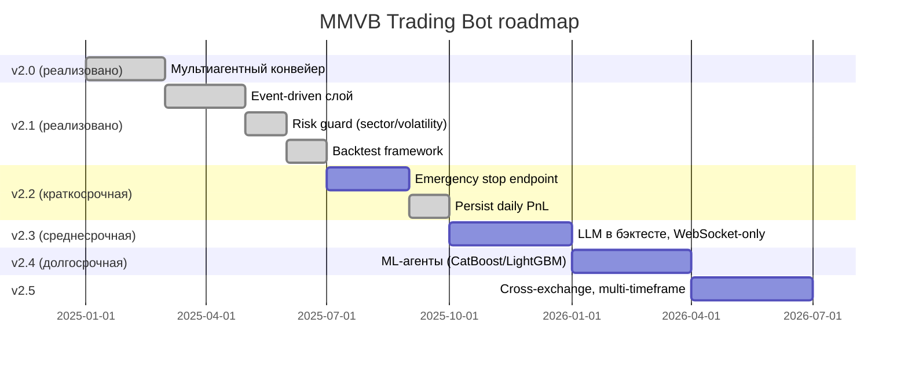
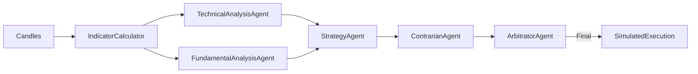
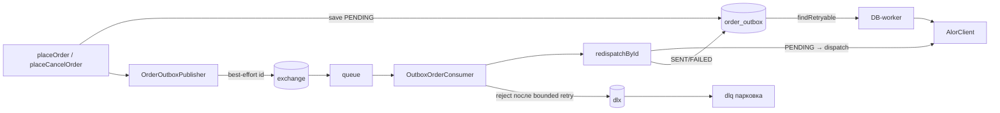
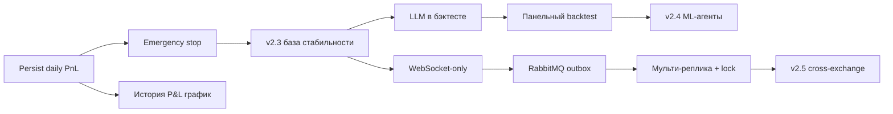

# 13. Roadmap и планы развития

## 13.1. Текущее состояние (v2.1)

**Реализовано в текущей ветке:**

- 6 LLM-агентов (тех. анализ, фундаментал, стратегия, контрар, арбитр, feedback) + Guardrails + semantic cache + resilience (CB/RateLimiter/Retry).
- Alor-интеграция: REST + WebSocket, idempotency, outbox, контроль спреда.
- MOEX ISS данные, индикаторы (MA, RSI, ATR, MACD, Bollinger, EMA), Kelly criterion, адаптивные SL/TP.
- Стратегии `conservative`/`default`/`aggressive`, self-learning (PerformanceFeedbackAgent).
- 7 таблиц, Liquibase, REST API, Prometheus-метрики, alertmanager-конфиг.
- Docker compose (TimescaleDB/PostgreSQL 15 + Redis 7).
- **Event-driven слой** (раздел 2.3): `PriceChangedEvent`, `StrategyGeneratedEvent`, `EntrySignalEvent`, `ExecutionReportEvent` + `TradingEventPublisher` + `@EventListener`.
- **Sector concentration** (раздел 5.3): `risk.max-sector-exposure`, справочник `risk.sectors`.
- **Volatility guard** (раздел 5.4): ATR% > `risk.max-volatility-percent` → HOLD.
- **Backtest framework** (раздел 11): `BacktestEngine`, `SimulatedExecution`, `BacktestMetrics`, endpoint `GET /api/v1/backtest/{ticker}`, 6 unit-тестов.
- **TimescaleDB для candles** (раздел 6.4): гипертаблица (чанки по time, retention 90 дней) + батч-запись свечей `CandleRepository.saveAll` вместо построчного `exists`+`save`.
- **Наблюдаемость LLM-агента** (раздел 13.18): JSON-логирование + trace_id, трейс-хранилище S3/MinIO, Shadow Mode / decision-level A/B + Grafana, **RAG-анализ ошибок** по трейсам (`/api/v1/rag/*`).

## 13.2. Дорожная карта по версиям

### v2.2 — Краткосрочные улучшения

| Фича | Описание | Статус |
|---|---|---|
| Emergency stop endpoint | `POST /api/v1/bot/emergency-stop` — закрывает все позиции + запрещает открытие | ✅ |
| Persist daily PnL | перенос `dailyPnl` из памяти в БД (`daily_risk_snapshot`) + `GET /api/v1/risk/daily-pnl-history` (раздел 6.6) | ✅ |
| Партиционирование `candles` | TimescaleDB hypertable: чанки по time (1 неделя) + retention 90 дней (раздел 6.4) | ✅ v2.2 |
| Партиционирование `positions`/`agent_logs` | PostgreSQL native partitioning (раздел 6.4) | ✅ v2.2 |
| Точный контроль SL/TP в лимитных заявках | биржевые stop/take-profit-заявки при открытии позиции (раздел 13.7.4) | ✅ v2.2 |
| Distributed lock | возможность запуска нескольких инстансов без гонок (раздел 2.6) | ✅ v2.2 |
| Multi-account | поддержка нескольких Alor-портфелей с общим конвейером и персональными лимитами | ✅ |
| Backtest: сохранение результатов | таблица `backtest_results` + сравнение итераций | ✅ |
| Backtest: out-of-sample | walk-forward (train → tune SL/TP → OOS), защита от переобучения | ✅ |

### v2.3 — Среднесрочные

| Фича | Описание | Статус |
|---|---|---|
| **LLM-агенты в бэктесте** | заменить детерминированный `signalAt()` на конвейер tech→fund→strategy→contrarian→arbitrator (раздел 11.1) | |
| Backtest: панельный прогон | несколько тикеров за один вызов, распределение результатов | ✅ (POST `/api/v1/backtest/panel`, раздел 11.6.1) |
| Backtest: конфиг `bt.*` | вынос констант 20%/2%/4% и `initialCapital` из кода | ✅ (раздел 11.8.1) |
| WebSocket-only исполнение | полный переход на WS для market-data и ордеров, REST — только fallback | |
| Уменьшение LLM-латентности | параллельные вызовы агентов, дельта-промпты | |
| Очередь (RabbitMQ) для outbox | RabbitMQ — дополнительный канал доставки outbox-строк (publisher → очередь → консьюмер через `redispatchById`), DB-worker остаётся фолбэком | ✅ (раздел 13.8.4) |

### v2.4 — ML-агенты

- Замена/дополнение части LLM-инференса ML-моделями (CatBoost/LightGBM) для задач, где нужна скорость и стабильность: скрининг кандидатов, оценка вероятности удержания тренда.
- Retraining pipeline: собранные через `agent_logs` и сделки данные → features → обучение на CI.

### v2.5 — Расширение горизонтов

- Multi-timeframe: вход по 10-минутному, фильтр по часовому/дневному.
- Cross-exchange: мониторинг котировок на нескольких площадках, арбитраж между MOEX и международными рынками (по мере регуляторной готовности).

## 13.3. План стабилизации (непрерывно)

1. **Набор regression-тестов** по каждому модулю (Guardrails, SemanticCache, Agent parsers, outbox, BacktestEngine).
2. **Backtest всех тикеров** по критериям раздела 11.5 перед каждой новой стратегией.
3. **Chaos testing**: отключение Redis/Postgres/Kimi/сети — проверка graceful degradation.
4. **Нагрузочное тестирование**: до 100 тикеров × 6 агентов × 2 LLM-вызова — бюджет латентности и стоимости.
5. **Мониторинг вырожденных случаев**: SPREAD > 1%, депозитарные паузы, гэпы.

## 13.4. Контрольные точки (milestones)

| Миля | Критерий готовности |
|---|---|
| M1 (v2.2) | Emergency stop ✅ + persist daily PnL ✅, тесты зелёные, документация обновлена |
| M2 (v2.3) | LLM-бэктест проходит критерии по ≥ 5 тикерам; WebSocket-only стабилен 1 неделю SIMULATION |
| M3 (v2.4) | ML-модель выигрывает у базовой LLM-версии на out-of-sample выборке |
| M4 (v2.5) | Cross-exchange сигналы без ложных арбитражных входов |

## 13.5. Что уже снято с планов (сделано)

Эти пункты были в планах, но реализованы в v2.1:

| Пункт | Где реализовано |
|---|---|
| Event-driven очередь (вместо @Scheduled) | раздел 2.3 — события + `@EventListener`, остаточные `@Scheduled` для poll/outbox |
| Sector Concentration | раздел 5.3 — `exceedsSectorExposure`, `risk.max-sector-exposure` |
| Volatility Check (ATR% > 5% → запрет) | раздел 5.4 — `isVolatilityTooHigh`, `risk.max-volatility-percent` |
| Backtest framework (первый этап) | раздел 11 — детерминированный `BacktestEngine` + endpoint + тесты |

> Пометка «не реализовано» из ранних версий документации снята — эти фичи теперь покрыты кодом и тестами.

## 13.6. Приоритизация

| Приоритет | Фича | Обоснование |
|---|---|---|
| P0 | Emergency stop | безопасность: ручная остановка в любой момент |
| P0 | Persist daily PnL | лимит убытка не должен теряться при рестарте |
| P1 | LLM в бэктесте | соответствие живому конвейеру, достоверность критериев приёма |
| P1 | Партиционирование candles | ✅ TimescaleDB hypertable + retention 90 дней (раздел 6.4) |
| P2 | Distributed lock | мульти-реплика (после стабилизации singleton) |
| P2 | Multi-account | бизнес-расширение |
| P3 | RabbitMQ outbox | при росте нагрузки |
| P3 | ML-агенты | экспериментально, после стабилизации LLM-конвейера |

## 13.7. Детализация фич v2.2

### 13.7.1. Emergency stop

> **Статус**: ✅ реализовано (`EmergencyStopService`, 2 endpoints, halt `EMERGENCY_STOP` в `TradingGate`). Коммит с планом C-001..C-003 → emergency stop.

**Требования:**

- `POST /api/v1/bot/emergency-stop` с телом `{"reason": "...", "liquidate": bool}`.
- При вызове: флаг `bot:emergency-stop=true` в Redis + локально.
- `TradingBotService.run()`, `StrategyService.run()`, `monitor()` проверяют флаг в начале цикла → немедленный выход.
- Опционально: закрыть все открытые позиции рыночными ордерами (через outbox).
- Повторный вход: только после `POST /api/v1/bot/resume` или рестарта с очисткой флага.

**Реализация:**

| Слой | Изменение |
|---|---|
| Controller | 2 endpoints: `POST /emergency-stop`, `POST /resume` |
| Service | `EmergencyStopService` (флаг Redis + локальный, проверка в циклах) |
| Risk | `RiskManagementService` учитывает флаг в `validateNewStrategy` → сразу HOLD |

**Статус реализации (текущая версия):**

- `EmergencyStopService` — флаг Redis (`bot:emergency-stop`) + локальный, персист причины в `trading_halt` (reason `EMERGENCY_STOP`), восстановление после рестарта, опциональная ликвидация позиций через `TradingControlService.forceCloseNow("EMERGENCY_STOP")`.
- `TradingGate` — halt `EMERGENCY_STOP` → `TradingBlockReason.EMERGENCY_STOP` (source MANUAL/AUTO); блокирует все входы акций и фьючерсов (`isTradingEnabled()`).
- `StrategyService.run()` — ранний выход при активном флаге (метрика `strategy.skipped{reason=EMERGENCY_STOP}`).
- В текущей архитектуре `TradingBotService.run()`/`monitor()` отсутствуют (событийная модель): входы маршрутизируются через `onStrategyGenerated` → `TradingGate.isTradingEnabled()`, поэтому они блокируются автоматически; мониторинг открытых позиций и реконсиляция продолжают работать.
- Авто-стоп (source=AUTO, убыток >10% за час) — не реализован, требует хранения PnL с таймстампами (см. 5.8).
| Метрики | `bot.emergency_stop{reason}`, alert `EmergencyStop` |

### 13.7.2. Persist daily PnL ✅

**Реализовано:**

- Таблица `daily_risk_snapshot` — одна строка на дату (`UNIQUE (trade_date)`), миграция `004-futures-risk.sql` (раздел 6.6).
- `DrawdownProtectionService` — upsert снапшота на закрытие позиции и по циклу риск-движка.
- При старте (`ApplicationReadyEvent`) и при первом касании нового дня подгружается P&L за сегодня из БД — рестарт в течение дня не «забывает» накопленный убыток.
- Новый endpoint `GET /api/v1/risk/daily-pnl-history?days=30` (график дневных результатов).
- Сброс лимита — автоматически по календарной дате 00:00 МСК (новая строка даты).

### 13.7.3. Backtest: сохранение результатов ✅

**Реализовано:**

- Таблица `backtest_results(id, ticker, params jsonb, metrics jsonb, oos jsonb, created_at)` + индекс `(ticker, created_at DESC)` (миграция `022-backtest-results.sql`).
- `BacktestEngine.run` пишет результат после прогона (best-effort: сбой записи не роняет прогон; пустые прогоны с 0 сделок не сохраняются).
- `GET /api/v1/backtest/results?ticker=&limit=` — сравнение итераций (последние по времени, `limit` 1..100, params/metrics/oos отдаются распарсеным JSON).
- Метрика `bt_pass_total{result=PASS|REJECT}` — результат каждой итерации.
- `BacktestResult.metrics()` — компактная карта метрик для персиста (без equityCurve/monthlyReturns/tradeReturns).
- Walk-forward валидация `GET /api/v1/backtest/{ticker}/validate` также сохраняет прогон с OOS-сводкой (consistency/robust/oosTrades/oosReturn/oosSharpe/oosSortino/oosProfitFactor) — см. 13.7.7.

### 13.7.4. Точный контроль SL/TP в лимитных заявках ✅

**Идея:** при открытии позиции выставлять на бирже Alor условные stop- и take-profit-заявки, чтобы SL/TP исполнялись биржей независимо от бота (мгновенная реакция, переживают рестарт). Локальный мониторинг остаётся fallback'ом, если заявка не выставлена/уровень устарел.

**Реализация (LIVE-режим, `protectionOrdersEnabled = alorClient.isLiveMode`):**

| Слой | Изменение |
|---|---|
| Alor API | `POST /client/orders/actions/limit` со `type` в теле: `stop` (`stopPrice`+`stopEndUnixTime=0`) и `take-profit`; контракт доставки как у лимитки (idempotencyKey, sim-режим) — `placeStopOrder`/`placeTakeProfitOrder` |
| Outbox | в payload добавлены `purpose` (`sl`/`tp`/`cancel`) и `stopPrice`; тип `cancel` маршрутизируется в `cancelOrder` (CONFIRMED/REJECTED — однозначны, UNCERTAIN — retry) |
| `positions` | новые поля `sl_order_id`, `tp_order_id`, `sl_order_price`, `tp_order_price`, `sl_pending_replace`, `tp_pending_replace` (миграция `020-protection-orders.sql`) |
| Исполнение | `attachProtectionOrders` — выставление SL на `ExitRules.effectiveSl` (максимум жёсткого стопа и trailing) и TP на `takeProfit` из трёх точек подтверждения входа (full resolve / remainder cancel / WS fill) и из reconcile |
| Перевыставление | `onProtectionLevelsChanged` (trailing-монитор, стратегия) ставит флаг pending; `finishProtectionReplacement` снимает старую заявку и только ПОСЛЕ подтверждения отмены очищает флаг — новая выставляется на следующий цикл (защита от двойного стопа/тейка) |
| Reconcile | `reconcileProtectionOrders`: пропагация orderId из outbox (`resolveProtectionOutbox`, не пере-армирует заявку с подтверждённой отменой), детект исполнения/отмены через `verifyOrder`, завершение перевыставлений, выставление недостающих |
| Закрытие | `cancelProtectionOrders` снимает контр-заявки при закрытии; WS fill / verifyOrder защитной заявки → финализация с reason `STOP_LOSS`/`TAKE_PROFIT`; при `pendingClose` «в полёте» защитная заявка закрывает первой → локальный close-ордер отменяется |
| Мониторинг | `ExitRules.exchangeSlCovers`/`exchangeTpCovers` — если биржевая заявка актуальна на уровне, локальный мониторинг НЕ дублирует закрытие |

**Fallback:** при недоступности/отказе выставления (UNCERTAIN/FAILED с исчерпанными ретраями) локальный мониторинг SL/TP/trailing продолжает закрывать позиции как раньше.

### 13.7.5. Distributed lock ✅

**Идея:** разрешить запуск нескольких инстансов бота без гонок. Критические секции выполняет только «лидер» (владелец Redis-ключа), конкуренция исключается атомарным `SET key token NX PX`.

**Реализация:**

| Слой | Изменение |
|---|---|
| Redis-лок | `DistributedLockService`: `acquire` = `SET distributed-lock:<name> <uuid> NX PX ttl`, `release` = Lua compare-and-delete (удаляет ключ только своего владельца). TTL гарантирует освобождение при падении реплики; уникальный владелец исключает освобождение чужого прогона |
| Config | `distributed-lock.*` (`enabled`, `schedulerTtlSeconds`, `positionOpenTtlSeconds`). По умолчанию `enabled=false` — single-instance работает без Redis, `runExclusive` исполняет блок напрямую |
| Вход в позицию | `DecisionEngine.openPosition` берёт lock `position:<ticker>` (внутри per-ticker mutex) с `failOpenOnError=false`: при конкуренции/недоступности Redis вход пропускается (fail-closed — не открывать без лока) |
| Планировщики | lock `scheduler:*` (outbox-worker, strategy cycle, poll, reconciles, force close) с `failOpenOnError=true`: конкуренция → работает лидер, сбой Redis → блок всё равно исполняется (fail-open — не пропустить reconcile/close) |
| Метрики | `distributed.lock.acquired/contended/skipped/error/release.error` с тегом `name` |

**Что НЕ входит:** очередь RabbitMQ и полноценный leader-election-флаг (v2.3+, раздел 13.8). Lock работает в рамках одной БД — позиции и так идемпотентны (idempotencyKey + outbox + стейт-машина), это ещё один барьер против двойного входа.

### 13.7.6. Multi-account ✅

**Идея:** несколько Alor-портфелей через общий LLM-конвейер. Сигнал генерируется один раз, распределяется по аккаунтам (весовой round-robin с учётом ёмкости), ордера маршрутизируются в портфель аккаунта, лимиты риска — персональные. Пустая таблица `trading_accounts` = legacy single-account режим (портфель из `AlorConfig.portfolio`, позиции без `account_id`) — поведение идентично до-мультиаккаунтной версии.

**Реализация:**

| Слой | Изменение |
|---|---|
| Миграция | `021-multi-account.sql`: таблица `trading_accounts`; `account_id` на `positions`, `order_outbox`, `daily_risk_snapshot`; FK + индексы; уникальность дневных снапшотов `(trade_date, account_id)` + частичный индекс для global-строк |
| Аккаунт | `TradingAccount` (`alor_portfolio`, `exchange`, `enabled`, `aum_rub`, `max_open_positions`, `max_daily_loss_rub`, `weight`) — персональные переопределения лимитов, NULL = дефолт из `RiskConfig`/AUM |
| Распределение | `TradingAccountService.selectAccount` — весовой round-robin по включённым аккаунтам с ёмкостью (`max_open_positions`), кэш 30с; `portfolioOf(accountId)` — маршрутизация портфеля |
| Риск | персональный дневной лимит (`max_daily_loss_rub`), лимит позиций и AUM-переопределение на аккаунт; `daily_risk_snapshot.account_id` — снапшот P&L на аккаунт |
| Исполнение | `order_outbox.account_id` — доставка ордеров в нужный портфель; per-портфельные WS-подписки и реконсиляция состояний |
| Dashboard | `/api/v1/dashboard?accountId=` и SSE `/api/v1/dashboard/stream?accountId=` фильтруют снимок (позиции, closed-today, daily P&L) по аккаунту; null = агрегированный вид |

**API (управление и мониторинг, раздел 07):**

- `GET/POST /api/v1/accounts`, `GET/PUT/DELETE /api/v1/accounts/{id}` — CRUD реестра (ADMIN; DELETE — 409 при позициях или неотправленных outbox-ордерах);
- `GET /api/v1/accounts/{id}/dashboard` — live-снимок аккаунта (AUM, daily P&L, лимиты, позиции);
- `GET /api/v1/accounts/{id}/daily-pnl?days=` — история дневных P&L аккаунта;
- `GET /api/v1/dashboard?accountId=` / `GET /api/v1/dashboard/stream?accountId=` — фильтрация общего дашборда (404 при неизвестном аккаунте).

**Тесты:** `TradingAccountServiceTest` (legacy/round-robin/portfolio), `TradingAccountControllerIntegrationTest` (accounts CRUD, per-account dashboard и SSE-фильтр на Testcontainers), `DashboardServiceTest` (агрегированный vs per-account снимок).

### 13.7.7. Backtest: out-of-sample ✅

**Идея:** оценка стратегии на данных, не участвовавших в настройке — защита от переобучения на in-sample бэктесте (раздел 11.5, требование C-002). Вместо простого split 80/20 реализован walk-forward (скользящие фолды).

**Реализация (`BacktestValidator`):**

- Свечи делятся на последовательные фолды; для каждого фолда — in-sample (train) окно с подбором SL/TP по сетке `(1%,2%)/(2%,4%)/(3%,6%)` (максимум PF при ≥30 сделок, при равенстве — Sharpe), затем прогон на out-of-sample (test) окне, не участвовавшем в настройке.
- Агрегация OOS-сделок всех фолдов → сводная кривая капитала и метрики.
- `ValidationResult.isRobust()`: OOS Sharpe > 0.5, OOS PF > 1.1, ≥60% прибыльных фолдов, ≥100 OOS-сделок. Проваливается при переобучении и при тонком распределении сделок.
- Эндпоинт `GET /api/v1/backtest/{ticker}/validate?days=&folds=&timeframe=` возвращает consistency/robust/OOS-метрики и сохраняет прогон с OOS-сводкой в `backtest_results` (13.7.3).

**Тесты:** `BacktestValidatorTest`, OOS-персист в `BacktestResultPersistenceIntegrationTest`.

## 13.8. Детализация фич v2.3

### 13.8.1. LLM-агенты в бэктесте

Заменить `signalAt()` (детерминированный RSI/MACD) на конвейер агентов:

Проблемы, которые надо решить:

| Проблема | Решение |
|---|---|
| Стоимость: 10 тикеров × 365 дней × 6 агентов | сэмплирование: сигнал каждые N баров, параллельные вызовы |
| Латентность | кэш LLM-ответов по fingerprint бара |
| Детерминированность | `temperature=0`, стабильный seed |
| Тайм-ауты | resilience4j конфиг для backtest-профиля |

### 13.8.2. WebSocket-only исполнение

- Полный перевод market-data и ордеров на WS (`alor.ws`).
- REST остаётся fallback для `verifyOrder` и токенов.
- Ожидаемый выигрыш: латентность, меньше лимитов rate-limiter.

### 13.8.3. Панельный бэктест (реализовано)

`POST /api/v1/backtest/panel` (`PanelBacktestService`): прогон по нескольким тикерам за один
вызов, параллельно (`async`/`awaitAll`). Ответ — `results[]` (по тикеру) + `summary`
(распределение: `passShare`, `avgTotalReturn`, `medianTotalReturn`, `min`/`max`, `totalTrades`).
Дефолты параметров берутся из конфига `bt.*` (11.8.1). Результаты персистятся в
`backtest_results`, метрика `api.backtest.panel`. См. раздел 11.6.1.

### 13.8.4. Очередь (RabbitMQ) для outbox (реализовано)

**Функция — дополнительный канал доставки** outbox-строк (не замена): при сохранении ордера
помимо inline-dispatch `OrderOutboxPublisher` публикует id строки в RabbitMQ, консьюмер
`OutboxOrderConsumer` диспетчирует его через тот же `OrderOutboxService.redispatchById`
(единый диспетчер → те же гарантии идемпотентности, что и у inline/DB-worker). Источник
истины — строка в БД: RabbitMQ не является обязательным компонентом, DB-worker остаётся
фолбэком, гарантии «никакого double execution» не меняются.

Схема:

Детали реализации:

| Аспект | Решение |
|---|---|
| Топология | `exchange` (Direct) + `queue` (durable, `x-dead-letter-exchange = dlx`) + `dlq`; биндинг по `routingKey` |
| Ack | **AUTO** — контейнер подтверждает после нормального возврата, отклоняет при исключении |
| Retry | stateless, 3 попытки (backoff 1s → 2s → 10s), после исчерпания `RejectAndDontRequeueRecoverer` → DLQ |
| Идемпотентность | консьюмер не исполняет ордер сам — вызывает `redispatchById` (PENDING → dispatch, SENT → ack, FAILED → ack без переотправки) |
| Ошибки | невалидный body / сбой диспетчера → bounded retry → DLQ; строка в БД остаётся за DB-worker'ом |
| Publisher | best-effort: сбой публикации проглатывается (inline-dispatch не зависит от Rabbit) |
| Включение | `app.outbox.rabbitmq.enabled=true` + `spring.rabbitmq.*`; выключено по умолчанию (поведение прежнее) |
| Метрики | `outbox.published`, `outbox.publish_failed`, `outbox.consumed{outcome}`, `outbox.consumed_failed`, `outbox.consumed_invalid` |

**Ключевые решения:**

- **AUTO вместо MANUAL**: при ручном ack контейнер НЕ отклоняет сообщение после исчерпания
  ретраев (отклонение требует `AmqpRejectAndDontRequeueException` с `rejectManual=true`),
  поэтому poison-сообщение застревало бы unacked и не попадало в DLQ.
- **Без `Boolean`-возврата в listener**: в Spring AMQP 4.x `Boolean`-возврат трактуется как
  reply-пакет, а не ack-сигнал → двойной ack (`unknown delivery tag`) и повторная обработка
  заакенных сообщений.
- **Консьюмер условен**: бин создаётся только при `app.outbox.rabbitmq.enabled=true`
  (одно условие с фабрикой контейнера).

**Тесты:** `RabbitMqTransportIntegrationTest` (полный путь против Postgres + RabbitMQ:
publish → consume → SENT; already-SENT не переотправляется; invalid → DLQ),
`OrderOutboxPublisherTest`, `OutboxOrderConsumerTest`, хуки в `OrderOutboxServiceTest`.

## 13.9. Метрики зрелости продукта

| Уровень | Признак |
|---|---|
| L1 — прототип | бот работает в SIMULATION, LLM fallback допустим |
| L2 — стабильный | 1 неделя SIMULATION без `bot.halted.daily_loss`, метрики полные |
| L3 — проверенный | бэктесты PASS по ≥ 5 тикерам, chaos-тесты зелёные |
| L4 — боевой | LIVE с лимитами, emergency stop, persist daily PnL (v2.2) |
| L5 — масштабируемый | мульти-реплика (distributed lock), k8s, RabbitMQ (v2.3+) |

Целевое состояние на текущий момент — **L3** (бэктест реализован, но критерии ещё не подтверждены данными реального портфеля).

## 13.10. Критерии выхода из беты

- [ ] 2 недели подряд без ошибок цикла (`bot.cycle.error == 0`)
- [ ] `maxConsecutiveLosses < 4` для всех тикеров (нет пауз)
- [ ] Проскальзывание ≤ 0.1% в среднем (`trade.slippage.rub / общий оборот`)
- [ ] Бэктест `isPassable() == true` для ≥ 50% тикеров портфеля
- [ ] Все алерты критического уровня срабатывают корректно (проверено)
- [ ] Документация актуальна (этот документ — часть DoD)

## 13.11. Детализация v2.4 (ML-агенты)

**Задачи для ML-замены** (где детерминизм/скорость важнее гибкости):

| Задача | Сейчас (LLM) | ML-кандидат |
|---|---|---|
| Скрининг кандидатов (10 тикеров → топ-N) | каждый тикер полный конвейер | градиентный бустинг по признакам индикаторов |
| Оценка вероятности продолжения тренда | StrategyAgent (LLM) | бинарный классификатор (тренд вверх/вниз) |
| Порог уверенности | AdaptiveRiskService (правила) | онлайн-обучение по исходам сделок |

**Признаки** (features): RSI, ATR%, MACD-гистограмма, Bollinger %B, EMA-наклон, волатильность, winRate/чac, слепые зоны тикера, макро (ставка, нефть, курс).

**Pipeline**:

1. Сбор датасета: `positions` (исход сделки) + `candles` + `agent_logs`.
2. Обучение на CI (этап в пайплайне, данные — экспорт из БД).
3. Валидация: out-of-sample 20%, метрика — выигрыш у LLM-baseline (M3).
4. Промоушн: feature-флаг `ml.enabled`.

**Риски**:

- Переобучение на короткой истории (мало сделок).
- Нестационарность рынка MOEX — дрейф признаков.
- Регуляторные ограничения автоматической торговли.

## 13.12. Детализация v2.5 (Cross-exchange)

**Целевые рынки**: MOEX (основной) + внебиржевые/другие площадки по мере готовности.

**Арбитражные условия** (осторожно):

- Расхождение котировок > комиссии + проскальзывание + издержки перевода.
- Синхронизация времени (NTP), минимальное окно проверки.

**Ограничения**:

- Валютные/юридические ограничения движения капитала.
- Разные режимы торгов (T+2 на MOEX).
- Арбитраж выполняется **только** в SIMULATION до отдельного approval.

## 13.13. Управление зависимостями roadmap

Ключевое: **persist daily PnL — фундамент** для emergency stop и истории; **LLM в бэктесте — фундамент** для ML-этапа (метрики качества решений).

## 13.14. Риски дорожной карты

| Риск | Вероятность | Влияние | Митигация |
|---|---|---|---|
| LLM-бэктест дорогой/медленный | средняя | задержка M2 | сэмплирование баров, кэш ответов |
| MOEX меняет API | низкая | пауза интеграций | абстракция клиентов, тесты на контракты |
| Переобучение ML | высокая | ложная прибыль | строгая out-of-sample валидация |
| Регуляторные ограничения | низкая | остановка LIVE | SIMULATION-first, approval-гейт |
| Утечка секретов | низкая | критично | IAM-аудит, ротация, никаких секретов в git |
| Бот в одной реплике → SPOF | средняя | простой | distributed lock (раздел 13.7.5, ✅ v2.2) |

## 13.15. KPI по версиям

| Версия | KPI успеха |
|---|---|
| v2.1 (текущая) | 39 тестов зелёных; событийный слой без потерь (`event.handled ≈ event.published`); бэктест-endpoint работает |
| v2.2 | emergency stop < 1 c на реакцию; daily PnL переживает рестарт (тест); candles — гипертаблица TimescaleDB, выборка за год < 200 мс, retention удаляет чанки > 90 дней |
| v2.3 | LLM-бэктест ≥ 5 тикеров PASS; WebSocket-only 1 неделя SIMULATION без ошибок |
| v2.4 | ML-модель > LLM-baseline на out-of-sample по profit factor |
| v2.5 | 0 ложных арбитражных входов за месяц SIMULATION |

## 13.16. Процесс внесения фичи

1. **RFC**: описание в разделе roadmap (этот файл), владелец, KPI.
2. **TDD**: тесты до кода (например, для backtest — сначала `BacktestEngineTest`).
3. **Промежуточный деплой**: SIMULATION на 1 неделю.
4. **Оценка по KPI** таблицы выше.
5. **Промоушн**: только если KPI достигнуты; обновить README и статусы в этом разделе.

Этот процесс гарантирует, что статус в документации («🔜» / «✅») всегда честно отражает код — как это сделано для v2.1 (раздел 13.5).

## 13.17. Покрытие тестами (Kover)

- **Гейт в CI**: `./gradlew koverVerify` — правило `minBound(50%)` по всем модулям, `onCheck=true`.
  Отчёт `build/reports/kover/report/index.html` выгружается артефактом каждого PR.
- **Локальная проверка**: `.\gradlew.bat koverReport` (HTML/XML/Binary), затем `.\gradlew.bat koverVerify`.
- Текущий уровень покрытия и разбивка по пакетам — в отчёте Kover.

**План повышения покрытия до 100% (к v2.2):**

| Пакет / класс | Что добавить | Приоритет |
|---|---|---|
| `client.AlorRestClient` / `AlorWebSocketClient` | unit-тесты на mock WebClient/WS-потока (парсинг, fallback, outbox-повторы) | P0 |
| `service.RiskManagementService` | пороговые сценарии: maxPositionRub, daily loss limit, sector/volatility, restart-resume daily PnL | P0 |
| `service.FeedbackService` / `SelfLearningService` | feedback-парсинг, обучение агентов, fallback на дефолт | P1 |
| `service.StrategyService` | HOLD при `confidence < 0.5`, учёт sector/volatility guard | P1 |
| `service.SettingsService` | применённые настройки → RiskConfig/LeverageConfig (runtime), валидация | P1 |
| `controller.*` | `@WebMvcTest` для всех endpoints (роли ADMIN/ANALYTICS, в т.ч. запрет POST для ANALYTICS) | P1 |
| `infrastructure.*` (UuidV7, outbox poller, промпты) | краевые случаи, retry, таймауты | P2 |
| `backtest.BacktestEngine` | реальная фикстура MOEX уже покрыта (`RealDataBacktestFixtureTest`); добавить edge-кейсы (пустой вход, деление на 0) | P2 |

> Критерий «100% покрытие» применяется к критичным торговым путям (client, risk, execution, settings);
> для генерации отчётов и инфраструктуры допускается исключение через `@Generated`/фильтры Kover.

## 13.18. Наблюдаемость LLM-агента (3 фазы) — реализовано

План наблюдаемости LLM-агента выполнен полностью (compile + tests + ktlint зелёные).

### Phase 1 — Structured JSON logging + trace_id ✅

- `logback-spring.xml`: JSON в stdout (LogstashEncoder), профиль `!json-logs-off`.
  MDC-поля: `trace_id`, `cycle_id`, `ticker`, `agent`, `application=mmvb-trading-bot-v2`.
- `TraceContext` (`infrastructure/tracing`): MDC-контекст корутин (`mdcContext`/`withMdc`).
- `StrategyService.run()`: `trace_id = cycle_id = UuidV7`, дочерние корутины наследуют MDC.
- `ResilientLlmClient.complete()`: `withMdc(AGENT=...)` вокруг каждого LLM-вызова.
- `Position.cycleId` + миграция `013-position-cycle-id.sql` (индекс); `PositionOpened/ClosedEvent.cycleId`.

### Phase 2 — Трейс-хранилище S3/MinIO ✅

- `TraceStorage` / `S3TraceStorage` (`infrastructure/tracing`): lazy MinioClient,
  auto-create бакета, ключ `<traceId>/<agent>/<createdAt>-<uuid>.json`, best-effort.
- `ResilientLlmClient`: `ResolvedEndpoint.provider`, `persistTrace()` во `withMdc`;
  `LlmResponse.storageKey` кэшируется через SemanticCache.
- `agent_logs.storage_key` (миграция `014`), все 6 агентов сохраняют `storageKey`.
- Конфиг `trace-storage.*` (env `MINIO_ENDPOINT/ACCESS_KEY/SECRET_KEY/BUCKET`),
  MinIO-сервис в `docker-compose.yml`.

### Phase 3 — Shadow Mode / Decision-level A/B ✅

- `ExperimentConfig` (`experiment.*`): `enabled`, `experimentId`, `variantPromptVersion`,
  `shadowExecution`, `rolloutPercent` (+ `inRollout(cycleId)`).
- `PaperTradingService`: на каждый цикл пишет две записи в `experiment_decisions`:
  - **CONTROL** — решение текущего пайплайна (исполняется, кроме полного shadow);
  - **VARIANT** — `is_paper=true`: либо повторный вызов Арбитра с промптом
    `variantPromptVersion` (реальное A/B, `bypassCache=true`), либо тень контроля
    (`shadow-copy`, без LLM).
- При `PositionClosedEvent` фиксируется исход обеих рук: CONTROL — фактический P&L,
  VARIANT — гипотетический (HOLD→0, противоположное направление→−P&L, то же→P&L×qty_ratio).
- `ArbitratorAgent.adjudicate(bypassCache=false)` — для A/B-вызова кэш обходится.
- Метрики `experiment.*` (logged/executed/shadowed/llm/outcome), API
  `GET /experiment/status`, `POST /experiment/enable`, `GET /experiment/decisions`.
- Управление через `BotSettings` (`experimentEnabled`, `experimentRolloutPercent`,
  `variantPromptVersion`) — миграция не требуется (JSON-блоб `bot_settings`), таблица
  `experiment_decisions` — миграция `015-experiment-decisions.sql`.

Следующий шаг: сравнение исходов рук уже визуализируется в Grafana — dashboard
«Trading Bot - A/B Experiment» (провижининг `grafana/provisioning/`, см. 09.2).
Промоушн вариантной руки — только после накопления статистики и решения по KPI.

### Phase 4 — RAG-анализ ошибок ✅

Анализ первопричины ошибок LLM-агентов по трейсам из S3/MinIO (см. раздел 9.5):

- `RagConfig` (`rag.*`, env `RAG_ENABLED` и др.): `enabled=false` по умолчанию,
  `corpusLimit=500`, `refreshIntervalMs=600000`, `maxResults=5`,
  `similarityThreshold=0.02`, `llmEnabled=true`.
- `TraceEmbedder` — локальный TF-IDF (токенизация EN+RU, стоп-слова, idf,
  косинус) — без внешнего vector DB и без затрат embedding API.
- `TraceCorpusIndex` — in-memory корпус с `@Volatile` снимком, параллельное
  чтение (Semaphore 8) на `Dispatchers.IO`; `search(query)` / `searchSimilar(trace)`.
- `TraceStorage.list()/read()` — чтение ключей по lastModified и объектов.
- `RagErrorAnalyzer` — переиндексация на `ApplicationReadyEvent` и по расписанию;
  `analyze(query,ticker,k)`, `analyzeTrace(storageKey,k)`, `status()`; LLM-разбор
  (prompt `rag-analyzer`, `temperature=0.2`) с rule-based fallback; метрики
  `rag.*`; API `GET /api/v1/rag/status`, `POST /api/v1/rag/refresh`,
  `POST /api/v1/rag/analyze`, `POST /api/v1/rag/analyze-trace`.
- Best-effort: сбой хранилища/LLM не влияет на торговлю.

Дальнейшие шаги (вне текущей задачи): асинхронный разбор каждого fallback-трейса,
`ticker`-фильтрация корпуса, пагинация корпуса при > 500 трейсов, алерт
`RagIndexEmpty` при пустом корпусе в течение N часов.

### Закрытие пробелов наблюдаемости (v2.2)

Остаточные пробелы, обнаруженные при аудите постановки задачи, закрыты:

| Пробел | Решение |
|---|---|
| `LlmTrace.errorMessage` не заполнялся | `LlmResponse.errorMessage` + передача причины/текста исключения в `persistTrace()` (fallback-трейсы теперь несут причину NO_API_KEY/CALL_ERROR + message) |
| Синхронный `putObject` на hot-path LLM-вызова | `AsyncTraceStorage` (`@Primary`): ограниченный FIFO-буфер, ключ возвращается сразу, фоновый консюмер пишет; при переполнении — синхронный fallback; метрики `trace.write.async`, `trace.buffer.size` |
| `trace_id` не доходил до исполнения ордеров | `TradingBotService` event-хендлеры ставят MDC из `strategy.cycleId`/`position.cycleId` (`onStrategyGenerated`, `onEntrySignal`, `onPriceChanged`, `pollMarketData`, WS-котировки) |
| Нет дешёвого доступа к трейсам | `TraceQueryService` + `GET /api/v1/traces` (по `key`/`cycleId`/recent) — без RAG/LLM |
| Хранение выключено по умолчанию, нет retention | `TRACE_STORAGE_ENABLED:-true` в `docker-compose.yml`; `trace-storage.retention-days` → S3 lifecycle expiration (idempotent) |

Новые конфиги (`trace-storage.*`): `async-buffer-size` (env `TRACE_ASYNC_BUFFER_SIZE`),
`retention-days` (env `TRACE_RETENTION_DAYS`). API: `GET /api/v1/traces`.
Тесты: `AsyncTraceStorageTest`, `TraceObjectKeyTest`, `TraceQueryServiceTest`, `LlmResponseTest`.
