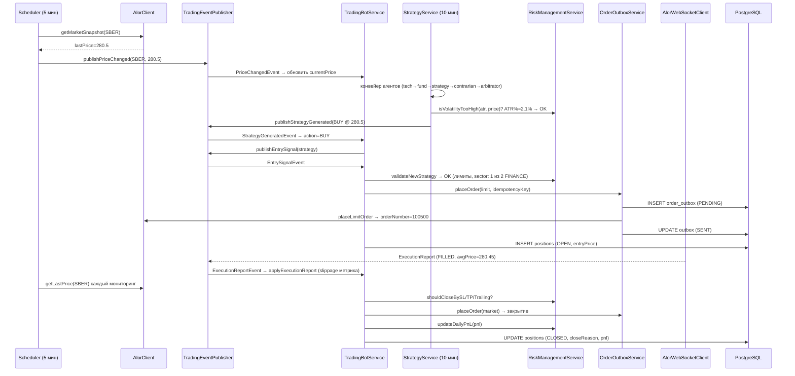

# 14. Приложения

## 14.1. Глоссарий

| Термин | Определение |
|---|---|
| **Позиция** | Открытая сделка (LONG/SHORT) на тикер, управляемая ботом |
| **Цикл (cycle)** | Полный проход конвейера агентов по тикеру: свеча → индикаторы → 5 агентов → Final решение |
| **Draft** | Черновая стратегия агента (confidence 0–1), итог конвейера — стратегия |
| **Final** | Итоговое решение арбитра с учётом all-final-правил и overrideReason |
| **Guardrails** | Валидация и ограничения входа LLM-ответов (формат, диапазоны, флаги) |
| **Semantic Cache** | Кэш LLM-ответов по семантическому fingerprint входов (Redis) |
| **Outbox** | Таблица-буфер ордеров (`order_outbox`): гарантия доставки при сбоях |
| **Idempotency key** | SHA-256 хэш параметров ордера; повторные отправки не создают дублей |
| **SL / TP** | Stop-loss / take-profit уровни (ATR-множители, см. раздел 5) |
| **Kelly** | Доля капитала на сделку по формуле Келли; бот использует half-Kelly с лимитом 0.5 |
| **MOEX ISS** | Информационно-статистический сервис Московской биржи (REST API) |
| **Alor** | Брокер MOEX; Alor Open API — REST/WebSocket |
| **Kimi / Moonshot** | LLM-провайдер (kimi-k3) для агентов |
| **Volatility regime** | Режим волатильности (CALM/NORMAL/HIGH/EXTREME), влияет на таймауты LLM |
| **Prompt Registry** | Реестр промптов из classpath (`prompts/*.yml`), версии default/conservative/aggressive |
| **Adaptive risk** | Адаптивная настройка SL/TP по исторической статистике сделок по тикеру |
| **Liquibase** | Инструмент миграций БД (changesets в `db/changelog/changes/*.sql`) |

## 14.2. Тикеры по умолчанию

`application.yml → trading.tickers` (10 тикеров):

| Тикер | Бумага | Сектор (risk.sectors) | Биржа |
|---|---|---|---|
| SBER | Сбербанк | FINANCE | MOEX |
| GAZP | Газпром | ENERGY | MOEX |
| LKOH | Лукойл | ENERGY | MOEX |
| YNDX | Яндекс | IT | MOEX |
| MGNT | Магнит | RETAIL | MOEX |
| NVTK | Новатэк | ENERGY | MOEX |
| ROSN | Роснефть | ENERGY | MOEX |
| TATN | Татнефть | ENERGY | MOEX |
| VTBR | ВТБ | FINANCE | MOEX |
| ALRS | АЛРОСА | METALS | MOEX |

> Тикер, отсутствующий в `risk.sectors`, получает сектор `UNKNOWN` (секторная проверка для него работает, но смысл ограничения теряется — см. раздел 5.3).

## 14.3. Переменные окружения

| Переменная | Назначение | Default |
|---|---|---|
| `DB_HOST` / `DB_PORT` / `DB_NAME` | PostgreSQL подключение | `localhost` / `5432` / `trading_bot` |
| `DB_USER` / `DB_PASS` | пользователь/пароль БД | `trader` / `trader` |
| `REDIS_HOST` / `REDIS_PORT` | Redis подключение | `localhost` / `6379` |
| `ALOR_API_URL` / `ALOR_WS_URL` | Alor REST/WebSocket | `https://api.alor.ru` / `wss://api.alor.ru/ws` |
| `ALOR_TOKEN` / `ALOR_REFRESH_TOKEN` | Alor Open API токены | пусто |
| `ALOR_PORTFOLIO` / `ALOR_EXCHANGE` | портфель/биржа Alor | `D12345` / `MOEX` |
| `KIMI_API_KEY` | API-ключ Moonshot/Kimi | пусто |
| `KIMI_BASE_URL` / `KIMI_MODEL` | URL и модель LLM | `https://api.moonshot.cn/v1` / `kimi-k3` |
| `CBR_RATE` / `BRENT_PRICE` / `USD_RUB` | макро fallback | `16.0` / `75.0` / `90.0` |
| `LLM_SEMANTIC_CACHE` / `LLM_SEMANTIC_CACHE_TTL` | семантический кэш | `true` / `10` |
| `TRADING_MODE` | `SIMULATION` или `LIVE` | `SIMULATION` |
| `BOT_INTERVAL_MS` / `STRATEGY_INTERVAL_MS` / `MONITOR_INTERVAL_MS` | интервалы циклов | `300000` / `600000` / `600000` |
| `MAX_OPEN_POS` | макс. новых позиций за цикл | `0` |

## 14.4. Файл `.env`

```env
DB_HOST=localhost
DB_PORT=5432
DB_NAME=trading_bot
DB_USER=trader
DB_PASS=trader_pass
REDIS_HOST=localhost
REDIS_PORT=6379
ALOR_API_URL=https://api.alor.ru
ALOR_WS_URL=wss://api.alor.ru/ws
ALOR_TOKEN=
ALOR_REFRESH_TOKEN=
ALOR_PORTFOLIO=D12345
ALOR_EXCHANGE=MOEX
KIMI_API_KEY=
KIMI_BASE_URL=https://api.moonshot.cn/v1
KIMI_MODEL=kimi-k3
TRADING_MODE=SIMULATION
MAX_OPEN_POS=0
BOT_INTERVAL_MS=300000
STRATEGY_INTERVAL_MS=600000
MONITOR_INTERVAL_MS=600000
```

## 14.5. docker-compose.yml (текущий)

```yaml
services:
  postgres:
    image: timescale/timescaledb:2.17.2-pg15
    environment:
      POSTGRES_DB: trading_bot
      POSTGRES_USER: trader
      POSTGRES_PASSWORD: trader_pass
    ports:
      - "5432:5432"
    healthcheck:
      test: ["CMD-SHELL", "pg_isready -U trader"]
      interval: 10s
      retries: 5
    volumes:
      - pgdata:/var/lib/postgresql/data

  redis:
    image: redis:7-alpine
    ports:
      - "6379:6379"
    healthcheck:
      test: ["CMD", "redis-cli", "ping"]
      interval: 10s
      retries: 5

  app:
    build: .
    depends_on:
      postgres:
        condition: service_healthy
      redis:
        condition: service_healthy
    environment:
      DB_URL: jdbc:postgresql://postgres:5432/trading_bot
      SPRING_R2DBC_URL: r2dbc:postgresql://postgres:5432/trading_bot
      DB_USER: trader
      DB_PASS: trader_pass
      REDIS_HOST: redis
      REDIS_PORT: 6379
      TRADING_MODE: SIMULATION
      MAX_OPEN_POS: 0
    ports:
      - "8080:8080"

volumes:
  pgdata:
```

## 14.6. Основные команды

```bash
# Локальная сборка
.\gradlew.bat build

# Тесты
.\gradlew.bat test

# Запуск
.\gradlew.bat bootRun

# Запуск с профилем backtest (будущий модуль)
.\gradlew.bat bootRun --args="--spring.profiles.active=backtest --bt.tickers=SBER --bt.days=365"

# Docker compose
docker compose up -d postgres redis
docker compose up app

# Kubernetes
kubectl -n trading-bot get pods
kubectl -n trading-bot logs deploy/trading-bot -f
kubectl -n trading-bot get cm,secret,deploy,svc

# PostgreSQL
psql -U trader -d trading_bot -c "SELECT * FROM positions ORDER BY opened_at DESC LIMIT 5;"

# Prometheus метрики
curl http://localhost:8080/actuator/prometheus
```

## 14.7. Ссылки на внешние API

| Сервис | Документация |
|---|---|
| Alor Open API | https://alor.dev (REST + WebSocket, токены, ордера) |
| MOEX ISS | https://iss.moex.com |
| Moonshot/Kimi | https://platform.moonshot.ai (LLM API, цены за токен) |
| Postgres | https://www.postgresql.org/docs/15/ |
| Redis | https://redis.io/documentation |

## 14.8. Структура документации

| # | Раздел | Содержимое |
|---|---|---|
| 01 | Executive Summary | обзор для бизнеса, метрики, быстрый старт |
| 02 | Архитектура | C4-диаграммы, слои, event-driven, потоки сделок, singleton |
| 03 | LLM-конвейер | 6 агентов, промпты, guardrails, semantic cache, resilience |
| 04 | Интеграции | Alor, MOEX ISS, Kimi, outbox, WS, матрица отказов |
| 05 | Risk Management | risk config, sector/volatility guard, Kelly, лимиты, мониторинг |
| 06 | База данных | ER-диаграмма, таблицы, миграции, оптимизация |
| 07 | API | все endpoints, примеры ответов, curl |
| 08 | Конфигурация | application.yml, env, modes, kubernetes config |
| 09 | Мониторинг | метрики, PromQL, Grafana, алерты, SLO |
| 10 | Деплой | docker, k8s, cloud.ru, security, миграция LIVE |
| 11 | Backtest | BacktestEngine, метрики, критерии приёма, endpoint |
| 12 | Troubleshooting | частые проблемы, диагностика, FAQ |
| 13 | Roadmap | версии, планы, приоритеты, что снято с планов |
| 14 | Приложения | глоссарий, команды, ссылки, чеклист |

## 14.9. Чеклист перед боем (LIVE)

Прохождение **всех** пунктов обязательно:

- [ ] `TRADING_MODE=SIMULATION` прогнан ≥ 1 неделю с `MAX_OPEN_POS>0`
- [ ] Дневной P&L не терялся (рестарт не сбрасывал лимит) — `daily_risk_snapshot` восстанавливает состояние (раздел 6.6).
- [ ] Бэктест тикеров из портфеля: `isPassable()` = PASS хотя бы по большинству (раздел 11.5)
- [ ] `KIMI_API_KEY`, `ALOR_TOKEN`, `ALOR_REFRESH_TOKEN`, `ALOR_PORTFOLIO` в Secrets
- [ ] Промпты в ConfigMap (`prompts/*.yml`) протестированы в проде-режиме
- [ ] Алерты Prometheus активны: BotDown, DailyLossLimitReached, LLMCircuitBreakerOpen, OutboxStuck
- [ ] `risk.sectors` покрывает все тикеры из `trading.tickers` (иначе сектор UNKNOWN)
- [ ] `MAX_OPEN_POS` выставлен желаемым (не 0!)
- [ ] Тест emergency-остановки: `POST /api/v1/bot/emergency-stop` (liquidate=true), проверка блокировки входов, затем `POST /api/v1/bot/resume`

## 14.10. Глоссарий новых терминов v2.1

| Термин | Определение |
|---|---|
| **Event-driven слой** | Публикация доменных событий (`TradingEventPublisher`) с обработчиками `@EventListener` |
| **Sector concentration** | Ограничение числа открытых позиций в одном секторе (`risk.max-sector-exposure`) |
| **Volatility guard** | Запрет входа при ATR% от цены > `risk.max-volatility-percent` |
| **Backtest** | Прогон стратегии на исторических свечах с симуляцией исполнения и метриками |
| **isPassable** | Критерии приёма бэктеста: Sharpe > 1.2, MDD < 15%, PF > 1.3, ≥ 100 сделок |
| **SimulatedExecution** | Симуляция комиссии/проскальзывания/лотности в бэктесте |

## 14.11. Пример последовательности (полный цикл)

Полный цикл по одному тикеру, от тика до закрытия:



## 14.12. Точки расширения (extension points)

| Точка | Интерфейс | Куда смотреть |
|---|---|---|
| Новый агент | конвейер `StrategyService` | добавить класс в `agent/`, подключить в цепочке |
| Новый индикатор | `IndicatorCalculator` | статический метод, вернуть в `Indicators` |
| Новый сектор | `risk.sectors` в yml | маппинг тикеров |
| Новый лимит риска | `RiskManagementService.validateNewStrategy` | добавить guardrail в цепочку |
| Новый endpoint | `ApiController` | `@GetMapping` + метрика |
| Новый таймфрейм | `trading.timeframe` + `CandleRepository` | UNIQUE (ticker, timeframe, time) уже учитывает |
| Новый тип события | `event/Events.kt` + `TradingEventPublisher` | data class + publisher-метод + `@EventListener` |

## 14.13. Частые метрики и их назначение (шпаргалка)

| Метрика | О чём говорит | Плохо если |
|---|---|---|
| `bot_position_opened_total` | сколько открыто | внезапный скачок без стратегий |
| `bot_halted_daily_loss_total` | дневной лимит сработал | > 0 |
| `llm_fallback_activated_total` | LLM не отвечает | доля > 5% |
| `llm_cache_hit_rate` | экономия LLM | < 30% |
| `outbox_saved - outbox_sent` | застрявшие ордера | > 0 длительно |
| `trade_slippage_rub_total` | проскальзывание | рост при стабильном рынке |
| `event_published - event_handled` | потерянные события | > 0 |
| `bt_pass_total{result=REJECT}` | стратегия не проходит | все тикеры REJECT |

## 14.14. Версия документации

| Параметр | Значение |
|---|---|
| Версия кода | v2.1 (события, risk guard, backtest) |
| Дата актуализации | 2026-08-03 |
| Тесты | 39 зелёных (включая 6 BacktestEngineTest) |
| Сборка | BUILD SUCCESSFUL |
| Известные расхождения с кодом | persist daily PnL (🔜), k8s (🔜) — все честно помечены; emergency stop реализован |
